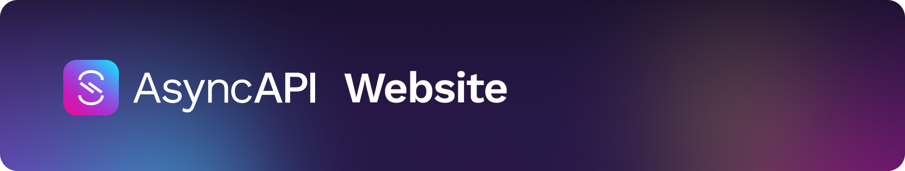

[](https://www.asyncapi.com)

---

<!-- ALL-CONTRIBUTORS-BADGE:START - Do not remove or modify this section -->
[](#contributors-)
<!-- ALL-CONTRIBUTORS-BADGE:END -->

[](https://app.netlify.com/sites/asyncapi-website/deploys)

## Overview

This repository contains the sources of AsyncAPI website:

- It's powered by [Next.js](https://nextjs.org/),
- It uses [Tailwind](https://tailwindcss.com/) CSS framework,
- It's build and deployed with [Netlify](https://www.netlify.com/).

## Requirements

Use the following tools to set up the project:

- [Node.js](https://nodejs.org/) v16.0.0+
- [npm](https://www.npmjs.com/) v7.10.0+


## Run locally

1. Fork the repository by clicking on `Fork` option on top right of the main repository.

2. Open Command Prompt on your local computer.

3. Clone the forked repository by adding your own GitHub username in place of `<username>`.
   For multiple contributions it is recommended to have [proper configuration of forked repo](https://github.com/asyncapi/community/blob/master/git-workflow.md).

```bash
    git clone https://github.com/<username>/website/
```

4. Navigate to the website directory.

```bash
    cd website
```

5. Install all website dependencies. 

```bash
    npm install
```

6. Run the website locally.

```bash
    npm run dev
```

7. Access the live development server at [localhost:3000](http://localhost:3000).


## Compose new blog post

To bootstrap a new post, run this command:

```bash
    npm run write:blog
```

Follow the interactive prompt to generate a post with pre-filled front matter.

### Spin up Gitpod codespace

In order to prepare and spin up a Gitpod dev environment for our project, we configured our workspace through a [.gitpod.yml](./.gitpod.yml) file.

To spin up a Gitpod codespace, go to http://gitpod.io/#https://github.com/asyncapi/website.

### Build

To build a production-ready website, run the following command:

```bash
npm run build
```

Generated files of the website go to the `.next` folder.

## JSON Schema definitions

All AsyncAPI JSON Schema definition files are being served within the `/definitions/<file>` path. The content is being served from GH, in particular from https://github.com/asyncapi/spec-json-schemas/tree/master/schemas.
This is possible thanks to the following:

1. A [Netlify Rewrite rule](https://docs.netlify.com/routing/redirects/rewrites-proxies/) located in the [netlify.toml](netlify.toml) file, which acts as proxy for all requests to the `/definitions/<file>` path, serving the content from GH without having an HTTP redirect.
2. A [Netlify Edge Function](https://docs.netlify.com/netlify-labs/experimental-features/edge-functions/) that modifies the `Content-Type` header of the rewrite response to become `application/schema+json`. This lets tooling, such as [Hyperjump](https://json-schema.hyperjump.io), to fetch the schemas directly from their URL.

## Project structure

This repository has the following structure:

<!-- If you make any changes in the project structure, remember to update it. -->

```text
  ├── .github                     # Definitions of GitHub workflows, pull request and issue templates
  ├── components                  # Various generic components such as "Button", "Figure", etc.
  ├── config                      # Transformed static data to display on the pages such as blog posts etc.
  ├── context                     # Various React's contexts used in website
  ├── css                         # Various CSS files
  ├── lib                         # Various JS code for preparing static data to render in pages
  ├── pages                       # Website's pages source. It includes raw markdown files and React page templates.
  │    ├── about                  # Raw blog for /about page
  │    ├── blog                   # Blog posts
  │    ├── docs                   # Blog for /docs/* pages
  │    └── tools                  # Various pages to describe tools
  ├── public                      # Data for site metadata and static blog such as images
  ├── scripts                     # Scripts used in the build and dev processes
  ├── next.config.js              # Next.js configuration file
  ├── netlify                     # Code that runs on Netlify
  │    ├── edge-functions         # Netlify Edge-Functions code
  ├── postcss.config.js           # PostCSS configuration file
  └── tailwind.config.js          # TailwindCSS configuration file
```

## Contributors ✨

Thanks goes to these wonderful people ([emoji key](https://allcontributors.org/docs/en/emoji-key)):

<!-- ALL-CONTRIBUTORS-LIST:START - Do not remove or modify this section -->
<!-- prettier-ignore-start -->
<!-- markdownlint-disable -->
<table>
  <tbody>
    <tr>
      <td align="center" valign="top" width="14.28%"><a href="http://www.fmvilas.com/"><br /><sub><b>Fran Méndez</b></sub></a><br /><a href="https://github.com/asyncapi/website/commits?author=fmvilas" title="Code">💻</a> <a href="https://github.com/asyncapi/website/commits?author=fmvilas" title="Documentation">📖</a> <a href="https://github.com/asyncapi/website/issues?q=author%3Afmvilas" title="Bug reports">🐛</a> <a href="#design-fmvilas" title="Design">🎨</a> <a href="#maintenance-fmvilas" title="Maintenance">🚧</a> <a href="#infra-fmvilas" title="Infrastructure (Hosting, Build-Tools, etc)">🚇</a> <a href="#ideas-fmvilas" title="Ideas, Planning, & Feedback">🤔</a> <a href="https://github.com/asyncapi/website/pulls?q=is%3Apr+reviewed-by%3Afmvilas" title="Reviewed Pull Requests">👀</a> <a href="#blog-fmvilas" title="Blogposts">📝</a></td>
      <td align="center" valign="top" width="14.28%"><a href="https://dev.to/derberg"><br /><sub><b>Lukasz Gornicki</b></sub></a><br /><a href="https://github.com/asyncapi/website/commits?author=derberg" title="Code">💻</a> <a href="https://github.com/asyncapi/website/commits?author=derberg" title="Documentation">📖</a> <a href="https://github.com/asyncapi/website/issues?q=author%3Aderberg" title="Bug reports">🐛</a> <a href="#design-derberg" title="Design">🎨</a> <a href="#maintenance-derberg" title="Maintenance">🚧</a> <a href="#infra-derberg" title="Infrastructure (Hosting, Build-Tools, etc)">🚇</a> <a href="#ideas-derberg" title="Ideas, Planning, & Feedback">🤔</a> <a href="https://github.com/asyncapi/website/pulls?q=is%3Apr+reviewed-by%3Aderberg" title="Reviewed Pull Requests">👀</a> <a href="#blog-derberg" title="Blogposts">📝</a></td>
      <td align="center" valign="top" width="14.28%"><a href="https://github.com/magicmatatjahu"><br /><sub><b>Maciej Urbańczyk</b></sub></a><br /><a href="https://github.com/asyncapi/website/commits?author=magicmatatjahu" title="Code">💻</a> <a href="https://github.com/asyncapi/website/commits?author=magicmatatjahu" title="Documentation">📖</a> <a href="https://github.com/asyncapi/website/issues?q=author%3Amagicmatatjahu" title="Bug reports">🐛</a> <a href="#design-magicmatatjahu" title="Design">🎨</a> <a href="#maintenance-magicmatatjahu" title="Maintenance">🚧</a> <a href="#infra-magicmatatjahu" title="Infrastructure (Hosting, Build-Tools, etc)">🚇</a> <a href="#ideas-magicmatatjahu" title="Ideas, Planning, & Feedback">🤔</a> <a href="https://github.com/asyncapi/website/pulls?q=is%3Apr+reviewed-by%3Amagicmatatjahu" title="Reviewed Pull Requests">👀</a> <a href="#blog-magicmatatjahu" title="Blogposts">📝</a></td>
      <td align="center" valign="top" width="14.28%"><a href="https://github.com/alequetzalli"><br /><sub><b>Alejandra Quetzalli </b></sub></a><br /><a href="https://github.com/asyncapi/website/commits?author=alequetzalli" title="Documentation">📖</a> <a href="https://github.com/asyncapi/website/pulls?q=is%3Apr+reviewed-by%3Aalequetzalli" title="Reviewed Pull Requests">👀</a> <a href="#talk-alequetzalli" title="Talks">📢</a></td>
      <td align="center" valign="top" width="14.28%"><a href="https://aayushmau5.github.io/"><br /><sub><b>Aayush Kumar Sahu</b></sub></a><br /><a href="https://github.com/asyncapi/website/commits?author=aayushmau5" title="Code">💻</a> <a href="https://github.com/asyncapi/website/issues?q=author%3Aaayushmau5" title="Bug reports">🐛</a> <a href="#design-aayushmau5" title="Design">🎨</a></td>
      <td align="center" valign="top" width="14.28%"><a href="https://boyney.io/"><br /><sub><b>David Boyne</b></sub></a><br /><a href="https://github.com/asyncapi/website/commits?author=boyney123" title="Code">💻</a> <a href="#design-boyney123" title="Design">🎨</a></td>
      <td align="center" valign="top" width="14.28%"><a href="https://github.com/jessemenning"><br /><sub><b>Jesse Menning</b></sub></a><br /><a href="#blog-jessemenning" title="Blogposts">📝</a></td>
    </tr>
    <tr>
      <td align="center" valign="top" width="14.28%"><a href="https://dedouss.is/"><br /><sub><b>Dimitrios Dedoussis</b></sub></a><br /><a href="#blog-dedoussis" title="Blogposts">📝</a></td>
      <td align="center" valign="top" width="14.28%"><a href="https://linkedin.com/in/jonaslagoni/"><br /><sub><b>Jonas Lagoni</b></sub></a><br /><a href="#blog-jonaslagoni" title="Blogposts">📝</a> <a href="https://github.com/asyncapi/website/commits?author=jonaslagoni" title="Code">💻</a> <a href="https://github.com/asyncapi/website/pulls?q=is%3Apr+reviewed-by%3Ajonaslagoni" title="Reviewed Pull Requests">👀</a></td>
      <td align="center" valign="top" width="14.28%"><a href="https://github.com/smoya"><br /><sub><b>Sergio Moya</b></sub></a><br /><a href="https://github.com/asyncapi/website/commits?author=smoya" title="Code">💻</a> <a href="#blog-smoya" title="Blogposts">📝</a> <a href="https://github.com/asyncapi/website/pulls?q=is%3Apr+reviewed-by%3Asmoya" title="Reviewed Pull Requests">👀</a></td>
      <td align="center" valign="top" width="14.28%"><a href="https://github.com/bodograumann"><br /><sub><b>Bodo Graumann</b></sub></a><br /><a href="https://github.com/asyncapi/website/commits?author=bodograumann" title="Documentation">📖</a></td>
      <td align="center" valign="top" width="14.28%"><a href="https://damilolarandolph.com"><br /><sub><b>Damilola Randolph</b></sub></a><br /><a href="https://github.com/asyncapi/website/commits?author=damilolarandolph" title="Code">💻</a></td>
      <td align="center" valign="top" width="14.28%"><a href="https://github.com/Barbanio"><br /><sub><b>Barbanio González</b></sub></a><br /><a href="#blog-Barbanio" title="Blogposts">📝</a> <a href="#ideas-Barbanio" title="Ideas, Planning, & Feedback">🤔</a></td>
      <td align="center" valign="top" width="14.28%"><a href="https://github.com/hkaur008"><br /><sub><b>Hargun Kaur</b></sub></a><br /><a href="https://github.com/asyncapi/website/commits?author=hkaur008" title="Code">💻</a></td>
    </tr>
    <tr>
      <td align="center" valign="top" width="14.28%"><a href="https://github.com/ceich"><br /><sub><b>Chris Eich</b></sub></a><br /><a href="https://github.com/asyncapi/website/pulls?q=is%3Apr+reviewed-by%3Aceich" title="Reviewed Pull Requests">👀</a></td>
      <td align="center" valign="top" width="14.28%"><a href="https://github.com/hpatoio"><br /><sub><b>Simone Fumagalli</b></sub></a><br /><a href="https://github.com/asyncapi/website/commits?author=hpatoio" title="Documentation">📖</a></td>
      <td align="center" valign="top" width="14.28%"><a href="https://melissaturco.com"><br /><sub><b>Missy Turco</b></sub></a><br /><a href="https://github.com/asyncapi/website/commits?author=mcturco" title="Code">💻</a> <a href="#design-mcturco" title="Design">🎨</a> <a href="#ideas-mcturco" title="Ideas, Planning, & Feedback">🤔</a> <a href="https://github.com/asyncapi/website/pulls?q=is%3Apr+reviewed-by%3Amcturco" title="Reviewed Pull Requests">👀</a></td>
      <td align="center" valign="top" width="14.28%"><a href="https://ritik307.github.io/portfolio/"><br /><sub><b>Ritik Rawal</b></sub></a><br /><a href="https://github.com/asyncapi/website/commits?author=ritik307" title="Code">💻</a></td>
      <td align="center" valign="top" width="14.28%"><a href="https://github.com/akshatnema"><br /><sub><b>Akshat Nema</b></sub></a><br /><a href="https://github.com/asyncapi/website/commits?author=akshatnema" title="Code">💻</a></td>
      <td align="center" valign="top" width="14.28%"><a href="https://bolt04.github.io/react-ultimate-resume/"><br /><sub><b>David Pereira</b></sub></a><br /><a href="https://github.com/asyncapi/website/commits?author=BOLT04" title="Code">💻</a> <a href="https://github.com/asyncapi/website/commits?author=BOLT04" title="Documentation">📖</a></td>
      <td align="center" valign="top" width="14.28%"><a href="https://github.com/ron-debajyoti"><br /><sub><b>Debajyoti Halder</b></sub></a><br /><a href="https://github.com/asyncapi/website/commits?author=ron-debajyoti" title="Code">💻</a></td>
    </tr>
    <tr>
      <td align="center" valign="top" width="14.28%"><a href="http://juanarce.me"><br /><sub><b>Juan A.</b></sub></a><br /><a href="https://github.com/asyncapi/website/commits?author=jaas666" title="Code">💻</a></td>
      <td align="center" valign="top" width="14.28%"><a href="https://github.com/luphieanza"><br /><sub><b>Muhammad Rafly Andrianza</b></sub></a><br /><a href="https://github.com/asyncapi/website/commits?author=luphieanza" title="Documentation">📖</a></td>
      <td align="center" valign="top" width="14.28%"><a href="https://github.com/Harish-b-03"><br /><sub><b>Harish</b></sub></a><br /><a href="https://github.com/asyncapi/website/commits?author=Harish-b-03" title="Code">💻</a></td>
      <td align="center" valign="top" width="14.28%"><a href="https://github.com/paulgoldsmith"><br /><sub><b>Paul Goldsmith</b></sub></a><br /><a href="https://github.com/asyncapi/website/commits?author=paulgoldsmith" title="Code">💻</a> <a href="https://github.com/asyncapi/website/issues?q=author%3Apaulgoldsmith" title="Bug reports">🐛</a></td>
      <td align="center" valign="top" width="14.28%"><a href="http://www.twitter.com/dulemartins"><br /><sub><b>Tabah Baridule</b></sub></a><br /><a href="https://github.com/asyncapi/website/commits?author=Dule-mart" title="Documentation">📖</a></td>
      <td align="center" valign="top" width="14.28%"><a href="https://starlightknown.github.io/"><br /><sub><b>Karuna Tata</b></sub></a><br /><a href="#a11y-starlightknown" title="Accessibility">️️️️♿️</a></td>
      <td align="center" valign="top" width="14.28%"><a href="https://github.com/nibble0101"><br /><sub><b>Joseph Mawa</b></sub></a><br /><a href="https://github.com/asyncapi/website/pulls?q=is%3Apr+reviewed-by%3Anibble0101" title="Reviewed Pull Requests">👀</a></td>
    </tr>
    <tr>
      <td align="center" valign="top" width="14.28%"><a href="https://github.com/aeworxet"><br /><sub><b>Viacheslav Turovskyi</b></sub></a><br /><a href="https://github.com/asyncapi/website/commits?author=aeworxet" title="Documentation">📖</a> <a href="https://github.com/asyncapi/website/commits?author=aeworxet" title="Code">💻</a></td>
      <td align="center" valign="top" width="14.28%"><a href="https://www.linkedin.com/in/helen-kosova/"><br /><sub><b>Helen Kosova</b></sub></a><br /><a href="https://github.com/asyncapi/website/commits?author=hkosova" title="Documentation">📖</a></td>
      <td align="center" valign="top" width="14.28%"><a href="https://linktr.ee/thulieblack"><br /><sub><b>V Thulisile Sibanda</b></sub></a><br /><a href="https://github.com/asyncapi/website/commits?author=thulieblack" title="Documentation">📖</a></td>
      <td align="center" valign="top" width="14.28%"><a href="https://github.com/manavdesai27"><br /><sub><b>Manav Desai</b></sub></a><br /><a href="https://github.com/asyncapi/website/commits?author=manavdesai27" title="Documentation">📖</a></td>
      <td align="center" valign="top" width="14.28%"><a href="http://www.toukir.co"><br /><sub><b>Mohd Toukir Khan</b></sub></a><br /><a href="https://github.com/asyncapi/website/commits?author=toukirkhan" title="Documentation">📖</a></td>
      <td align="center" valign="top" width="14.28%"><a href="https://annysah.hashnode.dev"><br /><sub><b>Anisat Akinbani</b></sub></a><br /><a href="https://github.com/asyncapi/website/commits?author=Annysah" title="Documentation">📖</a></td>
      <td align="center" valign="top" width="14.28%"><a href="https://github.com/sambhavgupta0705"><br /><sub><b>sambhavgupta0705</b></sub></a><br /><a href="https://github.com/asyncapi/website/commits?author=sambhavgupta0705" title="Code">💻</a></td>
    </tr>
    <tr>
      <td align="center" valign="top" width="14.28%"><a href="https://github.com/Ankitchaudharyy"><br /><sub><b>Ankit Chaudhary</b></sub></a><br /><a href="https://github.com/asyncapi/website/commits?author=Ankitchaudharyy" title="Code">💻</a></td>
      <td align="center" valign="top" width="14.28%"><a href="https://github.com/Amzani"><br /><sub><b>samz</b></sub></a><br /><a href="https://github.com/asyncapi/website/commits?author=Amzani" title="Code">💻</a></td>
      <td align="center" valign="top" width="14.28%"><a href="https://bhaswatiroy.github.io/Bhaswati-Roy-Portfolio/"><br /><sub><b>Bhaswati Roy </b></sub></a><br /><a href="https://github.com/asyncapi/website/commits?author=BhaswatiRoy" title="Documentation">📖</a></td>
      <td align="center" valign="top" width="14.28%"><a href="https://www.behance.net/muibudeenaisha"><br /><sub><b>AISHAT MUIBUDEEN</b></sub></a><br /><a href="#design-Mayaleeeee" title="Design">🎨</a></td>
      <td align="center" valign="top" width="14.28%"><a href="https://nawedali.tech"><br /><sub><b>Nawed Ali</b></sub></a><br /><a href="https://github.com/asyncapi/website/commits?author=nawed2611" title="Code">💻</a></td>
    </tr>
  </tbody>
</table>

<!-- markdownlint-restore -->
<!-- prettier-ignore-end -->

<!-- ALL-CONTRIBUTORS-LIST:END -->

This project follows the [all-contributors](https://github.com/all-contributors/all-contributors) specification. Contributions of any kind welcome!
