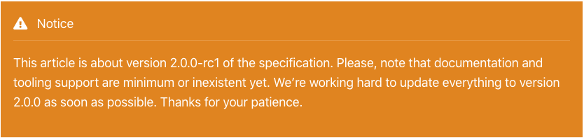
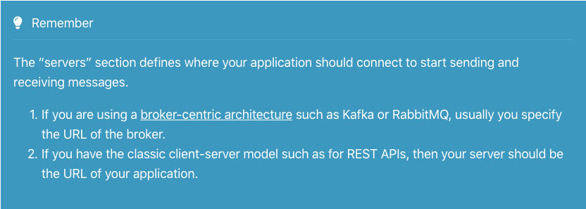

# AsyncAPI website

This repo contains the asyncapi.org website. It's powered by [Hugo](https://gohugo.io).

## Installation

Follow [Hugo](https://gohugo.io) installation instructions to install the website.

## Running in development

Start a development server:

```bash
hugo server -D
```

## Authoring

### Adding a new documentation page

```bash
hugo new docs/page_name.md
```

> This will create a draft version of your page. Make sure you remove `draft: true` from the front-matter of the document once it's ready to get published.

### Removing a page

Just remove the page file. E.g., `rm content/docs/page_name.md`.

### Shortcodes

#### Code

This shortcode allows you to add a block of code. It has the following features:

* Language selector
* Line highlighter

##### Usage Example

```md

This line should not be highlighted.
This line should be highlighted.
This line should be highlighted.
This line should be highlighted.
This line should not be highlighted.
This line should be highlighted.

```


#### Link

This shortcode allows you to add a link that will open in a new tab.

##### Usage Example

```md
{}Text of the link (Markdown){}
```

```html
Text of the link (HTML)
```

#### Notice

This shortcode allows you to add a notice message to your document.

##### Usage Example

```md
{}
A Markdown text for the notice.
{}
```

```html

An HTML text for the notice.

```



Icon and header title are customizable using `icon` and `title` properties respectively. For instance:

```md
{}
A Markdown text for the notice.
{}
```

> Find icons here: https://fontawesome.com/icons?d=gallery&m=free

#### Remember

This shortcode allows you to add a message the user must remember or something you want to remark.

##### Usage Example

```md
{}
A Markdown text.
{}
```

```html

An HTML text.

```



Icon and header title are customizable using `icon` and `title` properties respectively. For instance:

```md
{}
A Markdown text.
{}
```

> Find icons here: https://fontawesome.com/icons?d=gallery&m=free

#### Specification chooser

This shortcode shows a menu bar with all the specification versions and highlights the current one.

##### Usage Example

```md
{}
```


