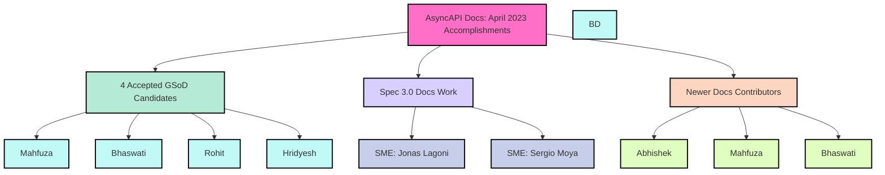

import ContributionNotes from '@/assets/docs/fragments/contribution-notes.md';
import TalkToMe from '@/assets/docs/fragments/talk-to-me.md';

# AsyncAPI Docs Report - April 2023
In April 2023, the AsyncAPI documentation experienced significant growth with **8,889 sessions** and **4,575 unique users**, including **2,895 new users**. April was a strong month for our expanding docs community.

## Google Season of Docs 2023 (GSoD) at AsyncAPI
We are thrilled to introduce this year's selected technical writing candidates for the 2023 Google Season of Docs (GSoD) at AsyncAPI!

### 2023 GSoD Accepted Technical Writer Candidates
Quetzalli Writes has chosen four outstanding candidates to collaborate with us for GSoD this year: [Mahfuza](https://github.com/mhmohona), [Bhaswati](https://github.com/BhaswatiRoy), [Rohit](https://github.com/TRohit20), and [Hridyesh](https://github.com/kakabisht).

### Overview of the LIVE Writing/Editing Interviews
During the LIVE interview session, Quetzalli divided the exercises into two parts: writing and editing. Candidates were given a document and asked to identify issues and potential solutions, then rewrite or edit the document as needed. Some candidates faced challenges with staying focused on writing, while others struggled to generate ideas due to nerves or the live format of the exercise. A few candidates had difficulty spotting errors and completing the editing task. 

However, Quetzalli did not disqualify candidates who experienced nerves, writer's block, or had limited editing skills. Instead, she guided them with questions and suggestions, encouraging them to search for answers online during the call. The main objective was to evaluate the candidates' problem-solving skills, ability to accept feedback, and integrate suggestions for improvement. The following sections outline the writing and editing exercises and the selection criteria for the candidates.

#### The Writing Part
For the writing exercise, Quetzalli utilized [an old commit from the 2022 GSoD project](https://github.com/asyncapi/website/pull/1025/commits/1f1fe7dc643434d8ab24a877ee4e2af38a0f330b), which contained numerous errors for candidates to identify and fix. Some examples of these errors include:
- Multiple preview deployment links instead of live links to actual documentation.
- Content more appropriate for the `Background context` section crammed into the `Introduction`.
- Inadequate tutorial steps that lacked sufficient technical background context for first-time users.

#### The Editing Part
For the editing exercise, Quetzalli used the same [old commit from the 2022 GSoD project](https://github.com/asyncapi/website/pull/1025/commits/1f1fe7dc643434d8ab24a877ee4e2af38a0f330b) for some candidates. For those who progressed further during the writing exercise, she provided a second block of content to edit that was unformatted and contained repeated mistakes. The purpose of this unformatted text was to assess the candidates' ability to:
- Research terms like CLI, Node.js, macOS, etc., instead of assuming they know the correct spelling.
- Use the `replace all` keyboard shortcut to fix repeated mistakes.
- Think to check and confirm the correct spelling of AsyncAPI during an AsyncAPI interview.

#### Candidate Selection Criteria
The following factors were considered when assessing candidates:
- A humble attitude that actively listens and incorporates feedback.
- Strong collaborative abilities.
- A clear writing style.
- Technical writing experience and passion.
- Editing experience and approach.
- Effective use of grammar tools _(e.g., Grammarly)_ and tech writing research tools _(e.g., Phind.com, ChatGPT)_.
- Competency in researching with search engines such as Google.

## Spec 3.0 Release
AsyncAPI community members, including Jonas Lagoni and Sergio Moya, have started the process of identifying Spec 3.0 Subject Matter Experts (SMEs) who can provide the necessary background context for our technical writers to begin updating our documentation.

While Quetzalli and Sergio are currently the only ones sharing the Spec 3.0 **writing work**, we're actively seeking more contributors to join their writing efforts.

The following Spec 3.0 release changes require documentation updates:
- [Request/reply](https://github.com/asyncapi/spec/pull/847)
- [Operation/channel decoupling](https://github.com/asyncapi/spec/pull/827)
- [Operation action: pub/sub confusion](https://github.com/asyncapi/spec/pull/806)
- [Unified referencing behavior: using $ref instead of string](https://github.com/asyncapi/spec/pull/852)
- [Common metadata fields](https://github.com/asyncapi/spec/pull/796)
- [Moving root properties `tags` and `externalDocs` to `info`](https://github.com/asyncapi/spec/pull/794)
- [Splitting out server URL into host and pathname](https://github.com/asyncapi/spec/pull/888)
- [More reusable objects in components](https://github.com/asyncapi/spec/pull/792)

## Contributor Growth
We are delighted to report an increase in **new docs contributors** collaborating on the *AsyncAPI Docs Style Guide*, working alongside [Bhaswati Roy](https://github.com/BhaswatiRoy). We would like to recognize and thank [Abhishek](https://github.com/octonawish-akcodes) for his ongoing contributions to our Style Guide and [Mahfuza](https://github.com/mhmohona) for proactively [opening PRs to fix documentation bugs](https://github.com/asyncapi/cli/pull/546).

Our gratitude goes out to our new contributors for their valuable contributions to the expansion and improvement of our documentation!

## Conclusion
April 2023 has been an exciting month for AsyncAPI, as we welcomed exceptional technical writing candidates through 2023 GSoD and expanded our community of docs contributors again. These developments will enhance the quality of AsyncAPI documentation and foster a more collaborative environment. We eagerly anticipate the progress our technical writers will make, addressing Spec 3.0 release changes with the support of Subject Matter Experts (SMEs) and new contributors. Our growing docs community, demonstrated by the work on the AsyncAPI Docs Style Guide and proactive bug fixing, showcases the dedication of our contributors. 2023 GSoD at AsyncAPI signifies a major milestone in our community's journey towards better documentation, a stronger docs community, and an improved overall experience for AsyncAPI users.

---

## How to contribute to AsyncAPI Docs
Did you know that you can contribute Docs to AsyncAPI as well?
<ContributionNotes />

### Talk to me
<TalkToMe />
