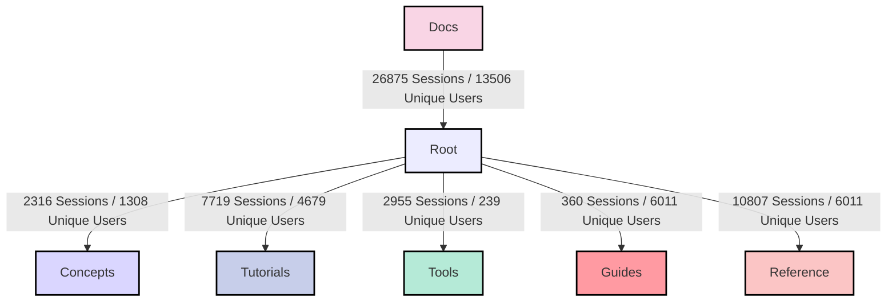
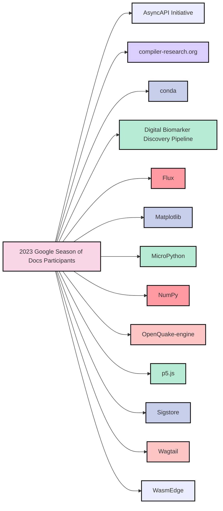
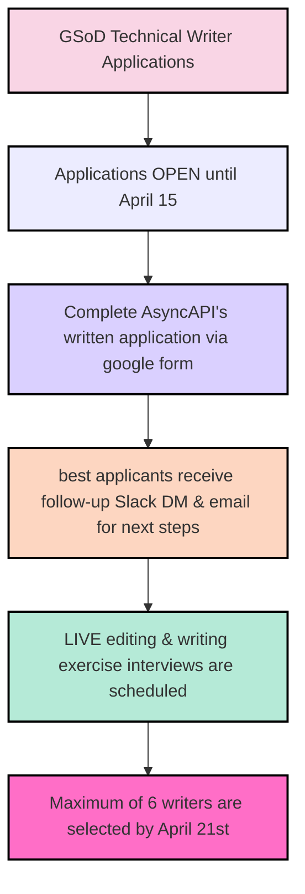
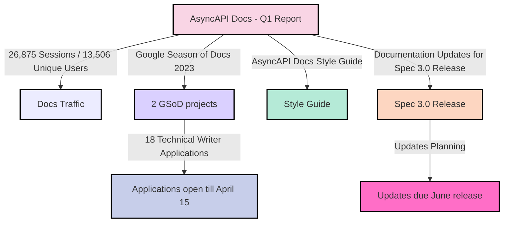

import ContributionNotes from '@/assets/docs/fragments/contribution-notes.md';
import TalkToMe from '@/assets/docs/fragments/talk-to-me.md';

# AsyncAPI Documentation Report - Q1 2023

During Q1 2023, AsyncAPI Docs had **26,875 sessions** and **13,506 unique users**. 

### Docs sessions by content bucket:
- `/docs`: **26,875 sessions** overall with **13,506 unique users**.
- `/docs/concepts`: **2,316 sessions** with **1,308 unique users**.
- `/docs/tutorials`: **7,719 sessions** with **4,679 unique users**.
- `/docs/tools`: **2,955 sessions** with **239 unique users**.
- `/docs/guides`: **360 sessions** with **6,011 unique users**.
- `/docs/reference`: **10,807 sessions** with **6,011 unique users**.

## Google Season of Docs 2023 (GSoD)

[AsyncAPI is one of 13 OSS organizations accepted into Google Season of Docs 2023!](https://developers.google.com/season-of-docs/docs/participants) Selected technical writers will work on two projects: **documenting the AsyncAPI document in detail** and **creating interactive learning paths**. 

### GSoD 2023 budget at AsyncAPI:
- We received a total budget of $10,350.
- $5,000 for documenting the AsyncAPI document section details
- $5,000 for creating interactive learning paths
- $350 for participant swag+shipping costs

### GSoD technical writer applications are open
Quetzalli Writes is currently accepting applications for technical writers who want to participate in GSoD 2023 at AsyncAPI. **The deadline for applications is April 15.** Interested participants must complete this [AsyncAPI GSoD 2023 written application available in a public Google form](https://forms.gle/Lb4ELK78R1WY2z9MA). We have received 18 applications to date. 

If selected, the next step in the process for candidates will be to receive a direct follow-up message (DM) on AsyncAPI Slack and an email from Quetzalli to schedule a LIVE editing and writing exercise interview. Up to 6 technical writers will be selected no later than April 21st.

## AsyncAPI Docs style guide
The [AsyncAPI Docs Style Guide has been created as an epic issue](https://github.com/asyncapi/website/issues/1240) in our docs repository, broken into individual tasks:
1. About this guide
1. Accessibility
1. Code examples
1. Content buckets explanation
1. Docs contribution guidelines
1. Inclusive language
1. Voice & Tone
1. Grammar
1. Numbers
1. Punctuation
1. Formatting
1. Internalization (i18n) & Localization
1. Links
1. SEO
1. Styling
1. Version control
1. Glossary

We did not pitch the style guide project for Google Season of Docs 2023 because creating a style guide does not require any knowledge of event-driven architecture (EDA). A style guide can be a good first issue to assign to new contributors unfamiliar with EDAs. By assigning them such tasks, we can help them learn about the basics of AsyncAPI and gradually move on to more complex documentation projects.

## Spec 3.0 Release
AsyncAPI community members, including Jonas Lagoni, have begun [planning documentation updates for the upcoming Spec 3.0 release](https://github.com/asyncapi/website/issues/1433) in June. We are looking for contributors to assist with the documentation efforts. A meeting point has also been established for documentation in our community spec meetings until the release is live and the docs are ready.

Here are the Spec 3.0 release changes requiring documentation:
- [Request/reply](https://github.com/asyncapi/spec/pull/847)
- [Operation/channel decoupling](https://github.com/asyncapi/spec/pull/827)
- [Operation action: pub/sub confusion](https://github.com/asyncapi/spec/pull/806)
- [Unified referencing behavior: using $ref instead of string](https://github.com/asyncapi/spec/pull/852)
- [Common metadata fields](https://github.com/asyncapi/spec/pull/796)
- [Moving root properties `tags` and `externalDocs` to `info`](https://github.com/asyncapi/spec/pull/794)
- [Splitting out server URL into host and pathname](https://github.com/asyncapi/spec/pull/888)
- [More reusable objects in components](https://github.com/asyncapi/spec/pull/792)

## Contributor growth
We are pleased to report that **new docs contributors** are already working on the _AsyncAPI Docs Style Guide_, such as [Bhaswati Roy](https://github.com/BhaswatiRoy). Bhaswati impressed us with her research strength and ability to break down new topics into managable tasks. 

We are thrilled to have new contributors working with us to help ensure consistency and clarity across all documentation. 

## Conclusion
Overall, Q1 2023 saw many sessions and unique users visiting the new AsyncAPI Docs after their information architecture makeover from the GSoD 2022 program. For the second time, we were accepted into Google Season of Docs 2023 for two projects that will help improve the quality of our documentation and provide valuable opportunities for contributors to develop new skills. We have also begun planning documentation updates for the upcoming Spec 3.0 release and started work on our first style guide, which will ensure that our documentation remains consistent and relevant.

Creating our first AsyncAPI Docs style guide is a major milestone because it will help ensure consistency and clarity across all documentation moving forward. With three new contributors working on the Style Guide and 18 applications already submitted for GSoD 2023 technical writing positions, the future of our docs community keeps looking bright!

---

## How to contribute to AsyncAPI Docs
Did you know that you can contribute Docs to AsyncAPI as well?
<ContributionNotes />

### Talk to me
<TalkToMe />
