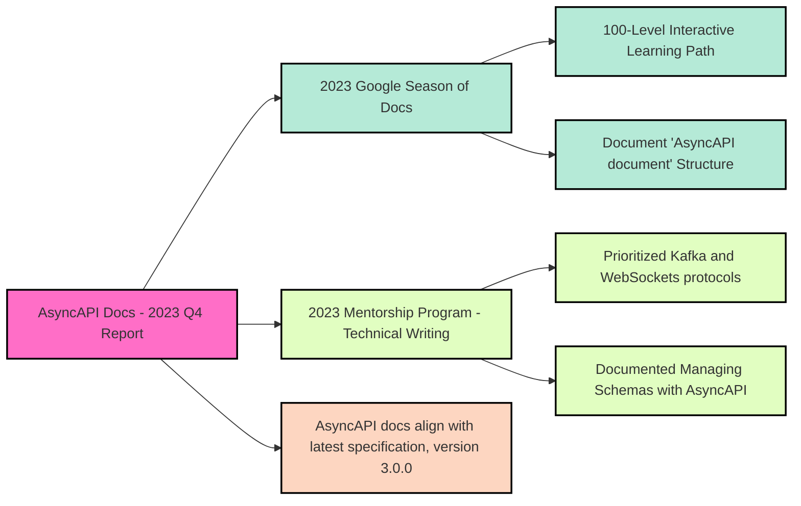

import ContributionNotes from '@/assets/docs/fragments/contribution-notes.md';
import TalkToMe from '@/assets/docs/fragments/talk-to-me.md';

# AsyncAPI Documentation Report - Q4 2023
As a core maintainer of AsyncAPI Docs, I (Quetzalli Writes) volunteer to write periodic updates about the AsyncAPI Docs ecosystem. The goal is to keep the community informed about what's going on in docs and how docs contributors collaborate with other areas in AsyncAPI Initiative.

## Overview
During Q4 2023, AsyncAPI Docs had a total of **19,267 sessions** and **6,447 unique users**. 

The successful contributions from the _2023 Google Season of Docs_ and the _2023 Technical Writing Mentorship Program_, made significant strides in documenting the intricacies of the new Spec 3 and its enhanced features.

### Sessions per `content bucket`:
- `/docs/concepts`: **1,861 sessions** with **286 unique users**.
- `/docs/tutorials`: **5,528 sessions** with **2,139 unique users**.
- `/docs/tools`: **2,492 sessions** with **665 unique users**.
- `/docs/guides`: **523 sessions** with **167 unique users**.
- `/docs/reference`: **6,834 sessions** with **2,629 unique users**.

## Google Season of Docs 2023 (GSoD)
[AsyncAPI was accepted into Google Season of Docs 2023 for two projects](https://developers.google.com/season-of-docs/docs/participants): **documenting the AsyncAPI document in detail** and **create a 100-level interactive learning path**. We received a total budget of $10,350.

### Project 1: AsyncAPI document structure 
Our first identified challenge involved updating the documentation for the structure of an AsyncAPI document to align with the latest specification, version 3.0.0. The new version introduces numerous changes and features, necessitating a revision of the configuration guidelines for AsyncAPI documents. To facilitate easier implementation of Event-Driven Architectures (EDAs), our documentation needs to provide more comprehensive explanations of the different sections within an AsyncAPI document. We've introduced a dedicated `/AsyncAPI-document` subdirectory within the **Concepts** area. That new section delves into the structure of an AsyncAPI document, with each component meticulously detailed on its own page.

### Project 2: Create a 100-level interactive learning path
The second challenge we've addressed is launching a beginner-friendly, 100-level introduction to AsyncAPI. Our new interactive learning path is enhanced with engaging e-characters and a creative storyline, employing creative metaphors to effectively convey technical concepts. That new interactive educational resource will soon be available on our [AsyncAPI Killercoda profile](https://killercoda.com/asyncapi/). To support this initiative, we've established a dedicated repository for interactive learning content at `https://github.com/asyncapi/learning-paths`. 

Our new interactive learning path features a narrative where the [AsyncAPI mascot Eve assists Chan](https://github.com/asyncapi/brand/blob/master/illustrations/eve-and-chan/eve-chan-v2.png) in repairing his spaceship following an unexpected crash in Eve's backyard. Throughout this journey, various API concepts are elucidated using the engaging theme of fixing Chan's spaceship. In _"Module 1: Introduction to AsyncAPI,"_ Chan's spaceship crash lands in Eve's backyard, serving as a backdrop to explore AsyncAPI, its usage, and real-world applications. The story progresses to _"Module 2: Event-Driven Architectures,"_ where Eve examines the spaceship's engine, introducing event-driven systems and their design using AsyncAPI, particularly for microservices. The _"Module 3: AsyncAPI Specification"_ sees Eve helping Chan program his spaceship, delving into the AsyncAPI document structure, including its various components like info, channels, and schemas. The narrative continues with _"Module 4: Creating and Validating AsyncAPI Code and Documents,"_ where Chan returns to his planet to test communications with Eve, focusing on writing, validating, and hands-on exercises for AsyncAPI documents. The journey concludes with Module 5, a summary of the learning outcomes, a teaser about checking AsyncAPI tools, and a link back to the documentation.

## AsyncAPI 2023 Mentorship Program - `technical writing` category
In the AsyncAPI 2023 Mentorship Program, the `technical writing` category started documenting how the Kafka and Websocket protocols work with AsyncAPI. We also detailed different kinds of schemas to manage with AsyncAPI. 

The below table lists sample topics covered: 

| **Kafka with AsyncAPI**| **WebSockets with AsyncAPI** |
|------------------------|------------------------------|
| Create AsyncAPI document for app interacting with Kafka   | Tutorial for WebSockets with AsyncAPI   |
| Kafka Specific Bindings | Tutorial for Request Reply using WebSockets    |

## Spec 3.0 Docs
All AsyncAPI docs now align with the latest specification, version 3.0.0. The new version introduces numerous changes and features, necessitating a complete revision of the docs. The new `request/reply` feature from version 3 has been comprehensively documented, enriching both our **Concepts** and **Tutorials** sections.

## Conclusion
Overall, Q4 showed a period of significant growth and achievement for AsyncAPI Docs. The data speaks volumes: with a total of 19,267 sessions and 6,447 unique users, with primary engagement across the `/tutorials` and `/reference` content buckets. 

We enhanced our documentation to align with Spec 3.0.0, introduced a dedicated `/AsyncAPI-document` subdirectory within the **Concepts** area, and created an innovative, interactive 100-level learning path stand. These additions not only provided in-depth knowledge of the new Spec 3.0.0 but also made learning more engaging and accessible to our community. Moreover, our focused efforts in documenting specific protocols like Kafka and WebSockets under the Mentorship Program further diversified and strengthened our content offerings.

Overall, Q4 2023 was a testament to our commitment to delivering high-quality, relevant, and community-friendly documentation, setting a strong foundation for continued growth and innovation in the coming year.

---

### How to contribute to AsyncAPI Docs
Did you know that you can contribute Docs to AsyncAPI as well?
<ContributionNotes />

#### Talk to me
<TalkToMe />
