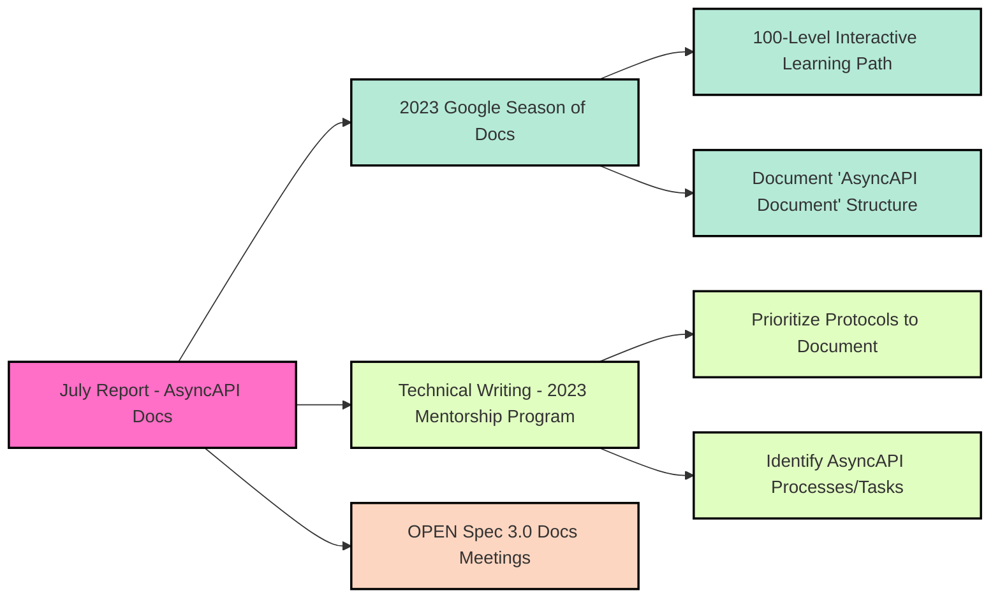

import ContributionNotes from '@/assets/docs/fragments/contribution-notes.md';
import TalkToMe from '@/assets/docs/fragments/talk-to-me.md';

# AsyncAPI Docs Report - July 2023

## Overview
In July 2023, our AsyncAPI documentation continued to flourish, with a total of **7,443 sessions** and **3,895 unique users** recorded. Engagement this month also included **2,345 new users**, further underlining the thriving growth of our docs community.

With the successful continuation of the _2023 Google Season of Docs_ and the _Technical Writing Mentorship Program_, our documentation contributors have made significant strides in understanding the intricacies of the new Spec 3 and its enhanced features.

## 2023 Google Season of Docs
During July, remarkable progress was achieved on [documenting the AsyncAPI document structure](https://github.com/asyncapi/website/issues/1507). Assigned to our diligent Google Season of Docs (GSoD) writers, most sections have already undergone their second draft, and these dedicated writers are actively engaging with core spec contributors to clarify any queries.

Simultaneously, the [create 100-level interactive learning path](https://github.com/asyncapi/website/issues/1520) has been advancing steadily. The [setup of a dedicated AsyncAPI GitHub repository to host with Killercoda](https://github.com/asyncapi/website/issues/1522), marks a significant step towards hosting our interactive learning paths. To ensure inclusivity, the topics to be covered in our 100-level learning path will also be determined through a forthcoming community vote.

## 2023 AsyncAPI Mentorship Program — `Technical Writing` 
Technical writers participating in the 2023 AsyncAPI Mentorship Program are actively engaged in community building, opening a [community vote that successfully identified Kafka and Websocket as the prioritized protocols for this year's scope of work](https://github.com/orgs/asyncapi/discussions/815). 

Diving into detailed research and interactions with diverse community members, our [writers are also researching meticulously the most common AsyncAPI processes/tasks associated with Kafka and Websocket](https://github.com/orgs/asyncapi/discussions/814).

## Join `OPEN` Spec 3.0 Docs Meetings
Calling out to all members of the AsyncAPI community! Our efforts to bolster **Spec 3.0 documentation** continues with a series of community meetings. These biweekly gatherings, scheduled for Thursdays at 14:30 UTC, provide an open forum for enthusiastic contributors and inquisitive minds.

Whether you're passionate about contributing to Spec 3.0 docs or seeking clarifications, these meetings are the conduit to connect and collaborate with the expertise of our spec contributors. A special invitation is extended to the participants of the GSoD and Mentorship Program, ensuring their contributions seamlessly align with the evolution of Spec 3.0.

### Watch July Spec 3.0 Docs Meetings
For those who missed our July meetings, you can revisit these sessions on the AsyncAPI YouTube channel. 

#### July 6th 2023 (Spec 3.0 Docs Meeting)
<YouTube id="Lunp8eSLONc" />

#### July 20th 2023 (Spec 3.0 Docs Meeting)
<YouTube id="a2luTxpmkfs" />

## AsyncAPI Docs - July Summary
In July 2023, the AsyncAPI documentation community experienced steady engagement, with a total of 7,443 sessions and 3,895 unique users. The concurrent progress of the _2023 Google Season of Docs_ and the _Technical Writing Mentorship Program_ highlighted the writers' dedication to understanding the intricacies of the new Spec 3 and its advanced functionalities.

During this period, the Google Season of Docs (GSoD) writers made substantial strides in their assigned projects. Additionally, the "create 100-level interactive learning path" project gained momentum as the writers set up a dedicated GitHub repository for hosting our interactive learning paths with Killercoda. 

The 2023 AsyncAPI Mentorship Program writers delved into meticulous research and community interactions, aiming to comprehensively capture common AsyncAPI processes and tasks associated with our selected protocols. 

Meanwhile, the OPEN Spec 3.0 Docs Meetings continued to serve as a platform for fostering docs collaboration. With biweekly gatherings scheduled on Thursdays at 14:30 UTC, these meetings provide an opportunity for contributors to engage with expert spec contributors, aligning their contributions seamlessly with the evolution of Spec 3.0. Those who missed the July Spec 3.0 Docs Meetings could easily catch up by accessing the recordings on the AsyncAPI YouTube channel. 

---

### How to contribute to AsyncAPI Docs
Did you know that you can contribute Docs to AsyncAPI as well?
<ContributionNotes />

#### Talk to me
<TalkToMe />