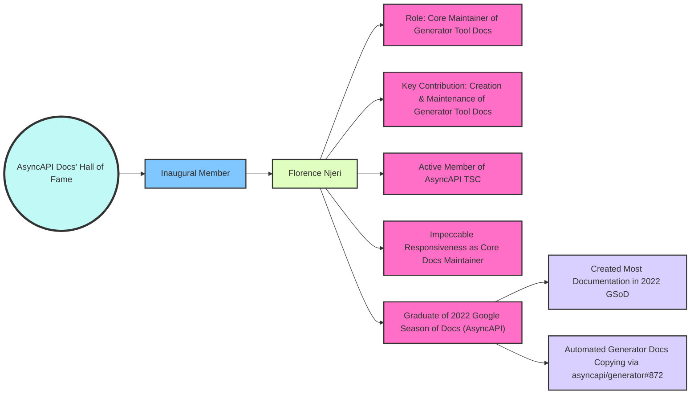
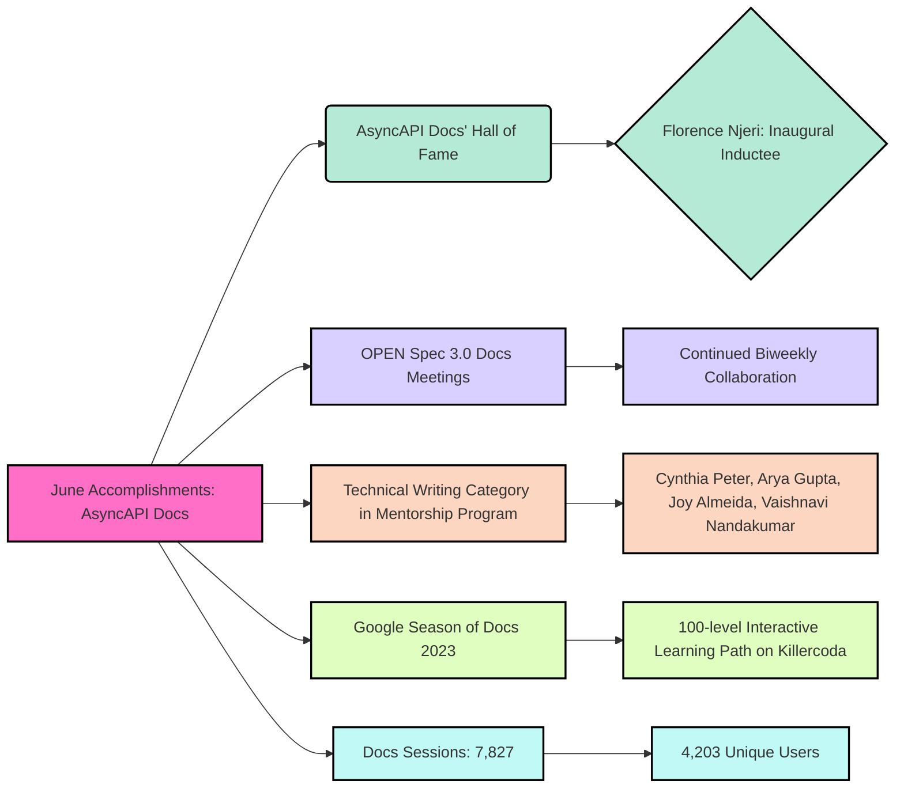

import ContributionNotes from '@/assets/docs/fragments/contribution-notes.md';
import TalkToMe from '@/assets/docs/fragments/talk-to-me.md';

# AsyncAPI Docs Report - June 2023
In June 2023, the AsyncAPI documentation had **7,827 sessions** and **4,203 unique users**, including **2,566 new users**, showing consistent engagement within our vibrant docs community. 

Adding to this excitement was the kick-off of both the _2023 Google Season of Docs_ and _Technical Writing Mentorship Program_ projects, further expanding our bustling docs community.

## Google Season of Docs 2023 Update: AsyncAPI Projects
As of June, our Google Season of Docs (GSoD) writers have been diligently working on tasks from the [cover AsyncAPI document sections in detail](https://github.com/asyncapi/website/issues/1507) project. Most have completed initial drafts for their first documents, and some are already diving into their second. A select few have gone above and beyond, arranging discussions with core spec contributors to clarify questions on their docs pull requests.

Meanwhile, progress on the [create 100-level interactive learning path](https://github.com/asyncapi/website/issues/1520) project continues. We've concluded the [community vote on our host platform for AsyncAPI Interactive Learning Paths](https://github.com/orgs/asyncapi/discussions/711), with [Killercoda](https://killercoda.com) securing the majority of votes. Consequently, our writers are now fully geared towards crafting the 2023 GSoD Learning Path on the Killercoda platform. Once developed, we can repurpose this content to also share on the Linux Foundation platform.

> **Note:** For clarity, the 2023 GSoD focus lies solely on implementation on one platform—Killercoda. Any potential addition of the content to the Linux Foundation platform is a separate task, not included in the 2023 GSoD writers' obligations.

## Introducing a `Technical Writing` Category in 2023 AsyncAPI Mentorship Program
In our quest to continually enhance the AsyncAPI Mentorship Program, we're excited to announce the inclusion of a `Technical Writing` category in our 2023 edition. For 2023, the selected technical writers will document how various protocols _(i.e., Kafka, Websocket, MQTT, etc.)_ work with the AsyncAPI specification.

We're delighted to welcome and congratulate our accepted writers into this year's program - [Cynthia Peter](https://github.com/CynthiaPeter), [Arya Gupta](https://github.com/Arya-Gupta), [Joy Almeida](https://github.com/J0SAL), and [Vaishnavi Nandakumar](https://github.com/VaishnaviNandakumar). Their remarkable skills and passion shone through during a rigorous selection process, earning them their well-deserved places in our 2023 Technical Writing Mentorship Program.

## Join our `OPEN` Spec 3.0 Docs Meetings
Calling all AsyncAPI community members! We're continuing our series of **Spec 3.0 documentation** community meetings, happening **biweekly on Thursdays at 14:30 UTC**.

Whether you're eager to contribute to Spec 3.0 docs, or you have questions that need answers, these open meetings are your gateway to connect and collaborate with our expert spec contributors. We especially encourage our GSoD and Mentorship Program writers to attend so as to ensure that their contributions align flawlessly with Spec 3.0.

### Missed our June Meetings?
No worries! You can watch the previous June **Spec 3.0 documentation** community meetings on the AsyncAPI YouTube channel.

<YouTube id="dRu9itGfJ1E" />

## AsyncAPI Docs' Hall of Fame - Welcoming Florence Njeri
We're delighted to introduce the ⭐ **AsyncAPI Docs' Hall of Fame** ⭐ to our monthly AsyncAPI Docs reports; a place to feature particularly exceptional and dedicated technical writing maintainers and contributors! 

A hearty congratulations to [Florence Njeri](https://github.com/Florence-Njeri), our inaugural inductee and exceptional docs contributor for June. Florence, an active TSC member, excels in her meticulous maintenance of the [Generator Tool documentation](https://www.asyncapi.com/docs/tools/generator). Her consistent, flawless, and timely contributions have made her an invaluable asset to our community.

Florence, a Kenyan 🇰🇪 engineer, emerged from the 2022 Google Season of Docs with AsyncAPI, focusing on Generator Tool docs. Of the six writers from 2022 GSoD, she distinguished herself by **crafting the most documentation** and **automating the copying of docs from the `/generator` repo to the `/website` repo** via [asyncapi/generator#872](https://github.com/asyncapi/generator/pull/872).

## AsyncAPI Docs - June Summary
June 2023 was a pivotal month for AsyncAPI's vibrant documentation community. The month marked the introduction of our **AsyncAPI Docs' Hall of Fame**, with [Florence Njeri](https://github.com/Florence-Njeri) being the inaugural inductee for her exceptional contribution. We've also unveiled the **`Technical Writing`** category as part of our 2023 Mentorship Program, welcoming Cynthia Peter, Arya Gupta, Joy Almeida, and Vaishnavi Nandakumar.

In our ongoing series of **`OPEN` Spec 3.0 Docs Meetings**, held biweekly, we continued to foster collaboration and knowledge-sharing. Our Google Season of Docs (GSoD) 2023 witnessed significant progress, with writers focusing on creating a 100-level interactive learning path on the Killercoda platform. The website sessions for June were at **7,827** with **4,203 unique users**, indicating a healthy and growing engagement.

Congratulations to all members for this productive month, and let's continue this momentum moving forward!

---

### How to contribute to AsyncAPI Docs
Did you know that you can contribute Docs to AsyncAPI as well?
<ContributionNotes />

#### Talk to me
<TalkToMe />
