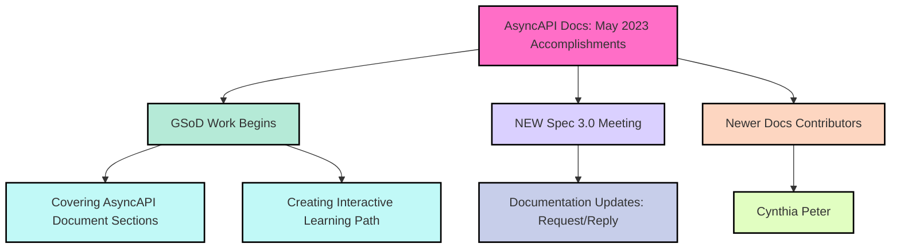

import ContributionNotes from '@/assets/docs/fragments/contribution-notes.md';
import TalkToMe from '@/assets/docs/fragments/talk-to-me.md';

# AsyncAPI Docs Report - May 2023
In May 2023, the AsyncAPI documentation had **9,453 sessions** and **4,876 unique users**, including **2,895 new users**, highlighting the increasing interest and engagement within our vibrant docs community. May was a busy month in our expanding docs community!

## Google Season of Docs 2023 (GSoD) at AsyncAPI
We are thrilled to have started working with this year's selected technical writing candidates for the 2023 Google Season of Docs (GSoD) at AsyncAPI: [Mahfuza](https://github.com/mhmohona), [Bhaswati](https://github.com/BhaswatiRoy), [Rohit](https://github.com/TRohit20), and [Hridyesh](https://github.com/kakabisht). This year, all GSoD interns will get the opportunity to work on both GSoD projects: [cover AsyncAPI document sections in detail](https://github.com/asyncapi/website/issues/1507) and [create 100-level interactive learning path](https://github.com/asyncapi/website/issues/1520). 

Additionally, our GSoD interns have started a [community vote to select our host platform for AsyncAPI Interactive Learning Paths](https://github.com/orgs/asyncapi/discussions/711). You are cordially invited to participate in the vote and share your thoughts, as your feedback plays a vital role in shaping the future of our interactive learning experience.

## NEW Spec 3.0 Docs Meeting - `OPEN`
Attention, AsyncAPI community members! We are excited to announce a new `OPEN` meeting dedicated to **Spec 3.0 documentation**. In this meeting, we will have the privilege of hosting Spec 3.0 Subject Matter Experts (SMEs), including the esteemed Jonas Lagoni, who will provide essential background context. If you are interested in contributing to Spec 3.0 docs or have any questions, this is the perfect opportunity to join and engage with our knowledgeable experts. We also encourage our GSoD interns to attend these meetings to ensure their new docs align seamlessly with Spec 3.0.

Mark your calendars! We are planning to hold the first meeting on June 15, 2023, at 02:30 UTC. Stay tuned for further updates and details!

Additionally, we want to highlight an upcoming change in the Spec 3.0 release that will require documentation updates. The [Request/reply](https://github.com/asyncapi/spec/pull/847) feature is among the first to undergo these updates. Keep an eye out for further information and ensure your familiarity with this important change.

Thank you for your active participation and dedication to advancing the AsyncAPI ecosystem. Let's strive for excellence in our Spec 3.0 documentation!

## Contributor Growth
We are thrilled to share the exciting news of welcoming a new contributor to our documentation community! Please join us in extending a warm welcome to [Cynthia Peter](https://github.com/CynthiaPeter)! Cynthia is eager to enhance her technical writing skills and contribute to the growth of the AsyncAPI documentation.

To start her journey, Cynthia will be working on her first task, which involves completing the [*AsyncAPI Docs Style Guide* Glossary task](https://github.com/asyncapi/website/issues/1294). Once she successfully completes this task, we will swiftly onboard her with a Spec 3.0-related assignment. We are excited to see her skills flourish and her valuable contributions to the documentation.

Let's celebrate Cynthia's arrival and support her as she embarks on this rewarding endeavor. Together, we will continue to elevate the quality and accessibility of the AsyncAPI documentation.

## Conclusion
May witnessed another remarkable increase in sessions with a total of 9,453 community members exploring our docs. Welcoming 2,895 new docs readers to our community further demonstrates the expanding interest in AsyncAPI.

We are grateful for the dedication and contributions of our community members, both new and existing, who have played a pivotal role in this progress. The enthusiasm and support from our community continue to inspire us to provide high-quality documentation, and we appreciate the trust you place in us.

Furthermore, we are excited about the future endeavors and collaborations within the AsyncAPI ecosystem. The selected technical writing candidates for the 2023 Google Season of Docs (GSoD) program, along with their projects, promise to bring further enhancements to our documentation. Additionally, the community vote for the host platform of AsyncAPI Interactive Learning Paths empowers our community members to shape the future of our learning experience.

---

## How to contribute to AsyncAPI Docs
Did you know that you can contribute Docs to AsyncAPI as well?
<ContributionNotes />

### Talk to me
<TalkToMe />
