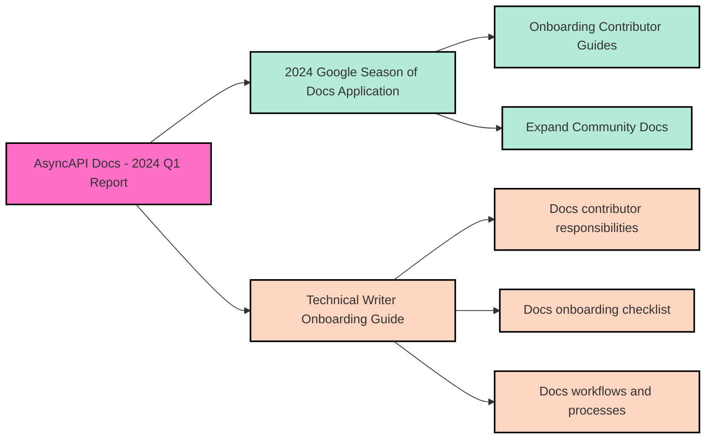

# AsyncAPI Documentation Report - Q1 2024
As a core maintainer of AsyncAPI Docs, I (Quetzalli Writes) volunteer to write periodic updates about the AsyncAPI Docs ecosystem. The goal is to keep the community informed about what's going on in docs and how docs contributors collaborate with other areas in AsyncAPI Initiative.

## Overview
During Q1 2024, AsyncAPI Docs had a total of **26,923 sessions** and **8,128 unique users**. Our tutorials content bucket garnered the highest visitor count, indicating strong engagement. Additionally, our newer content bucket for migrations attracted a notable influx of new users, showcasing promising growth.

| Content Bucket   | Sessions | Unique Users |
|------------------|----------|--------------|
| `/docs/concepts` | 4,700    | 838   |
| `/docs/tutorials`| 8,204    | 3,171 |
| `/docs/tools`    | 3,982    | 991   |
| `/docs/guides`   | 909      | 254   |
| `/docs/reference`| 6,348    | 1,991 |
| `/docs/migration`| 487      | 122   |

Presented below are the analytics for documentation sections developed during the 2023 Google Season of Docs (GSoD), spanning from December 1, 2023, to March 25, 2024:

| 2023 GSoD projects | Sessions      | New Users         |
|---------------|---------------|-------------------|
|`concepts/asyncapi-document`              | 2,653 | 449  |
|`tutorials/getting-started/request-reply` | 455   | 109  |

## Top Searches: Algolia Analytics
We've identified the most popular searches within the AsyncAPI documentation, as tracked by our Algolia analytics. `Kafka` and `WebSocket` are amongst the most frequently searched terms in our documentation. 

Here are the top 15 queries: 

| Rank | Search Query  | Number of Queries |
|------|---------------|-------------------|
| 1    | oneof         | 57                |
| 2    | array         | 56                |
| 3    | kafka         | 55                |
| 4    | websocket     | 41                |
| 5    | enum          | 36                |
| 6    | type          | 35                |
| 7    | example       | 35                |
| 8    | operation     | 33                |
| 9    | avro          | 33                |
| 10   | allof         | 31                |
| 11   | schema        | 30                |
| 12   | payload       | 29                |
| 13   | bindings      | 28                |
| 14   | operations    | 26                |
| 15   | format        | 26                |

## 2024 Google Season of Docs: Application
Our documentation lacks a persona-driven journey for diverse roles, such as documentation contributors, code contributors, ambassadors, maintainers, etc. Consequently, the AsyncAPI onboarding experience is not as efficient as it could be for new contributors, often resulting in onboarding calls being perceived as bottlenecks. To address this issue, [AsyncAPI has submitted an application for 2024 Google Season of Docs](https://github.com/orgs/asyncapi/discussions/1136) that proposes two projects: `Onboarding Contributor Guides` and `Expand Community Docs`. 

We have also created a new [AsyncAPI Slack channel named `#temp-gsod-2024`](https://www.asyncapi.com/slack-invite) that anyone can join for:
- Mentees identification
- Mentors identification
- Ideas identification
- Mentees, ideas, and mentors matching

> _NOTE: Google will publish the list of accepted organizations on April 10, 2024, at 18:00 UTC. Stay tuned for updates!_

## Technical Writer Onboarding Guide
In our efforts to automate the onboarding process for new documentation contributors at AsyncAPI, we've created the [AsyncAPI Technical Writer Onboarding Guide and Checklist](https://github.com/asyncapi/community/blob/master/docs/onboarding-guide). The guide is designed to empower new community members with the necessary knowledge and skills to contribute effectively to our documentation. We also believe this guide will encourage greater participation.

Outlined in this guide are various workflows and processes, including:
- Responsibilities of technical writer contributors
- Onboarding checklist for technical writers
- Prerequisite knowledge required
- Overview of the AsyncAPI docs community
- Setup and tools necessary for documentation contributions
- Steps to open documentation pull requests
- Guidelines for creating new documentation directories
- Etc.

## Conclusion
Overall, Q1 showcased continued progress and engagement for AsyncAPI documentation. The documentation witnessed a total of **26,923 sessions** and **8,128 unique users**, indicating consistent interest in our resources. Notably, our Algolia analytics revealed that `Kafka` and `WebSocket` emerged as the most sought-after topics within our documentation, shedding light on key areas of interest for our users.

Furthermore, we're excited to announce that AsyncAPI has submitted an application for the 2024 Google Season of Docs. Our proposal outlines two impactful projects: `Onboarding Contributor Guides` and `Expand Community Docs`. These initiatives aim to streamline the onboarding process for new contributors and enhance our community documentation, fostering greater collaboration and knowledge-sharing within the AsyncAPI community.

---

## Contribute to AsyncAPI Documentation

To get started as a docs contributor, follow the steps in the [AsyncAPI Technical Writer Onboarding Checklist](https://github.com/asyncapi/community/blob/master/docs/onboarding-guide/docs-onboarding-checklist.md).