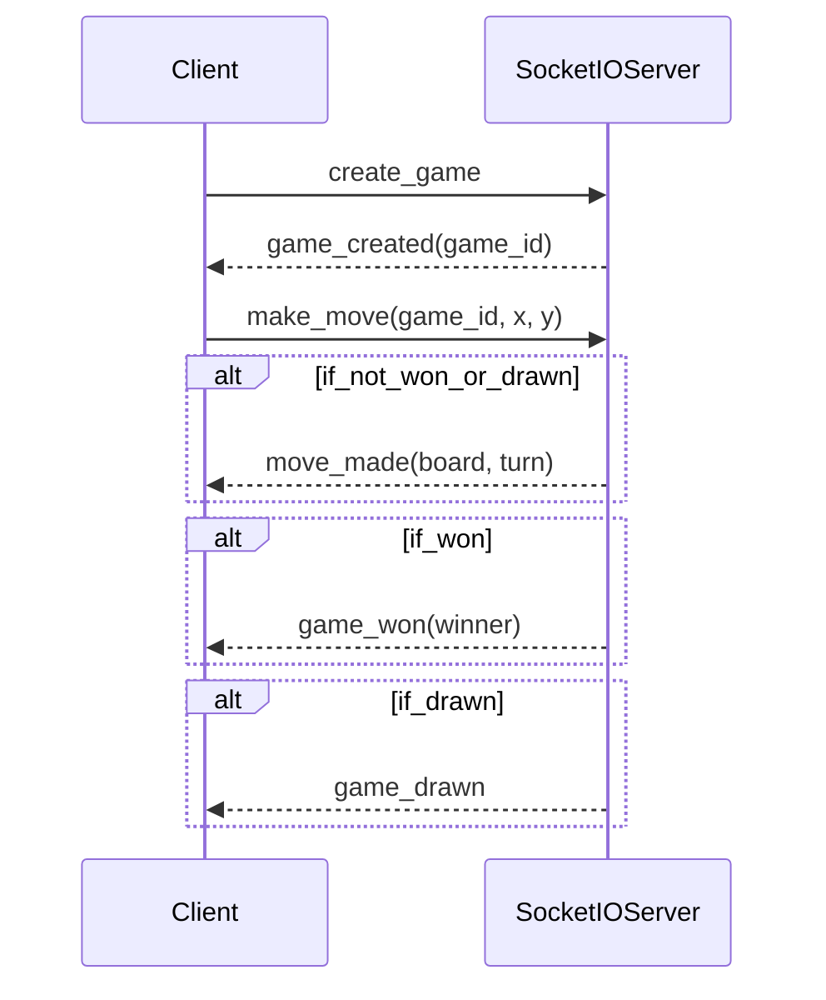

## What is Flask-SocketIO, SocketIO?
If you are reading this blog, you are probably already familiar with SocketIO [python-socketio](https://github.com/miguelgrinberg/python-socketio) and [Flask-SocketIO](https://flask-socketio.readthedocs.io/en/latest/). If you want to learn more about them, please check the following resources:
 - https://socket.io/docs/v4/
 - https://www.asyncapi.com/blog/socketio-part1
 - https://www.asyncapi.com/blog/socketio-part2

## The problem
Imagine that you are working on a large project that uses a Flask-SocketIO server to handle real-time communication between the client and the server. The server was originally well-documented, but over time the documentation has become out of date as the server has evolved and new features have been added.

I found myself in the same situation. I needed to maintain and constantly add more documentation to a Flask-SocketIO server. To make this process more efficient, I sought a solution to automate documentation generation from the existing codebase. This would eliminate the need for team members to manually edit the AsyncAPI specification file every time there was a change, a challenging task for those unfamiliar with AsyncAPI. By automating this process, we could save time and reduce the workload for the team.

To address this issue, I decided to implement SIO-AsyncAPI. This tool allows you to generate an AsyncAPI specification from your SocketIO server and validate incoming and outgoing messages against it. This functionality is similar to how FastAPI, Flask-RESTful, and other frameworks have long provided it for RESTful servers. Now, with [SIO-AsyncAPI](https://github.com/daler-rahimov/sio-asyncapi), it is possible to apply this approach to SocketIO servers as well.

## How to use SIO-AsyncAPI
Instead of giving you a detailed, step-by-step guide, we'll use a more exciting approach. We'll take the existing Flask-SocketIO server and add SIO-AsyncAPI. To make things even more interesting, we'll ask [ChatGPT](https://chat.openai.com/chat) to generate a server for us and use it as a real-world Flask-SocketIO server.

### Generate a Flask-SocketIO server
I had to ask ChatGPT for multiple alterations to get the desired result. Here are my queries to ChatGPT:

>- create python flask-socket server that provides tic tac toe game api
>- change previous code and add type hints
>- for previous example use pydantic models instead of dictionaries

And here is the final code that ChatGPT generated for us:

```python
from typing import List, Union

from flask import Flask
from flask_socketio import SocketIO, emit
from pydantic import BaseModel

app = Flask(__name__)
socketio = SocketIO(app)

games: dict[int, 'Game'] = {}

class Game(BaseModel):
    board: List[List[str]]
    turn: str

class MakeMoveData(BaseModel):
    game_id: int
    x: int
    y: int

@socketio.on('create_game')
def create_game() -> None:
    # Create a new game and add it to the list of games
    game_id = len(games) + 1
    games[game_id] = Game(board=[['' for _ in range(3)] for _ in range(3)], turn='X')

    # Send the game id to the client
    emit('game_created', {'game_id': game_id})

@socketio.on('make_move')
def make_move(data: MakeMoveData) -> None:
    # Get the game and make the move
    game = games[data.game_id]
    board = game.board
    turn = game.turn
    board[data.x][data.y] = turn

    # Check for a win or draw
    result = check_game_status(board)

    # Update the game state and send it to the client
    if result == 'X':
        emit('game_won', {'winner': 'X'})
    elif result == 'O':
        emit('game_won', {'winner': 'O'})
    elif result == 'draw':
        emit('game_drawn', {})
    else:
        games[data.game_id] = Game(board=board, turn='O' if turn == 'X' else 'X')
        emit('move_made', {'board': board, 'turn': game.turn})

def check_game_status(board: List[List[str]]) -> Union[str, None]:
    # Check for a win or draw
    for i in range(3):
        if board[i] == ['X', 'X', 'X']:
            return 'X'
        if board[i] == ['O', 'O', 'O']:
            return 'O'
    if all(board[i][i] == 'X' for i in range(3)):
        return 'X'
    if all(board[i][i] == 'O' for i in range(3)):
        return 'O'
    if all(board[i][j] != '' for i in range(3) for j in range(3)):
        return 'draw'
    return None


if __name__ == '__main__':
    socketio.run(app, debug=True)

```

It's not quite correct (e.g. data in `make_move` will be passed as a dictionary, not a Pydantic model), but it's good enough for our purposes.

### Generate Mermaid diagram
Now let's ask ChatGPT to generate a Mermaid diagram for us as well, so we can get a better illustration of our server:

>- create mermaid diagram for previous example

I had to alter the given diagram a bit, but here is the final result:




### Add SIO-AsyncAPI to the server

Now let's imagine that this is our old server written in Flask-SocketIO and we want to add SIO-AsyncAPI. Here is how we would do it:

1. Install SIO-AsyncAPI via `pip install sio-asyncapi`
2. Change import statements
```python
# instead of `from flask_socketio import SocketIO`
from sio_asyncapi import AsyncAPISocketIO as SocketIO
```
3. Add an additional argument to the `AsyncAPISocketIO` constructor
```python
socketio = SocketIO(
    app,
    validate=True,
    generate_docs=True,
    version="1.0.0",
    title="Tic-Tac-Toe API",
    description="Tic-Tac-Toe Game API",
    server_url="http://localhost:5000",
    server_name="TIC_TAC_TOE_BACKEND",
)
```
5. Tell the `@socketio.on` decorator to get models from the type hint.
> Note: you can also pass `request_model` and `response_model` arguments to the `@socketio.on` decorator instead of using type hints.
```python
@socketio.on('make_move', get_from_typehint=True)
```
Now type annotations will be used to generate the AsyncAPI specification and validate incoming/outgoing messages. Note that the return value from a function is not data sent by the `emit` function but rather the `acknowledge` value that the client receives.

6. Add an `on_emit` decorator to register/document a SocketIO emit event. Since we are not defining `emit` function ourselves but only calling it, we need to tell SIO-AsyncAPI what to expect when `emit` is called. E.g
```python
class GameCreatedData(BaseModel):
    game_id: int

@socketio.doc_emit('game_created', GameCreatedData)
@socketio.on('create_game')
def create_game():
  ...
    emit('game_created', {'game_id': game_id})
```

### Get AsyncAPI specification
Now we can get the AsyncAPI specification by calling the `socketio.asyncapi_doc.get_yaml()` function. Here is what the rendered specification looks like:


### Validation and Error handling
SIO-AsyncAPI will automatically validate incoming and outgoing messages. If a message is invalid, it will raise one of these 3 exceptions: `EmitValidationError`, `RequestValidationError`, or `ResponseValidationError`.

Flask-SocketIO has the `@socketio.on_error_default` decorator for default error handling that we can use. E.g.:
```python
@socketio.on_error_default
def default_error_handler(e: Exception):
    """
    Default error handler. It is called if no other error handler is defined.
    Handles RequestValidationError, EmitValidationError, and ResponseValidationError errors.
    """
    if isinstance(e, RequestValidationError):
        logger.error(f"Request validation error: {e}")
        return {'error': str(e)}
    elif isinstance(e, ResponseValidationError):
        logger.critical(f"Response validation error: {e}")
        raise e
    if isinstance(e, EmitValidationError):
        logger.critical(f"Emit validation error: {e}")
        raise e
    else:
        logger.critical(f"Unknown error: {e}")
        raise e
```
Instead of re-raising exceptions, we can return some error interpreted as an `acknowledge` value sent to the client. That's what we do in the example above when there is a `RequestValidationError`.

This is how it looks like in FireCamp if we do not provide `game_id` in the `make_move` request:


Because the `make_move` request may return an error in the acknowledged value now, we should add a new `MakeMoveAckData` model and annotate the `make_move` function accordingly. This will automatically update the documentation in our AsyncAPI specification.
```python
class MakeMoveAckData(BaseModel):
    error: Optional[str] = Field(None, description='The error message', example='Invalid move')

...
@socketio.on('make_move', get_from_typehint=True)
def make_move(data: MakeMoveData) -> MakeMoveAckData:
  ...
```

### Final Code and Specification
Here is the final code of the server. I also added examples to Pydantic models to make the specification more readable.
```python
import pathlib
from typing import List, Union, Optional

from flask import Flask
from flask_socketio import emit
from pydantic import BaseModel, Field
from loguru import logger

from sio_asyncapi import AsyncAPISocketIO as SocketIO
from sio_asyncapi import (EmitValidationError, RequestValidationError,
                          ResponseValidationError)

app = Flask(__name__)

socketio = SocketIO(
    app,
    validate=True,
    generate_docs=True,
    version="1.0.0",
    title="Tic-Tac-Toe API",
    description="Tic-Tac-Toe Game API",
    server_url="http://localhost:5000",
    server_name="TIC_TAC_TOE_BACKEND",
)

games: dict[int, 'Game'] = {}


class Game(BaseModel):
    board: List[List[str]] = Field(..., description='The game board', example=[
                                   ['X', 'O', ''], ['', 'X', ''], ['', '', 'O']])
    turn: str = Field(..., description='The current turn', example='X')


class MakeMoveData(BaseModel):
    game_id: int = Field(..., description='The game id', example=1)
    x: int = Field(..., description='The x coordinate', example=0)
    y: int = Field(..., description='The y coordinate', example=0)


class GameCreatedData(BaseModel):
    game_id: int = Field(..., description='The game id', example=1)


class GameWonData(BaseModel):
    winner: str = Field(..., description='The winner', example='X')


class GameDrawnData(BaseModel):
    pass


class MoveMadeData(BaseModel):
    board: List[List[str]] = Field(..., description='The game board', example=[
                                   ['X', 'O', ''], ['', 'X', ''], ['', '', 'O']])
    turn: str = Field(..., description='The current turn', example='X')

class MakeMoveAckData(BaseModel):
    error: Optional[str] = Field(None, description='The error message', example='Invalid move')

@socketio.doc_emit('game_created', GameCreatedData)
@socketio.on('create_game')
def create_game():
    # Create a new game and add it to the list of games
    game_id = len(games) + 1
    games[game_id] = Game(board=[['' for _ in range(3)] for _ in range(3)], turn='X')

    # Send the game id to the client
    emit('game_created', {'game_id': game_id})

@socketio.doc_emit('game_won', GameWonData)
@socketio.doc_emit('game_drawn', GameDrawnData)
@socketio.doc_emit('move_made', MoveMadeData)
@socketio.on('make_move', get_from_typehint=True)
def make_move(data: MakeMoveData) -> MakeMoveAckData:
    # Get the game and make the move
    logger.info(f'Making move {data}')
    game = games[data.game_id]
    board = game.board
    turn = game.turn
    board[data.x][data.y] = turn

    # Check for a win or draw
    result = check_game_status(board)

    logger.info(f'Game result: {result}')
    # Update the game state and send it to the client
    if result == 'X':
        emit('game_won', {'winner': 'X'})
    elif result == 'O':
        emit('game_won', {'winner': 'O'})
    elif result == 'draw':
        emit('game_drawn', {})
    else:
        games[data.game_id] = Game(board=board, turn='O' if turn == 'X' else 'X')
        emit('move_made', {'board': board, 'turn': game.turn})

def check_game_status(board: List[List[str]]) -> Union[str, None]:
    # Check for a win or draw
    for i in range(3):
        if board[i] == ['X', 'X', 'X']:
            return 'X'
        if board[i] == ['O', 'O', 'O']:
            return 'O'
    if all(board[i][i] == 'X' for i in range(3)):
        return 'X'
    if all(board[i][i] == 'O' for i in range(3)):
        return 'O'
    if all(board[i][j] != '' for i in range(3) for j in range(3)):
        return 'draw'
    return None

@socketio.on_error_default
def default_error_handler(e: Exception):
    """
    default error handler. it called if no other error handler defined.
    handles requestvalidationerror, emitvalidationerror and responsevalidationerror errors.
    """
    if isinstance(e, RequestValidationError):
        logger.error(f"request validation error: {e}")
        return {'error': str(e)}
    elif isinstance(e, ResponseValidationError):
        logger.critical(f"response validation error: {e}")
        raise e
    if isinstance(e, EmitValidationError):
        logger.critical(f"emit validation error: {e}")
        raise e
    else:
        logger.critical(f"unknown error: {e}")
        raise e

if __name__ == '__main__':
    # generate the asyncapi doc
    path = pathlib.Path(__file__).parent / "chat_gpt_asyncapi.yaml"
    doc_str = socketio.asyncapi_doc.get_yaml()
    with open(path, "w") as f:
        # doc_str = spec.get_json_str_doc()
        f.write(doc_str)
    # run the app
    socketio.run(app, debug=True)

```

And here is the auto generated specification:
```yaml
asyncapi: 2.5.0
channels:
  /:
    publish:
      message:
        oneOf:
        - $ref: '#/components/messages/Create_Game'
        - $ref: '#/components/messages/Make_Move'
    subscribe:
      message:
        oneOf:
        - $ref: '#/components/messages/game_created'
        - $ref: '#/components/messages/move_made'
        - $ref: '#/components/messages/game_drawn'
        - $ref: '#/components/messages/game_won'
    x-handlers:
      disconnect: disconnect
components:
  messages:
    Create_Game:
      description: ''
      name: create_game
    Make_Move:
      description: ''
      name: make_move
      payload:
        $ref: '#/components/schemas/MakeMoveData'
        deprecated: false
      x-ack:
        properties:
          error:
            description: The error message
            example: Invalid move
            title: Error
            type: string
        title: MakeMoveAckData
        type: object
    game_created:
      description: ''
      name: game_created
      payload:
        $ref: '#/components/schemas/GameCreatedData'
        deprecated: false
    game_drawn:
      description: ''
      name: game_drawn
      payload:
        $ref: '#/components/schemas/GameDrawnData'
        deprecated: false
    game_won:
      description: ''
      name: game_won
      payload:
        $ref: '#/components/schemas/GameWonData'
        deprecated: false
    move_made:
      description: ''
      name: move_made
      payload:
        $ref: '#/components/schemas/MoveMadeData'
        deprecated: false
  schemas:
    GameCreatedData:
      properties:
        game_id:
          description: The game id
          example: 1
          title: Game Id
          type: integer
      required:
      - game_id
      title: GameCreatedData
      type: object
    GameDrawnData:
      properties: {}
      title: GameDrawnData
      type: object
    GameWonData:
      properties:
        winner:
          description: The winner
          example: X
          title: Winner
          type: string
      required:
      - winner
      title: GameWonData
      type: object
    MakeMoveAckData:
      properties:
        error:
          description: The error message
          example: Invalid move
          title: Error
          type: string
      title: MakeMoveAckData
      type: object
    MakeMoveData:
      properties:
        game_id:
          description: The game id
          example: 1
          title: Game Id
          type: integer
        x:
          description: The x coordinate
          example: 0
          title: X
          type: integer
        y:
          description: The y coordinate
          example: 0
          title: Y
          type: integer
      required:
      - game_id
      - x
      - y
      title: MakeMoveData
      type: object
    MoveMadeData:
      properties:
        board:
          description: The game board
          example:
          - - X
            - O
            - ''
          - - ''
            - X
            - ''
          - - ''
            - ''
            - O
          items:
            items:
              type: string
            type: array
          title: Board
          type: array
        turn:
          description: The current turn
          example: X
          title: Turn
          type: string
      required:
      - board
      - turn
      title: MoveMadeData
      type: object
    NoSpec:
      deprecated: false
      description: Specification is not provided
info:
  description: 'Tic-Tac-Toe Game API

    <br/> AsyncAPI currently does not support Socket.IO binding and Web Socket like
    syntax used for now.

    In order to add support for Socket.IO ACK value, AsyncAPI is extended with with
    x-ack keyword.

    This documentation should **NOT** be used for generating code due to these limitations.

    '
  title: Tic-Tac-Toe API
  version: 1.0.0
servers:
  TIC_TAC_TOE_BACKEND:
    protocol: socketio
    url: http://localhost:5000
```


> Cover image by <a href="https://images.pexels.com/photos/3608056/pexels-photo-3608056.jpeg?auto=compress&cs=tinysrgb&w=1260&h=750&dpr=1">Windmills During Dawn</a> from <a href="https://www.pexels.com/photo">Unsplash</a>
