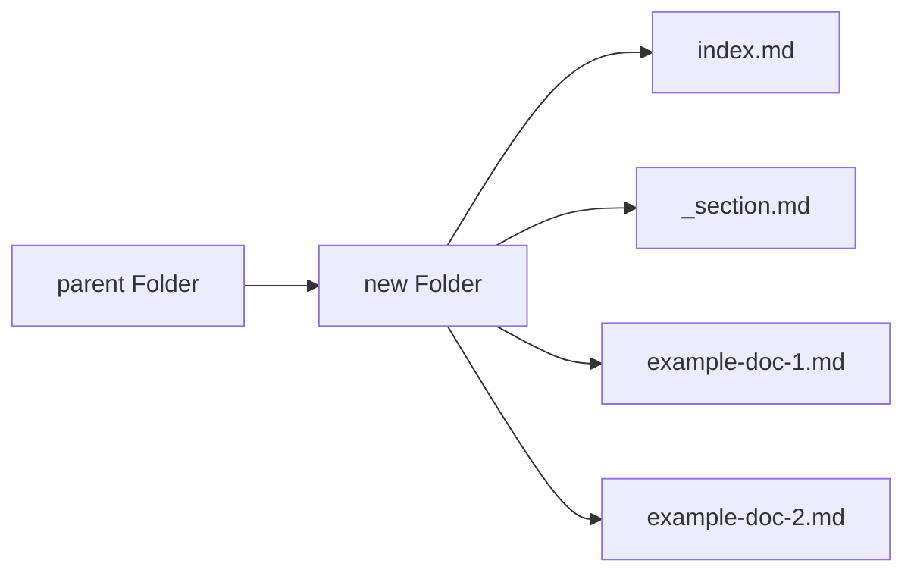

### Create new docs directories
Create a new docs directory (folder) via the following steps:
1. Identify the content bucket under which your document falls.
2. Open the project locally in your code editor of choice and navigate to the parent folder.
3. Right-click on the parent folder and click "new folder".
4. Give an appropriate name to the new folder.
5. Add the following two files to the new folder:
    1. `index.md`: Used as the main content for a website's directory or specific webpage. It's named index because many web servers are configured to automatically look for an index file when accessing a directory. When you access a directory on a web server, if an `index.md` file is present, it will be displayed as the default page for that directory.
    2. `_section.md`: Used for reusable components or partial content within a website's structure. It defines the page's `title` and `weight`. The title defines a human-readable title, and weight controls the order in which sections (directories) are displayed.
6. You can edit the index page after successfully creating these pages. 

