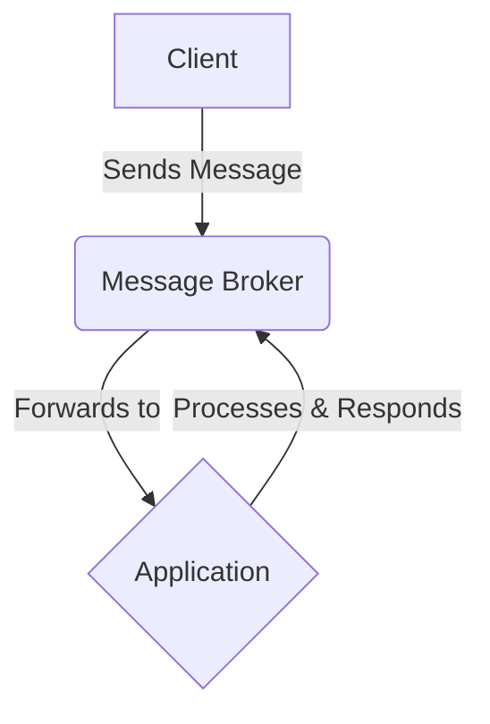

# Styling Guidelines

## CSS Code Style

### CSS Declarations
A declaration is a single CSS instruction composed of a property-value pair. It is the core function of CSS.
A property is an identifier for the feature to be styled (e.g., `color`). A value is a description of how the feature should be handled (e.g., `red`).

The property and value are separated by a colon (`:`).

**Example** `color: red;`

### CSS Declaration Blocks
A declaration block is a group of one or more declarations enclosed in curly braces (`{ }`).
Declarations within a block are separated by semicolons (`;`).

**Example**
```css
{
  display: block;
  background-color: green;
  color: red;
}
```

### CSS Rulesets
A ruleset is the most common building block in a stylesheet. It associates a set of styling instructions with the elements they should apply to. A ruleset consists of two parts namely a selector and a declaration block. 
A selector is a condition that "selects" which HTML element(s) to style (e.g., `.foo`, `h1`).
A declaration block contains the styles to be applied to the selected elements.

**Example of a complete ruleset**
```css
/* This entire structure is a ruleset */
.foo { /* This is the selector */
  /* This is the declaration block */
  display: block;
  color: red;
  /* End of the declaration block */
}
```

### CSS Statements
A statement is a complete building block in a stylesheet. There are two primary kinds of statements namely the rulesets(already defined above) and at-rules.

At-rules are used to convey metadata, import external resources, or apply conditional logic. They always begin with an at sign (`@`). Common examples include `@import`, `@media`, and `@font-face`.

### CSS Naming Convention
To properly style your css code, use the [BEM(Block, Element, Modifier) methodology](https://getbem.com/introduction/) to name CSS classes. This approach helps to create clear, self-documenting class names. 
- **Block**: A standalone component that is meaningful on its own. (`.card`, `.nav`, `.form`)
- **Element**: A part of a block that has no standalone meaning. It is semantically tied to its block. (`.card__title`, `.nav__link`, `.form__input`)
- **Modifier**: A flag on a block or element used to change appearance or behavior. (`.card--dark`, `.nav__link--active`, `.form__input--error`)

**Example**
```css
/* Block */
.code-snippet {
  position: relative;
  border: 1px solid #ccc;
  border-radius: 4px;
}

/* Element */
.code-snippet__header {
  padding: 8px 12px;
  background-color: #f5f5f5;
  font-weight: bold;
}

/* Modifier */
.code-snippet--dark {
  border-color: #555;
  background-color: #2d2d2d;
  color: #fff;
}
```

### CSS Formatting
- Use a space after a property-value delimiting colon `:`.
- Use two space indents for declarations.
- Use one declaration per line.
- Use a trailing semi-colon `;` on the last declaration.
- Place the opening curly brace on the same line as the last selector.
- Place the closing curly brace on a new line.
- For rules that are applied to multiple selectors at once, place each selector on a new line.
- Use comments to explain complex components or implicit logic.


**Good example**
```css
.foo,
.foo--bar,
.baz {
  display: block;
  background-color: green;
  color: red;
}
```

## Typography
Consistent typography is key to readability and visual hierarchy.

### Font
- Use Inter (or a fallback sans-serif like Helvetica, Arial) as the primary font.
- Use Roboto Mono for all code blocks and inline code.

### Font Size & Weight
- Set the base font size to 16px for body text.
- Set the line height to 1.6 for body text to ensure readability.

| Element | Font Size | Font Weight | Notes  |
|--------|-----|------------|------------|
| `<h1>` | `2.5rem` | `700`(Bold) | Page title, one per page. |
| `<h2>` | `2rem` | `700`(Bold) | Major section headings.    |
| `<h3>` | `1.75rem` | `600`(Semi-Bold) | Sub-section headings.     |
| `<h4>` | `1.5rem` | `600`(Semi-Bold) | Smaller sub-section Headings.     |
| Body/`<p>` | `1rem`(16px) | `400`(Regular) | Body text.     |
| Inline code (`code`)  | `0.9rem` | `400`(Regular) | Uses the monospace font.     |
| `Caption` / small | `0.875rem` | `400`(Regular) | Image captions or helper text.    |

## Markdown
Standardize Markdown usage for consistency across all documents.

### Emphasis
Use asterisks for italics (`*italic*`) and bold (`**bold**`). You can also use underscores (`_underscores_`) for emphasis.

### Links
Use square brackets to describe links and a parenthesis to insert the actual links. Always use descriptive link text. Avoid phrases like "click here."

- **✅ Good:** See our [Contribution Guide](../010-contribution-guidelines) for more.

- **❌ Bad:** For more info, [click here](../010-contribution-guidelines).

### Code Blocks
Use backticks for inline code (`const foo = 'bar';`). For code blocks, use triple backticks and specify the language for syntax highlighting.

```yaml
asyncapi: 2.5.0
info:
  title: Streetlights API
  version: '1.0.0'
```

### Lists
**Unordered Lists** - Use hyphens (`-`) for unordered lists. This provides better visual separation than asterisks. Use two spaces for nested list indentation.

- First level item

  - Second level item

    - Third level item

- First level item

**Ordered Lists** - Use numerals (`1.`) for all items in an ordered list. The Markdown renderer will automatically number them correctly, which prevents errors during reordering.

1. First item.

2. Second item.

3. Third item.


### Tables
Use Markdown's pipe table format for simplicity. Ensure columns are properly aligned for readability in the raw markdown file.


| Feature        | Status      | Assigned To |
|----------------|-------------|-------------|
| New Parser     | In Progress | @jane.doe   |
| Kafka Binding  | Done        | @john.doe   |
| Docs Overhaul  | Blocked     | @team/docs  |


### Diagrams
They are crucial for explaining complex architectures, so consistency is key.

- **Tool:** Whenever possible, use **Mermaid.js** to create diagrams directly within Markdown. This keeps them version-controlled and easy to update.

- **Style:**

  - **Colors:** Adhere to the AsyncAPI color palette. Use colors meaningfully to distinguish between different types of components (e.g., service, message, topic).

  - **Flow:** Diagrams should flow logically, typically from left-to-right or top-to-bottom.

  - **Clarity:** Avoid clutter. Use clear, concise labels. If a diagram becomes too complex, break it into multiple, simpler diagrams.





## Images
They should be clear, optimized, and accessible.

- **Format:**

  - **SVG:** For logos, icons, and simple diagrams.

  - **PNG:** For screenshots or images requiring transparency.

  - **JPEG:** For photographs. Optimize for the web to balance quality and file size.

- **Alt Text:** All `` tags must have a descriptive alt attribute for screen readers. If an image is purely decorative, use `alt=""`. In markdown, use the exclamation mark, square brackets and parenthesis combo (``) to add images, ensure to use a descriptive alt text such as ``.

- **Sizing:** Images should not exceed a maximum width of 800px to avoid overwhelming the content layout.

- **Captions:** Use a small, centered text below an image for captions when necessary.


## Additional Resources
- [CSS Syntax](https://developer.mozilla.org/en-US/docs/Web/CSS/CSS_syntax/Syntax)
- [BEM introduction](https://getbem.com/introduction/)
- [Material Design – Typography](https://m2.material.io/design/typography/understanding-typography.html)
- [Markdown Guide](https://www.markdownguide.org/basic-syntax/)
- [Mermaid.js documentation](https://mermaid.js.org/intro/)