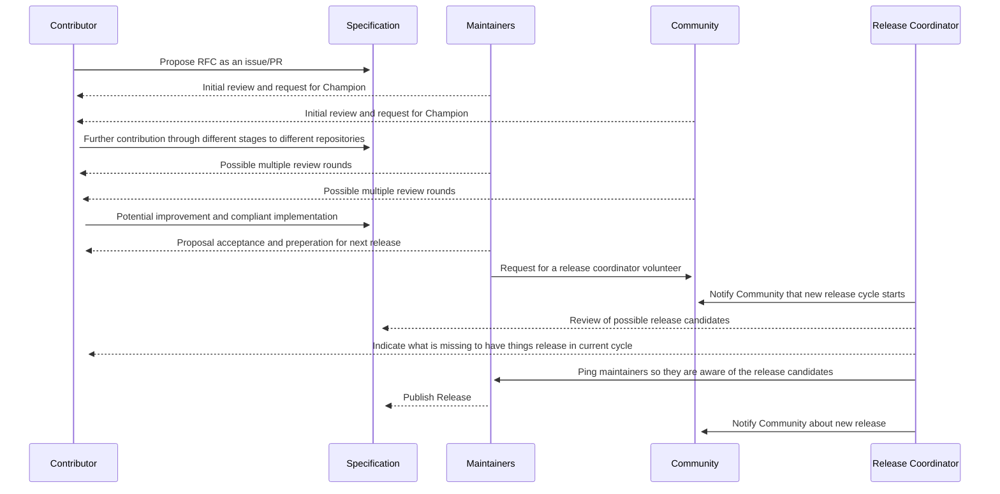

## How changes in the spec are introduced
AsyncAPI Initiative always concentrates on the problems rather than the solution. This is because you are generally rather single-minded when you already have a solution in mind to a problem instead of fully diving into the issue, seeing alternatives, and finding the best solution. 

### RFCs & champions
Some changes, however, are "substantial," We ask that these be put through a bit of a design process and produce a consensus among the AsyncAPI contributors/maintainers. The "RFC" (request for comments) process is intended to provide a consistent and controlled path for new features to enter the project.

#### What is an RFC? 
RFC is a document that proposes an idea and serves as high-level documentation of the concept and its thinking.

AsyncAPI finds this valuable because it makes prototyping an idea with words easy and flexible rather than immediately diving into an idea. RFCs force champions to explore the idea, document it and create a proposal for bringing it to life.

#### Who is a champion?
A Champion takes ownership of an idea and follows the proposed process to make the idea a reality.

## Spec changes lifecycle
The motivation for the Changes process is to raise the visibility of planned changes and make coordination and planning efforts easier. It is nearly impossible to follow all changes in a big project such as AsyncAPI spec. By providing a mechanism for sharing changes, it is easier for contributors to know what is coming and to ensure that we can address the impacts of changes well before the release date. The spec changes lifecycle consist of 2 parts, as seen below.

### Change process

- The author submits the change proposal by creating a discussion about the proposed changes. The person or group proposing the change is responsible for providing the first draft of the changes. Ideally, it's preferable to make this draft available as a pull request before submitting the Change proposal so the community can evaluate the change. However, starting with an issue is also permitted if the full details are not worked out.

- The contributors/maintainers reviews the proposed change request. The goal of this check is to prove or disprove a problem and guide the discussion toward either rejection or a preferred solution. 

- Implement the change. The author doesn't have to be the one to implement the change proposed but keep in mind that it might take a while before someone else does.

- Possibly iterate/refine as the community gets experience with your proposed changes. There may be some additional feedback about design choices that might be adjusted.

- Test implementation to gain confidence. When your change implementation is baked enough, and the solution seems desirable, there will be a compliant implementation with the AsyncAPI libraries and a test to gain confidence.

### How changes are introduced in spec: example

#### feat: added server variable object as a reusable object
Let's see how Daniel Kocot proposed and championed a feature for the next spec release. 
- He started a discussion on why his proposal was made.  [#707](https://github.com/asyncapi/spec/issues/707)
- He opened a PR for his proposed change, which was reviewed by the contributors/maintainers. [#717](https://github.com/asyncapi/spec/pull/717)
- After review and potential improvement, he did a compliant implementation of his feature with [AsyncAPI JS Parser](https://www.github.com/asyncapi/parser-js) and [spec-json-schemas](https://github.com/asyncapi/spec-json-schemas/pull/250) simply because it's a critical requirement.
- Since the implementation was a success, his proposed change got approved and made it to the next release.

Check out our [how to contribute guide](https://github.com/asyncapi/spec/blob/master/CONTRIBUTING.md) to learn more.

### Release process 
This part of the lifecycle aims to describe all details of the process so that any community member can jump in and help coordinate.

- We have four cycles a year for release, and they have a single coordinator.
-  Your contribution is made against the `next-spec` branch in 3 repositories.
- The coordinator at the beginning of the cycle checks if there are any release candidates. You know, like PRs that are in the advanced stage and have potential.
- The coordinator keeps a closed watch on what is merged, documents it in release notes, and engages contributors and maintainers of the spec to collaborate on a release.
- Maintainers trigger release when ready, release notes are published, and the world of open source won again.

Learn more about the [release process](https://github.com/asyncapi/spec/blob/master/RELEASE_PROCESS.md#what). 

### Release process visual
The image below visualizes the whole process of how changes are introduced to the spec in a single glance. 

