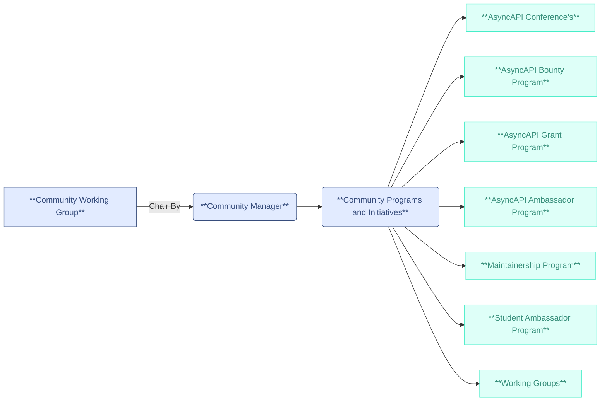

## AsyncAPI Community Building Goals and Objectives for 2025
[Carrying on from Thulie](https://github.com/orgs/asyncapi/discussions/948), it's time to discuss the goals for building and maintaining the AsyncAPI community in 2025. These goals will include planned objectives that we will define together to sustain the AsyncAPI Community. The Community Manager will play an important role in ensuring that our goals are addressed and that each program or initiative has a dedicated person responsible.

## Current Challenges:

We are facing several challenges in our community.
-  First, there is a growing number of contributors but not enough maintainers. This imbalance requires us to work on and prioritize the issue consistently.
-  Secondly, we do not have an onboarding process for new contributors and community members, which makes it difficult for them to understand how to get started and contribute effectively. We need a better approach to improve this onboarding experience.
-  Lastly, our community initiatives and programs have been operating without an official structure. There is a lack of visibility and understanding regarding how we work, highlighting the need for a more organized and unified approach.

## Objectives to Address These Challenges:
1. Increase maintainers and ensure their retention.
2. Create onboarding documentation and video content.
3. Establish a Community Working Group Umbrella.

## Proposed Solutions:
I invite everyone to discuss these proposed solutions and share any additional suggestions you may have.

### Increase Maintainers
Increasing the number of maintainers in our community remains one of our top goals, and we should continue to explore and experiment with strategies to achieve this. We have three strategies that could contribute significantly to our long-term goal of growing the number of maintainers.

1. **Fully Implement Maintainership** - We are currently in the pilot stages of implementing maintainership and are already seeing positive outcomes. I believe that by 2025, we need to fully integrate this into all our programs. The program will cater to anyone looking to enhance their skills as maintainers and to learn what it takes to become an open-source maintainer. Additionally, we should be open to individuals who want to apply without requiring a stipend.

2. **AsyncAPI Grant Program** - The AsyncAPI Community Grant Program, funded by the AsyncAPI Initiative, aims to provide financial support for critical technical projects and community initiatives within AsyncAPI. While this initiative is a new program and still in the ideation phase, it will directly contribute to the ongoing goal of growing and retaining maintainers while sustaining the community. The AsyncAPI Grant Program will specifically cater to individual contributors who are part of TSC members and maintainers.

We hope to initiate a pilot program in 2025 and come together to discuss how we will structure the program and decide what we consider critical technical projects and community initiatives within AsyncAPI.

3. **Increase Corporation Involvement** - We are looking for ways to increase business involvement and encourage not only sponsors but also companies who depend on and use AsyncAPI Spec and tooling to participate more actively in maintenance. This participation doesn’t have to be limited to coding; it can also include engaging in discussions, similar to our involvement in the marketing working group. Maybe do research by reaching out to the current TSC members and maintainers from corporate backgrounds. We welcome ideas and suggestions in this area.

### Onboarding Docs and Video Content
To improve and streamline the onboarding process for new contributors joining the community, we should still invest in creating onboarding materials. Currently, as part of the 2024 mentorship program, we have some docs that will be added. Additionally, we have training video scripts available in the [training repository](https://github.com/asyncapi/training), which we can record and build upon.Once we have some onboarding available, we should have a dedicated landing page on the website where we can have all the materials in one place for easy accessibility.

### Community Working Group Umbrella
I would like to introduce the Community Working Group, which serves as an umbrella for all community initiatives and programs at AsyncAPI. We have been functioning unofficially as a working group, but it’s time to reorganize, increase visibility for our current programs, and establish a structured approach to how we work.

The community manager will oversee and chair the working group, which includes community builders responsible for building, leading, and running the programs.
With this structured setup, we will say goodbye to community meetings and hello to the Community WG meeting; this is where we will provide updates on the different programs and the progress the builders are making.

### Initiatives and Programs
We remain committed to supporting the following initiatives as they promote community development, sustainability, and growth. We should continue to invest in these programs, which are run and led by outstanding community builders:

- [AsyncAPI Bounty Program](https://www.asyncapi.com/blog/asyncapi-bounty-program-2024) - Ash
- AsyncAPI Grant Program - Thulie & Lukasz
- [AsyncAPI Conference 2025](https://github.com/orgs/asyncapi/projects/43/views/2) - Thulie
- [Maintainership Program](https://www.asyncapi.com/blog/beyond-boundaries) - Ace
- [AsyncAPI Ambassador Program](https://www.asyncapi.com/community/ambassadors) - Thulie
- Student Ambassador Program  - Bami
- [Working Groups](https://github.com/asyncapi/community/blob/master/WORKING_GROUPS.yaml) - Bami

#### 1. AsyncAPI Conf 2025
I'm pleased with how things went this year and the connections we made through the conference. For 2025, we should hold at least 4 conferences each calendar quarter, including an online edition. Additionally, explore how we can scale the conference and have more events and people involved in the Conference Coordination WG and how other communities like Write the Docs do it. We have some areas to focus on and improve:

- Rebrand the name AACoT.
- Revise the conference prospectus.
- Continue the API Standards Booth, ensuring it is bigger, better, and properly planned.
- Revamp the current conference website following the rebranding.
- Get conference sponsors and work to convince the AsyncAPI Initiative to become a platinum sponsor.
- Plan conferences outside of Europe (the majority should be outside Europe/Schengen).
- Lastly, we need to start planning as soon as possible!

#### 2. AsyncAPI Bounty Program
Continue supporting and improving the program, establishing stability and efficiency.

#### 3. Maintainership Program
Revamp our mentorship programs and fully transition to maintainership. Projects participating in 2025 should be structured to promote ownership and prepare contributors to become maintainers-in-training.

Additionally, work on the following:

- Revising the program rules.
- Regularly gathering feedback from mentors and mentees.
- Thoroughly document the learnings from the 2024 maintainership implementations.
- Improving the format for proposal submissions.
- Collaborate with marketing to highlight program success stories, showcase them on our website, and even speak about them at the conference.

Continue participating in open-source grant programs such as GSoC, GSoD, and the AMP (AsyncAPI Maintainership Program).

#### 4. AsyncAPI Ambassador Program
Our ambassadors play a significant role in our community, and we have even doubled their numbers. 

For 2025, we need to focus on the following: 

- Revise the Ambassadors' Contribution Guide to include booth volunteering as a counted contribution. 
- Gather feedback from the ambassadors on how we can enhance their experience. 
- Review current Ambassador contributions and activity.
- Involve them in the Education Content initiative.

#### 5. AsyncAPI Grant Program
Since this is a new initiative, some groundwork will be needed.

- Secure funding for the program
- Create documentation explaining the program, why, and who can apply.
- Research and discuss ways on the criteria of how we select projects, who will perform selection TSC or through voting and communication around acceptance or rejections
- Explore other funding organizations, such as STF

#### 6. Student Ambassador Program

The focus of the Student Ambassador Program will be:

- Create a document explaining the program, requirements, and who can apply
- Onboard our very first set of Ambassadors

#### 7. Working Groups
Assess the current working group/s activity and update the YAML file. Expand the requirements to include quarterly reports and roadmap milestones from each working group under AsyncAPI.
