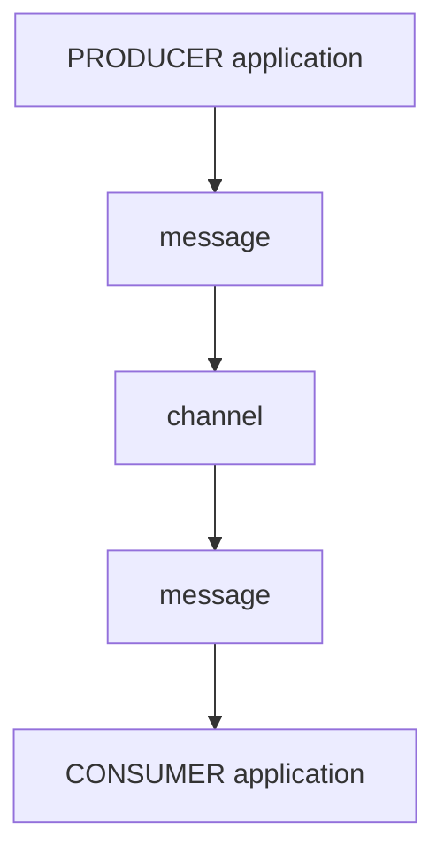

## What is an application?
An _application_ is a computer program or a group of them. 

An application can be a micro-service, IoT (Internet of things) device (for example, a sensor), mainframe process, and more. Users can create applications using various programming languages that support the chosen protocols.

## Why do we need applications?
In Event-Driven Architecture (EDA), an application can either be a producer, a consumer, or both. Additionally, if an application wants to connect and exchange messages with the server, it must adhere to the protocols supported by the server.

### Applications: producers and consumers

The diagram above illustrates a message transmission between a Producer application and a Consumer application through a channel.