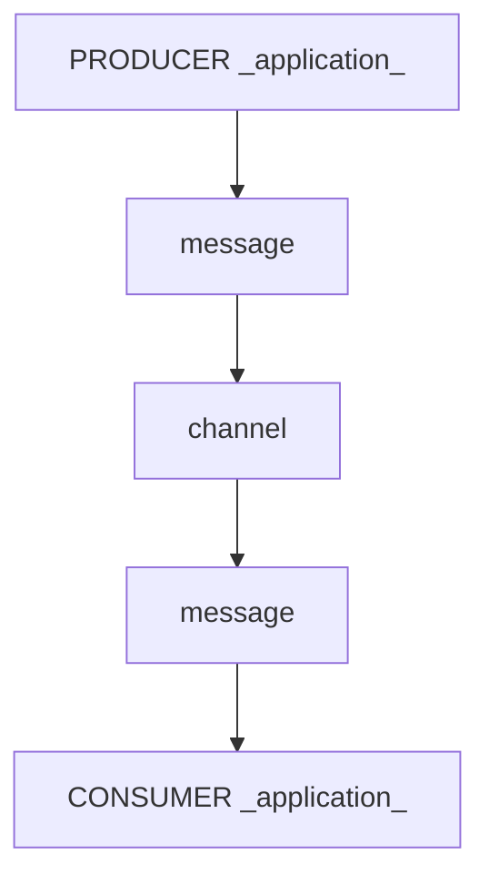

## What is an _application_?
An _application_ is a computer program or a group of them. 

An _application_ can be a micro-service, Internet of Things (IoT) device (for example, a sensor), mainframe process, and more. Users can create _applications_ using various programming languages that support the chosen protocols.

## Why do we need _applications_?
In Event-Driven Architecture (EDA), an _application_ can either be a producer, a consumer, or both. Additionally, if an _application_ wants to connect and exchange messages with the server, it must adhere to the protocols supported by the server.

### _Applications_: producers and consumers

The diagram above illustrates a message transmission between a Producer _application_ and a Consumer _application_ through a channel.
