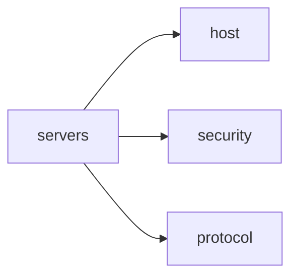

A server often acts as a message broker, managing communication between producers and consumers. However, it can represent different concepts too. To understand this better, please first review our [server concepts doc](/docs/concepts/server).

Adding and defining servers is important because it specifies how and where connections are made, enabling the sending and receiving of messages.

Unique keys identify the server and contain information about the server's connection details, such as the host, protocol, and authentication. 

Here is a diagram of server information with selected fields: 



The server is one of the main sections of the AsyncAPI document next to others like `info`, `channels`, or `operations`.

## Define servers

Include server definitions in your AsyncAPI document to specify which server a channel or operation connects to. Here is an example of defining a server in AsyncAPI:

```yaml
servers:
  prod:
    host: test.mosquitto.org
    protocol: mqtt
    description: Test MQTT server
```

The previous example shows a server setup using the MQTT protocol, where messages are sent to or received from the `test.mosquitto.org` host.

## Server reusability

Add server definitions in a single location, such as `components.servers`, and then refer to them using the `$ref` keyword for easy reuse.

Here's an example of an AsyncAPI document with two servers referenced from the `components` section:
```yaml
servers:
  kafka-test:
    $ref: '#/components/servers/kafka-test'
  mqtt-test:
    $ref: '#/components/servers/mqtt-test'
components:
  servers:
    kafka-test:
      host: my.kafka.pl
      protocol: kafka-secure
      description: Test Kafka server
    mqtt-test:
      host: test.mosquitto.org
      protocol: mqtt
      description: Test MQTT server
```

In this example, the main `servers` section lists multiple servers with sharable definitions. You can also store these server definitions separately and use them across various AsyncAPI documents.

## Channel only on specific server

Your AsyncAPI document can outline an application that receives messages on a channel from an MQTT server, while sending messages on a different channel via a Kafka server. This setup requires defining two servers, with each channel being exclusive to one server – one channel is only available on the MQTT server and the other only on the Kafka server. The AsyncAPI document describes this by adding a `servers` array to each channel, containing references to the respective server definitions.

Here's an example of how to add a server reference to a channel:

```yaml
servers:
  kafka-test:
    host: my.kafka.pl
    protocol: kafka-secure
    description: Test Kafka server
  mqtt-test:
    host: test.mosquitto.org
    protocol: mqtt
    description: Test MQTT server
channels:
  myChannel:
    servers:
      $ref: "#/servers/mqtt-test"
    message:
      $ref: '#/components/messages/myMessage'
```

In this example, the `myChannel` channel is only available on the `mqtt-test` server.
