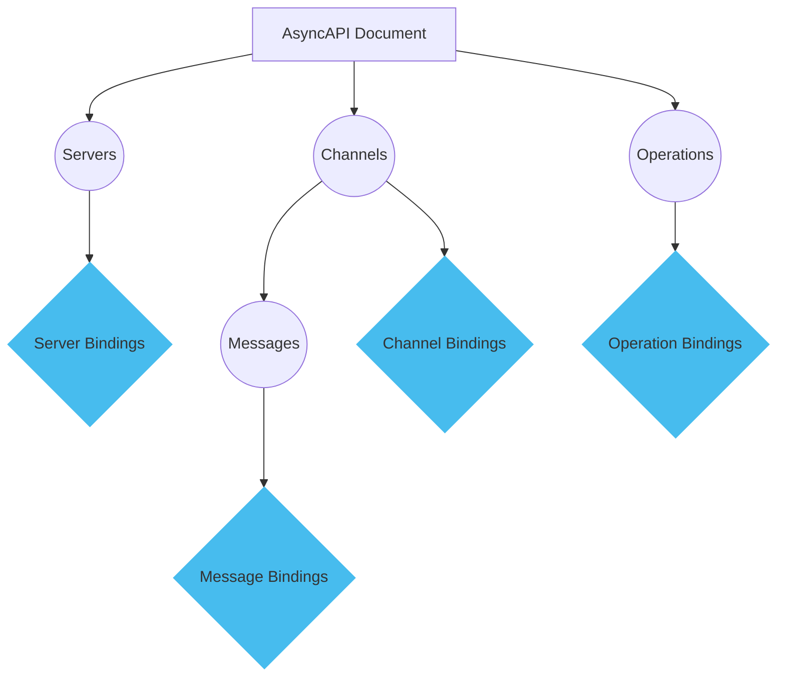
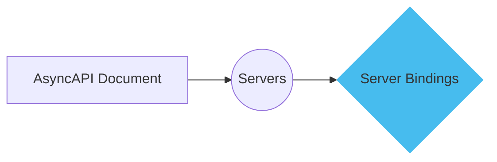
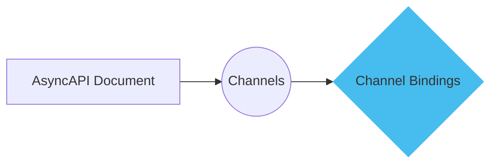
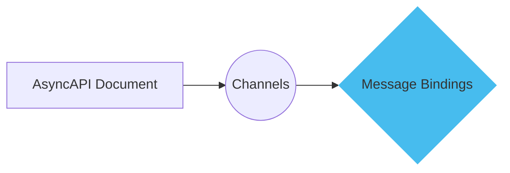
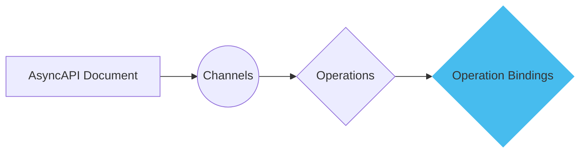

import BindingsOverview from '@/assets/docs/fragments/bindings-overview.md'

<BindingsOverview/>

The following diagram highlights the sections where bindings can be implemented:




## Server bindings

Server bindings provide protocol-specific information related to the server configuration. For example, if you use Pulsar as your message broker, you can specify the tenant name in the server bindings. 

Here is a diagram explaining server bindings:



This diagram shows where server bindings fit into the AsyncAPI document structure.

The next example showcases how to use server bindings to detail protocol-specific configurations for the server:

```yml
servers:
  production:
    bindings:
      pulsar:
        tenant: contoso
        bindingVersion: '0.1.0'
```

The previous document shows how to set up server bindings for a server that is a Pulsar broker.

## Channel bindings

Channel bindings are used to specify protocol-specific information for a specific channel. For example, in Kafka, you can specify number of partitions for a given topic.

Here is a diagram explaining where channel bindings fit into the AsyncAPI document structure:




Here is an example of using channel bindings to specify protocol-specific information for a specific channel:

```yml
channels:
  user-signedup:
    bindings:
      kafka:
        topic: 'my-specific-topic-name'
        partitions: 20
        replicas: 3
        topicConfiguration:
          cleanup.policy: ["delete", "compact"]
          retention.ms: 604800000
          retention.bytes: 1000000000
          delete.retention.ms: 86400000
          max.message.bytes: 1048588
        bindingVersion: '0.4.0'
```

The previous document shows how to configure channel bindings for a Kafka topic-representative channel.

## Message bindings

Message bindings provide protocol-specific information for a specific message. For example, for the AMQP protocol, you can specify the message type in a protocol-specific notation. 

Here is a diagram explaining where message bindings fit into the AsyncAPI document structure:




Here is an example of using message bindings to provide protocol-specific information for a specific message:

```yml
channels:
  userSignup:
    address: 'user/signup'
    messages:
      userSignupMessage:
        bindings:
          amqp:
            contentEncoding: gzip
            messageType: 'user.signup'
            bindingVersion: 0.3.0
```

The previous document shows how to set up message bindings for a message transported using the AMQP protocol.

## Operation bindings

Operation bindings allow you to specify protocol-specific information for a specific operation. For example, for MQTT, you can specify the quality of the service for a given operation.

Here is a diagram explaining where operation bindings fit into the AsyncAPI document structure:




Here is an example of using operation bindings to specify protocol-specific information for a specific operation:

```yml
channels:
  user/signup:
operations:
  userSignup:
    action: receive
    bindings:
      mqtt:
        qos: 2
        retain: true
        bindingVersion: 0.2.0
```

The previous document shows how to set up operation bindings for an operation that describes how an application that uses MQTT as transport, receives the message.

Using bindings helps you enhance the AsyncAPI documentation with protocol-specific details, making it easier to understand and implement the API.
