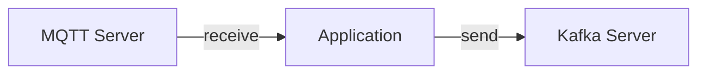

Incorporating [channels](/docs/concepts/channel) in the AsyncAPI document facilitates message organization and categorization, streamlining message routing to suitable consumers. It also enables the decoupling of producers and consumers, which contributes to the API's scalability and extensibility. Moreover, it offers comprehensive documentation and transparent communication about the API's communication patterns. Additionally, alternative names for channels can be user-defined to suit specific contexts and preferences.

Here is an example of how to define channels:

```yml
userSignedUp:
  address: 'user.signedup'
  messages:
    userSignedUp:
      $ref: '#/components/messages/userSignedUp'
```

The previous AsyncAPI document sets up an interface for a `userSignedUp` channel, where the `address` field holds the actual address of the channel (`user.signedup`).

### Channel availability on specific servers

When you add a channel to the AsyncAPI document, by default it is expected to be available on any server described in the document. In other words, if you have two servers, `production-kafka-secure` and `development-kafka`, the channel described in the AsyncAPI document must be present on both servers.

It's possible to encounter a scenario where an AsyncAPI document describes an application communicating in a production environment through multiple servers, each utilizing distinct protocols. For example, the application might receive messages from a channel on an MQTT server while concurrently sending messages to a different channel on a Kafka server. In such cases, it's imperative to distinctly specify the exclusive availability of one channel on the MQTT server and another channel solely on the Kafka server. 



Here is an example of how you might specify that a channel is available only on specific servers:

```yml
channels:
  lightTurnOn:
    address: light.on
    messages:
      lightOn:
        description: An event describing that lights are on
    servers:
      - $ref: '#/servers/serverA'
  lightTurnOnOff:
    address: light/onoff
    messages:
      lightOnOff:
        description: An event describing that light is either on or off
    servers:
      - $ref: '#/servers/serverB'
servers:
  serverA:
    host: serverA.example.com
    protocol: kafka
  serverB:
    host: serverB.example.com
    protocol: mqtt
```

The above example shows two different channels available only on selected servers. Notice the `servers` field under each channel. It means that the `lightTurnOn` channel is only available on `serverA` which uses Kafka protocol, and the `lightTurnOnOff` channel is available only on `serverB` which uses MQTT protocol.
