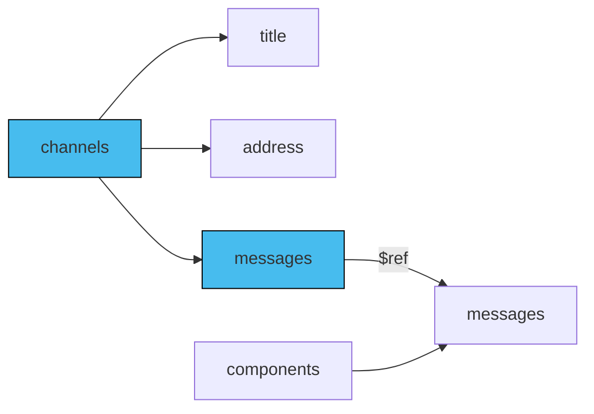

In an AsyncAPI document, adding [messages](/docs/reference/specification/v3.0.0#messageObject) mainly means setting up channels and operations. This is key for explaining how data moves between your applications. However, sometimes you might just want to use the AsyncAPI document to describe the messages themselves, without anything else.

## Add messages

In an AsyncAPI document, you define message definitions under channels. However, the best practice is to first define these messages under the 'components' section as reusable definitions. That way, you can reference them easily from a channel.

Here is a diagram showing some channel fields and the relation between channel messages and components messages:



### Channels section

Define the channels section in your AsyncAPI document, including the `messages` your channel accepts. For example:

```yaml
channels:
  allCommentsLiked:
    address: comment/liked
    messages:
      commentLiked:
        description: Message that is being sent when a comment has been liked by someone.
        payload:
           type: object
           title: commentLikedPayload
           additionalProperties: false
           properties:
               commentId: 
                 type: string
                 description: Id of the comment that was liked
    description: Notification channel for all the services that need to know comment is liked.
```

The above example presents an application that communicates over the `allCommentsLiked` channel, which only accepts one message called `commentLiked`.

### `messages` section

In your AsyncAPI document, create a `components.messages` section to define each message your application uses as a reusable message. When setting up multiple channels, you won't have to repeat the same message definitions. For example:

```yaml
components:
  messages:
    commentLiked:
        description: Message that is being sent when a comment has been liked by someone.
        payload:
           type: object
           title: commentLikedPayload
           additionalProperties: false
           properties:
               commentId: 
                 type: string
                 description: Id of the comment that was liked
```

You can reuse messages using the [Reference Object](/docs/reference/specification/v3.0.0#referenceObject). For example:

```yml
    messages:
      commentLiked:
        $ref: '#/components/messages/commentLiked'
```

Here's the complete AsyncAPI document with channels reusing the same message:
```yml
asyncapi: 3.0.0
info:
  title: Example API
  version: '1.0.0'
channels:
  allCommentsLiked:
    address: comment/liked
    messages:
      commentLiked:
        $ref: '#/components/messages/commentLikedUnliked'
    description: Notification channel for all the services that need to know comment is liked.
  allCommentUnliked:
    address: comment/unliked
    messages:
      commentUnliked:
        $ref: '#/components/messages/commentLikedUnliked'
    description: Notification channel for all the services that need to know comment is liked.
components:
  messages:
    commentLikedUnliked:
        description: Message that is being sent when a comment has been liked or unliked by someone.
        payload:
           type: object
           title: commentInfoPayload
           additionalProperties: false
           properties:
               commentId: 
                 type: string
                 description: Id of the comment that was liked or unliked
```

### Identifier of the message

The key name that represents a message in your AsyncAPI document must be interpreted as `messageId`. If your document defines channels, the message key defined in the channel is the `messageId`.

```yaml
channels:
  allCommentsLiked:
    address: comment/liked
    messages:
      commentLiked:
        $ref: '#/components/messages/commentLikedUnliked'
    description: Notification channel for all the services that need to know comment is liked.
```

The above example shows a `commentLiked` message under the `allCommentsLiked` channel. It references a reusable message definition from the `components` section represented by the `commentLikedUnliked` key. In this setup, the `commentLiked` key is the `messageId` and not `commentLikedUnliked`.

### Messages under operations

Operations specify which channels they interact with. If a channel has several messages, but your operation only involves one, indicate which specific message the operation uses. 

```yaml
channels:
  allComments:
    address: comments
    messages:
      commentLiked:
        $ref: '#/components/messages/commentLikedMsg'
      commentUnliked:
        $ref: '#/components/messages/commentUnlikedMsg'
    description: Notification channel for all the services that need to know comment is liked.
operations:
  onCommentLiked:
    action: receive
    channel:
      $ref: '#/channels/allComments'
    messages:
      - $ref: '#/channels/allComments/messages/commentLiked'
```

The above example demonstrates how to specify the message for the `onCommentsLiked` operation received from the `allCommentLiked` channel. It's important to note that the message reference points to the channel, not the components section. That ensures accurate information about the `messageId`, which in this case is `commentLiked`, not `commentLikedMsg`.
