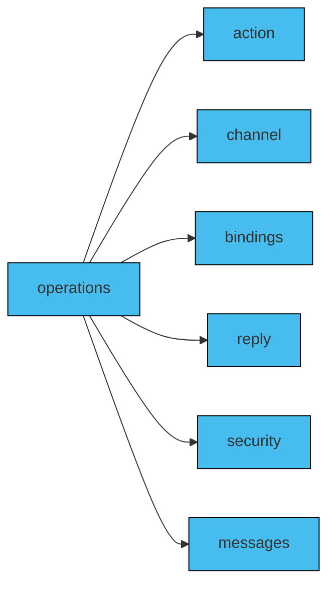

In a messaging system, 'operations' are how messages are sent and received between participants or components. In AsyncAPI, understanding operations helps you see how the system sends asynchronous messages back and forth without waiting for responses. They serve as a vital tool, aiding users in comprehending the range of tasks and functionalities that the API is capable of performing.

In an AsyncAPI document, operations describe your application's behaviors and capabilities by exchanging messages through channels configured in the AsyncAPI document. An `operation` represents a particular action or interaction that can be performed. The purpose of operations is to provide a standardized means for describing the process of sending, receiving from, requesting, or replying to messages within the messaging system. 

## Defining operations

Operations can be defined as an independent object in the AsyncAPI document. More information about each field name that is used to define operations can be found [in the reference documentation of the specification](/docs/reference/specification/v3.0.0#operationObject). 

The following diagram declares the field names that are frequently used to define operations in an AsyncAPI document:



## Adding operations

In the AsyncAPI document, 'operations' are distinct fields located at the root level of the document, alongside 'channels' and other key fields.
Operations must specify on what channel they are performed by referencing the `channel` with `$ref`. For example:

```
onUserSignUp:
  title: User sign up
  summary: React and process information about new user sign up.
  description: Process information about user sign up and update the information in the table that counts numbers of currently signed up users.
  action: receive
  channel:
    $ref: '#/channels/userSignup'
```

The operation definition mentioned above gives the details needed for the application to send a message. Its 'title' and 'summary' clearly show that it's about receiving an event when a new user signs up to the system.

Some fields are missing from this example:
- No `messages` field means that this operation processes any message coming from the `userSignup` channel.
- No `security` field means that there are no special security measures related to this operation and that the security should be applied the same as for other operations. Essentially, the security from the server level should be respected.
- No `reply` field means that after reacting to the user sign up, this application will not send any reply as a reaction.
