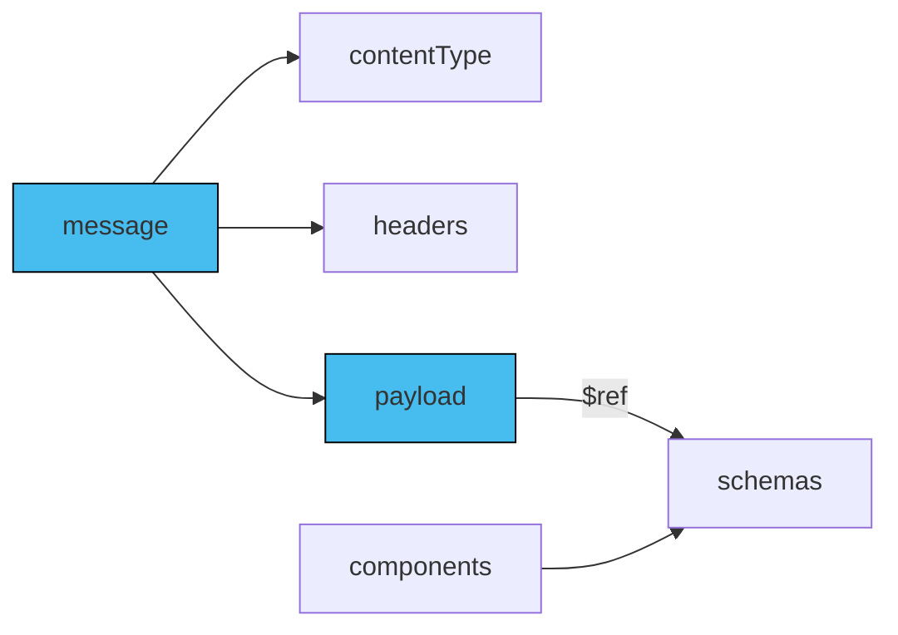

The payload schema sets the format, data types, and properties of a message. Such an approach ensures the message's payload follows a specific structure and data format.

It's recommended to use AsyncAPI Schema (a superset of JSON Schema) for handling complex messages and structured data.  AsyncAPI Schema helps consumers understand the payload's structure and data types. However, AsyncAPI allows any schema format. For example, when using the Avro schema format, define your message payload in Avro directly instead of trying to represent it in JSON Schema format.

## Define schema

Define the schema for the message payload with one of the following methods:

- Inline: Define the JSON schema within the message payload property.
- Components reference: Specify the schema using a reference to the `components.schemas` section, such as `$ref: '#/components/schemas/user`.
- Remote reference: Specify the schema using an absolute remote endpoint, such as `$ref: 'https://schemas.example.com/user'`.
- Local file reference: Specify the schema using a relative reference, such as `$ref: './user-signedup.json'`.

The diagram below describes how payload referencing works within the component reference:



Here is an example of an AsyncAPI document where the payload's schema is defined directly within it:

```yaml
channels:
  exampleChannel:
    address: exampleChannel
    messages:
      SimpleSignup:
        payload:
          type: object
          properties:
            name:
              type: string
            email:
              type: string
```

## Attach examples

Although optional, attaching examples to the AsyncAPI document is highly recommended. You can use JSON or YAML format for binary encodings. Attach the examples to the examples property within the message payload definition. For example:

```yaml
examples:
  - name: SimpleSignup
    summary: A simple UserSignup example message
    payload:
      user:
        name: Demo
        email: demo@demo.io
```

## Reuse schemas between messages

To reuse a schema in your AsyncAPI document, define it in the `components/schemas` section and reference it using the `$ref` keyword. Using `$ref` avoids duplication and ensures consistency. Here's an example of reusing a schema from components in AsyncAPI:

```yaml
components:
  messages:
    SimpleSignup:
      name: SimpleSignup
      contentType: application/json
      payload:
        $ref: '#/components/schemas/SimpleSignup'
    examples:
    - name: SimpleSignup
      payload: 
        user:
          name: Demo
          email: demo@demo.io
  schemas:
    SimpleSignup:
      type: object
      properties:
        name:
          type: string
        email:
          type: string
```

## Schema formats

The default schema in an AsyncAPI document is the AsyncAPI schema itself. However, you can choose from other formats like JSON Schema, Avro, OpenAPI Schema, Protobuf, and more. Remember to indicate in your AsyncAPI document which schema format you're using.

You specify the format of the schema inside the `payload` field. The type of information you can put in `payload` can be described as a tuple. (A tuple is an ordered sequence of elements that can't be changed during a program's execution.) 

When using AsyncAPI Schema, the `payload` must represent a reference or the payload schema definition as described in previous sections. 

If you're using various formats, the `payload` field should include both `payload.schemaFormat` and `payload.schema`. For example:
```yaml
  payload:
    schemaFormat: application/vnd.apache.avro;version=1.9.0
    schema:
      $ref: "https://www.asyncapi.com/resources/casestudies/adeo/CostingRequestPayload.avsc"
```

The above example specifies that the provided schema of the message payload is in Avro, version 1.9.0. It also specifies where the Avro schema file is located.

## Schema formats and limitations related to their structures

Some schema formats are too challenging to manage in JSON/YAML. Complex schema formats — Avro, AsyncAPI schemas, and other JSON-based schemas — can be directly included in the AsyncAPI document or referenced using `$ref` for specific sections.
```yaml
    payload:
        schemaFormat: 'application/vnd.apache.avro;version=1.9.0'
        schema: # The following is an Avro schema in YAML format (JSON format is also supported)
          type: record
          name: User
          namespace: com.company
          doc: User information
          fields:
            - name: displayName
              type: string
            - name: email
              type: string
            - name: age
              type: int
```

The process is more complex for Protobuf schemas, as their Protocol Buffers are not JSON-based. You cannot use `$ref` to reference parts of the schema. Instead, you must include the entire Protobuf schema definition as a string:

```yaml
      payload:
        schemaFormat: application/vnd.google.protobuf;version=3
        schema: |
            message Point {
                required int32 x = 1;
                required int32 y = 2;
                optional string label = 3;
            }

            message Line {
                required Point start = 1;
                required Point end = 2;
                optional string label = 3;
            }
```


