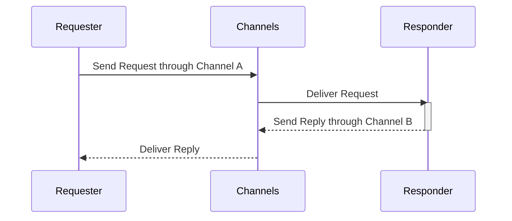

Request/Reply is a communication pattern where one entity, the 'requestor,' sends a message to another, the 'replier', and waits for a response. Such a pattern is used when a component (or service) needs to initiate an action and receive a specific response in return, either synchronously or asynchronously. In Event-Driven Architectures, this communication pattern is asynchronous, meaning that the requester does not block and wait for an immediate response. Instead, it can continue processing other tasks or even send out other requests while waiting for the reply to arrive. 

In the case of multiple requests made, each request is processed independently and sends the reply/response to the corresponding requestor when ready.

Here is diagram to illustrate the working of a basic request/reply pattern:


The request/reply pattern in AsyncAPI works in the same fashion while supporting all the different sub-patterns. Irrespective of the sub-pattern you would like to represent, the request/reply pattern can be implemented in the AsyncAPI document in the `Operation` object.

You can add the reply info using the `Operation Reply` object under the `Operation` object. The `reply` field represents the response details.

In AsyncAPI, you have the flexibility to represent the request/reply pattern in two different ways.

The first approach is when the requester specifies at runtime, within the request itself, where the response should be sent. Such an approach allows for the dynamic determination of the reply address based on factors such as the request message payload or header.

The second approach is when the requester already knows exactly where the response should be sent. In such cases, the address of the reply channel is directly specified in the AsyncAPI document.

## Dynamic response channel

There are situations where you do not know the reply channel at the design time. Instead, the reply address is dynamically determined at runtime, based on factors such as the request message payload or header. 

In the case where you don't know the address of the reply yet, you have the option to either assign null to the `address` property or omit the property entirely indicating that the address is not known at the moment. The `address` property being referred to in this case is part of the channel that the operation with the reply references to. To dynamically specify where the reply should be sent, you can use the `Operation Reply Address` object. The `Operation Reply Address` object has a property called `location` that allows you to define a runtime expression that specifies the address of the reply channel. 

For instance, this pattern allows the replier to direct its response to a specific channel as defined by the requestor. This is typically achieved by including a `replyTo` property in the request header. The requestor specifies this property to indicate where it expects to receive the response, guiding the communication flow in a structured and predictable manner.

```yml
asyncapi: 3.0.0

info:
  title: Ping/pong example for a requester with a dynamic reply channel
  version: 1.0.0
  description: Example with a requester that initiates a request/reply interaction, with the response directed to the destination specified in the request's `replyTo` header.

channels:
  ping:
    address: /ping
    messages:
      ping:
        $ref: '#/components/messages/ping'
  pong:
    address: null
    messages:
      pong:
        $ref: '#/components/messages/pong'

operations:
  pingRequest:
    action: send
    channel: 
      $ref: '#/channels/ping'
    reply:
      address:
        description: The response destination is dynamically set according to the `replyTo` field in the request header
        location: "$message.header#/replyTo"
      channel: 
        $ref: '#/channels/pong'
```

## Multiple channels with single message when reply address is known

The request/reply pattern can also be implemented over multiple channels with a single message. You can do this by specifying multiple channels with a single message and specifying the same address for both the requester and the replier.

Here's an example of setting up both the requestor and replier over the same address:
```yml
asyncapi: 3.0.0

info:
  title: Ping/pong example with requester over the same channel
  version: 1.0.0
  description: Requester example initiating a request-reply interaction, utilizing the same channel for both sending the request and receiving the reply.

channels:
  ping:
    address: /
    messages:
      ping:
        $ref: '#/components/messages/ping'
  pong:
    address: /
    messages:
      pong:
        $ref: '#/components/messages/pong'

operations:
  pingRequest:
    action: send
    channel: 
      $ref: '#/channels/ping'
    reply:
      channel: 
        $ref: '#/channels/pong'
```

## Multiple messages over the same channel when reply address is known

In some cases, representing the [same information](#multiple-channels-with-single-message-when-reply-address-is-known) might require a different approach. You can do so by specifying multiple messages under the same channel. In such scenarios, use the `messages` property in the `Operation` object to explicitly define which message among the multiple messages available over the same channel is a request and which is a reply.  

Consider an example where multiple messages are transmitted over a single channel, all sharing the same address. In this setup, the `Operation` object is utilized to distinctly specify which of these messages serves as the request and which functions as the reply:
```yml
asyncapi: 3.0.0

info:
  title: Ping/pong example when a channel contains multiple messages
  version: 1.0.0
  description: Requester example that initiates the request-reply pattern within a root channel that contains multiple messages

channels:
  rootChannel:
    address: /
    messages:
      ping:
        $ref: '#/components/messages/ping'
      pong:
        $ref: '#/components/messages/pong'

operations:
  pingRequest:
    action: send
    channel: 
      $ref: '#/channels/rootChannel'
    messages:
      - $ref: "/components/messages/ping"
    reply:
      messages:
        - $ref: "/components/messages/pong"
      channel: 
        $ref: '#/channels/rootChannel'
```
