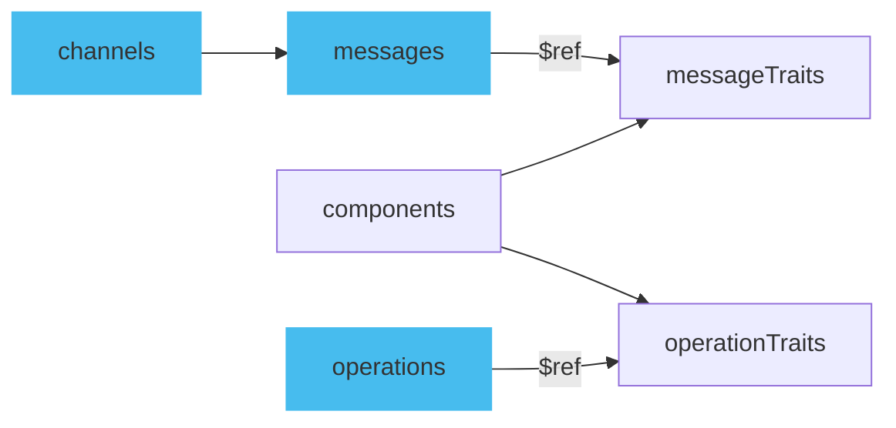

Traits work only with the `operations` and `messages` fields. Traits allow the definition of properties to be reused across multiple messages and operations within the specification. Reusing traits promotes code maintainability and reduces duplication while making your AsyncAPI documents cleaner to manage.

## Defining traits

Traits are meant to be reused, so it's best to define them in the `components` section of your AsyncAPI document, either under `operationTraits` or `messageTraits`. Choose depending on whether they're for operations or messages. Give each trait a unique name and list the properties it includes. You can reference these traits with the `$ref` keyword, allowing you to keep traits in a separate file outside the AsyncAPI document. For more on using `$ref` and reusability, check out the [reusable parts document](/docs/concepts/asyncapi-document/reusable-parts).



[Message traits](/docs/reference/specification/latest#messageTraitObject) do not fully cover all fields that a normal message has, such as the `payload`. The same is true with [Operation traits](/docs/reference/specification/latest#operationTraitObject) which represent only selected fields usually used in an operation.

Here is a part of a message that has a trait defined inline in a message:

```yaml
description: Example description.
traits:
  - name: UserSignup
    description: Trait description.
  - tags:
      - name: user
```

When traits are combined with a message object, the resulting message will look like the example shown below:

```yaml
name: UserSignup
description: Example description.
tags:
  - name: user
```

Notice that the trait description didn't override the already defined description in a message outside the trait. 

## Applying traits from components

Once a trait is defined, you can apply it to an operation or a message using the `$ref` keyword in the `traits` section. The `$ref` value should point to the path of the trait within the `components` section.

For example, let's say we have a trait named `commonHeaders` defined in `messageTraits`:

```yml
components:
  messageTraits:
    commonHeaders:
      headers:
        type: object
        properties:
          content-type:
            type: integer
```

To apply the above trait to a message object, you can do:

```yml
name: lightMeasured
title: Light measured
summary: Inform about environmental lighting conditions of a particular streetlight.
headers:
  type: object
  properties:
    custom-header:
      type: string
traits:
  - $ref: '#/components/messageTraits/commonHeaders'
```

Notice how the `commonHeaders` trait includes a `content-type` header and is merged into the `headers` object in a message:

```yaml
name: lightMeasured
title: Light measured
summary: Inform about environmental lighting conditions of a particular streetlight.
headers:
  type: object
  properties:
    content-type:
      type: integer
    custom-header:
      type: string
```

## Trait merging mechanism

In the AsyncAPI document, traits are merged into the operation or message object in the order they are defined, without overriding any properties. For detailed information on how this merging works, refer to [the specification's section on the traits merge mechanism](/docs/reference/specification/v3.0.0#traitsMergeMechanism).

