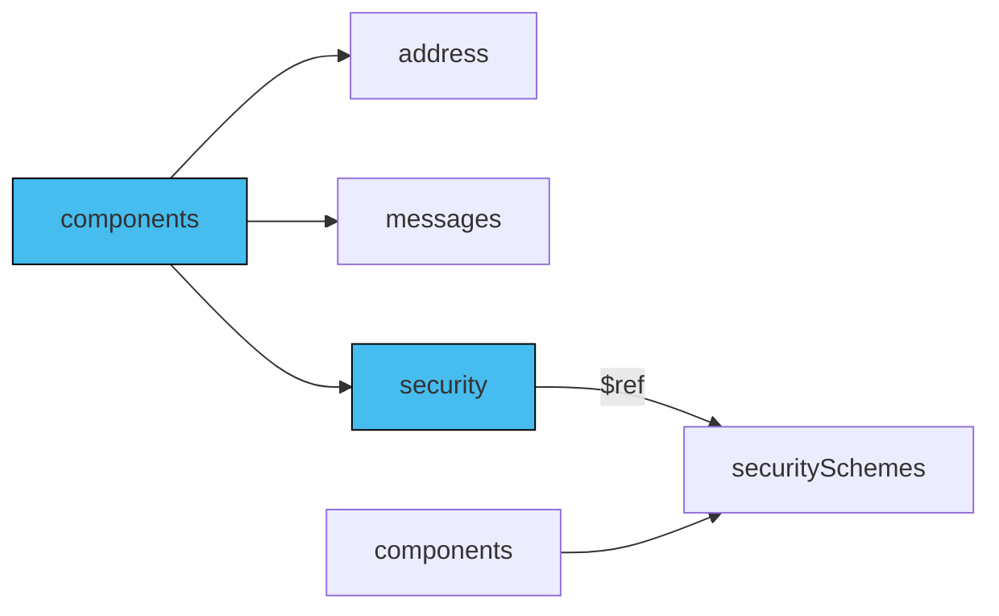

The server security concept in AsyncAPI means that the security settings specified at the server level automatically apply to all operations across all channels. If you want to modify these default security settings for a particular operation, you need to specify the security details directly on that operation.

## Add security

To accommodate such scenarios, the AsyncAPI document allows you to use the `security` field at the `operation` level. You can have multiple security schemes, but only one must be satisfied to authorize such an operation.

The diagram below describes how to implement reusable security schemes:



## Operation section

Security information for an operation is defined using a [Security Scheme](/docs/reference/specification/v3.0.0#securitySchemeObject) at the operation level. You can reference a scheme from another location, such as `components.securitySchemes`, using the `$ref` keyword.

```yaml
operations:
  sendAuthRevoke:
    action: send
    channel:
      $ref: '#/channels/authRevoke'
    security:
      - type: oauth2
        description: The oauth security descriptions
        flows:
          clientCredentials:
            tokenUrl: 'https://example.com/api/oauth/dialog'
            availableScopes:
              'subscribe:auth_revocations': Scope required for authorization revocation topic
        scopes:
          - 'subscribe:auth_revocations'
```

The previous example, featuring the `sendAuthRevoke` operation in an AsyncAPI document, demonstrates the capabilities of a client application with an existing notification service. If a server has its own security requirements, this operation must also comply with those.

## `securitySchemes` section

To reuse security schemes between operations, place them in `components.securitySchemes` and reference them via the `$ref` keyword in your operation:

```yaml
operations:
  sendAuthRevoke:
    action: send
    channel:
      $ref: '#/channels/authRevoke'
    security:
      - $ref: '#/components/securitySchemes/oauth'

components:
  securitySchemes:
    oauth:
       type: oauth2
        description: The oauth security descriptions
        flows:
          clientCredentials:
            tokenUrl: 'https://example.com/api/oauth/dialog'
            availableScopes:
              'subscribe:auth_revocations': Scope required for authorization revocation topic
        scopes:
          - 'subscribe:auth_revocations'
```

The previous code snippet shows the approach for reusing schema within multiple operations, even across multiple AsyncAPI documents.
