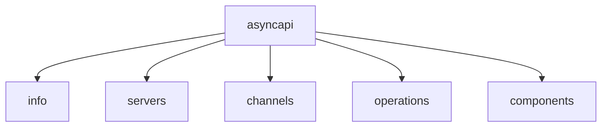

An AsyncAPI document structure must follow a specific format defined by the [AsyncAPI specification][asyncapi-spec]. It has mandatory and optional fields.

## Root elements

Root elements of an AsyncAPI document provide an overview of the API's characteristics and behavior. These root elements define metadata, channels, components, and more.



### `info` field

The [`info` field][info-object] is a mandatory element of the AsyncAPI specification that serves as the initial reference point for users navigating the API documentation and helping developers, architects, and other stakeholders quickly grasp the API's purpose and capabilities. This field contains essential metadata, including:

- `title`: API title.
- `version`: API version.
- `description`: Brief description of the API's purpose and features.
- `termsOfService`: URL or document specifying the API's terms of service.
- `contact`: Contact information of the API's owner or maintainer (name, email, and URL).
- `license`: API's license information, including name and URL.
- `tags`: A list of keywords to organize and categorize API documentation. They are also used to group applications logically.
- `externalDocs`: Links to additional, external documentation related to the API.

Below is an example of the `info` field:
```yaml
info:
  title: My Event-Driven API
  version: 1.0.0
  description: This API provides real-time event streaming capabilities
  termsOfService: https://example.com/terms-of-service
  contact:
    name: Rohit
    email: rohitwashere@asyncapi.com
  license:
    name: Apache 2.0
    url: https://www.apache.org/licenses/LICENSE-2.0.html
  tags:
    - name: Events
      description: APIs related to event streaming
    - name: Authentication
      description: APIs for authentication and authorization
  externalDocs:
    description: Additional documentation 
    url: https://example.com/docs
```

### `servers` field

The [`servers` field][server-object] details various servers, including network endpoints or message brokers to which applications can connect. This field includes connection information like protocol, host, port, and other options, enabling connectivity across different environments like production, staging, or development.

The individual `servers` field contains the following properties:

- `host`: The server hostname. It may include the port.
- `protocol`: The protocol or messaging protocol that is used by the server (for example, AMQP, MQTT, WebSocket).
- `protocolVersion`: The protocol version used for the connection.
- `pathname`: The path to a resource in the host.
- `description`: A string describing the server.
- `title`: A human-friendly title for the server.
- `summary`: A brief overview of the server.
- `security`: A declaration of security schemes supported by the server.
- `tags`: a list of keywords to logically group and categorize servers.
- `externalDocs`: Additional external documentation for this server.
- `bindings`: A map where the keys describe the name of the protocol and the values describe protocol-specific definitions for the server.

Below is an example of the `servers` field with multiple servers:
```yaml
servers:
  production:
    host: rabbitmq.in.mycompany.com:5672
    pathname: /v1
    protocol: amqp
    protocolVersion: 1.0
    description: Production RabbitMQ broker (uses the `production` vhost)
    title: Production Server
    summary: Production environment server
    security:
      - type: http
        scheme: bearer
    tags:
      - name: production
        description: Production environment
    externalDocs:
      description: Additional documentation for the production server
      url: https://example.com/docs/production
    bindings:
      amqp:
        exchange: my-exchange
        queue: my-queue
  staging:
    host: rabbitmq.in.mycompany.com:5672
    pathname: /v1
    protocol: amqp
    protocolVersion: 1.0
    description: Staging RabbitMQ broker (uses the `staging` vhost)
    title: Staging Server
    summary: Staging environment server
    security:
      - type: apiKey
        in: user
        description: Provide your API key as the user and leave the password empty
    tags:
      - name: staging
        description: Staging environment
    externalDocs:
      description: Additional documentation for the staging server
      url: https://example.com/docs/staging
    bindings:
      amqp:
        exchange: my-exchange
        queue: my-queue
```

### `channels` field

With the [`channels` field][channel-object], you can provide a map of channels the application communicates with during runtime. For each channel, you can specify the purpose, address, and expected message formats so that API consumers can understand the supported message-based interactions and the corresponding data models.

The individual `channels` field contains the following properties:

- `address`: A string representation of this channel's address.
- `messages`: A map of all messages sent to this channel by any application.
- `title`: A human-readable title for the channel.
- `summary`: A summary of the channel.
- `description`: A description of the channel, providing additional context and details of the message.
- `servers`: An array of `$ref` pointers to the server definitions for this channel. If servers are absent or empty, this channel must be available on all servers defined in the `servers` field.
- `parameters`: A map of the parameters included in the channel address.
- `tags`: a list of keywords to logically group channels.
- `externalDocs`: Additional external documentation for this channel.
- `bindings`: A map where the keys describe the name of the protocol and the values describe protocol-specific definitions for the channel.

Below is an example of the `channels` field with one channel:
```yaml
channels:
  user:
    address: 'users.{userId}'
    title: Users channel
    description: This channel is used to exchange messages about user events
    messages:
      userSignedUp:
        $ref: '#/components/messages/userSignedUp'
      userCompletedOrder:
        $ref: '#/components/messages/userCompletedOrder'
    parameters:
      userId:
        $ref: '#/components/parameters/userId'
    servers:
      - $ref: '#/servers/production'
    bindings:
      amqp:
        is: queue
        queue:
          exclusive: true
    tags:
      - name: user
        description: User-related messages
    externalDocs:
      description: Find more info here
      url: https://example.com
```

### `operations` field

The [`operations` field][operation-object] specifies operations the application can perform. It offers a clear and structured description detailing whether the application sends or receives messages and the specific purpose of each operation.

The individual `operations` field contains the following properties:

- `action`: Use `send` when the application expects to send a message to a channel and `receive` when it expects to receive messages from a channel.
- `channel`: A `ref` pointer to the channel definition that ensures the operation execution.
- `title`:	A human-friendly title for the operation.
- `summary`: A brief overview of the operation.
- `description`: A detailed explanation of the operation. 
- `security`:	A declaration of security schemes associated with the operation.
- `tags`: a list of keywords to logically group and categorize operations.
- `externalDocs`:	Additional external documentation for this operation.
- `bindings`: A map where the keys describe the name of the protocol and the values describe protocol-specific definitions for the operation.
- `traits`: A list of traits to apply to the operation object. 
- `messages`: A list of `$ref` pointers to the supported Message Objects that this operation can process.
- `reply`: The definition of the reply in a reply/request operation.

Below is an example of the `operations` field with one operation:
```yaml
operations:
  sendUserSignUp:
    action: send
    title: User sign up
    summary: Action to sign a user up
    description: A longer description
    channel:
      $ref: '#/channels/user'
    security:
      - type: oauth2
        description: The oauth security descriptions
        flows:
          clientCredentials:
            tokenUrl: https://example.com/api/oauth/dialog
            availableScopes:
              'subscribe:auth_revocations': Scope required for authorization revocation topic
        scopes:
          - 'subscribe:auth_revocations'
    tags:
      - name: user
      - name: signup
      - name: register
    bindings:
      amqp:
        ack: false
    traits:
      - $ref: '#/components/operationTraits/kafka'
    messages:
      - $ref: '#/components/messages/userSignedUp'
    reply:
      address:
        location: '$message.header#/replyTo'
      channel:
        $ref: '#/channels/userSignupReply'
      messages:
        - $ref: '#/channels/userSignupReply/messages/userSignedUpReply'
```

### `components` field

The [`components` field][components-object] lets you define reusable structures or definitions across your document. Items in `components` only become part of the API when explicitly referenced by properties outside this field, so you can use it to avoid repetition and improve maintainability.

The `components` field contains the following properties:

- `schemas`: An object to hold the reusable [Schema Object][schema-object].
- `servers`: An object to hold the reusable [Server Objects][server-object].
- `channels`: An object to hold the reusable [Channel Objects][channel-object].
- `operations`: An object to hold the reusable [Operation Item Objects][operation-item-object].
- `messages`: An object to hold the reusable [Messages Objects][message-object].
- `securitySchemes`: An object to hold the reusable [Security Scheme Objects][security-scheme-object].
- `serverVariables`: An object to hold the reusable [Server Variable Objects][server-variable-object].
- `parameters`: Contains reusable [Parameter Objects][parameter-object] that can be used in various parts of the AsyncAPI document.
- `correlationIds`: An object to hold the reusable [Correlation ID Objects][correlation-id-object].
- `replies`: An object to hold the reusable [Operation Reply Objects][operation-reply-object].
- `replyAddresses`: An object to hold the reusable [Operation Reply Address Objects][operation-reply-address-object].
- `externalDocs`: An object to hold the reusable [External Documentation Objects][external-documentation-object].
- `tags`: An object to hold the reusable [Tag Objects][tag-object].
- `operationTraits`: An object to hold the reusable [Operation Trait Objects][operation-trait-object].
- `messageTraits`: Represents common traits or characteristics that can be applied to messages or hold reusable [Message Trait Objects][message-trait-object].
- `serverBindings`: An object to hold the reusable [Server Bindings Objects][server-bindings-object].
- `channelBindings`: An object to hold the reusable [Channel Bindings Objects][channel-bindings-object].
- `operationBindings`: An object to hold the reusable [Operation Bindings Objects][operation-bindings-object].
- `messageBindings`: An object to hold the reusable [Message Bindings Objects][message-bindings-object].

Here's a code example of the components object in an AsyncAPI document:
```yaml
components:

  schemas:
    Category:
      type: object
      properties:
        id:
          type: integer
          format: int64
    AvroExample:
      schemaFormat: application/vnd.apache.avro+json;version=1.9.0
      schema:
        $ref: 'path/to/user-create.avsc/#UserCreate'

  servers:
    development:
      host: '{stage}.in.mycompany.com'
      protocol: amqp
      description: RabbitMQ broker
      bindings:
        $ref: '#/components/serverBindings/devAmqp'
      variables:
        stage:
          $ref: '#/components/serverVariables/stage'
      security:
        - $ref: '#/components/securitySchemes/oauth'

  serverVariables:
    stage:
      default: demo
      description: This value is assigned by the service provider in this example of `mycompany.com`

  channels:
    user:
      address: 'users.{userId}'
      title: Users channel
      description: This channel is used to exchange messages about user events
      messages:
        userSignedUp:
          $ref: '#/components/messages/userSignUp'
      parameters:
        userId:
          $ref: '#/components/parameters/userId'
      servers:
        - $ref: '#/components/servers/development'
      bindings:
        $ref: '#/components/channelBindings/user'
      tags:
        - $ref: '#/components/tags/user'
      externalDocs:
        $ref: '#/components/externalDocs/infoDocs'

  messages:
    userSignUp:
      summary: Action to sign a user up
      traits:
        - $ref: '#/components/messageTraits/commonHeaders'
      payload:
        $ref: '#/components/schemas/Category'
      correlationId:
          $ref: '#/components/correlationIds/default'
      bindings:
        $ref: '#/components/messageBindings/user'

  parameters:
    userId:
      description: Id of the user

  correlationIds:
    default:
      description: Default Correlation ID
      location: $message.header#/correlationId

  operations:
    sendUserSignUp:
      action: send
      title: User sign up
      bindings:
        $ref: '#/components/operationBindings/sendUser'
      traits:
        - $ref: '#/components/operationTraits/binding'
      reply:
        $ref: '#/components/replies/signupReply'

  replies:
    signupReply:
      address:
        $ref: '#/components/replyAddresses/signupReply'
      channel:
        $ref: '#/channels/userSignupReply'

  replyAddresses:
    signupReply:
      location: '$message.header#/replyTo'


  securitySchemes:
    oauth:
      type: oauth2
      description: The oauth security descriptions
      flows:
        clientCredentials:
          tokenUrl: https://example.com/api/oauth/dialog
          availableScopes:
            'subscribe:auth_revocations': Scope required for authorization revocation topic
      scopes:
        - 'subscribe:auth_revocations'

  operationTraits:
    binding:
      bindings:
        amqp:
          ack: false

  messageTraits:
    commonHeaders:
      headers:
        type: object
        properties:
          my-app-header:
            type: integer
            minimum: 0
            maximum: 100

  tags:
    user:
      name: user
      description: User-related messages

  externalDocs:
    infoDocs:
      url: https://example.com/docs
      description: Find more info here

  serverBindings:
    devAmqp:
      amqp:
        exchange: my-exchange
        queue: my-queue

  channelBindings:
    user:
      amqp:
        is: queue
        queue:
          exclusive: true

  operationBindings:
    sendUser:
      amqp:
        ack: false

  messageBindings:
    user:
      amqp:
        contentEncoding: gzip
        messageType: 'user.signup'
        bindingVersion: 0.2.0
```


[asyncapi-spec]: /docs/reference/specification/latest
[info-object]: /docs/reference/specification/latest#infoObject
[schema-object]: /docs/reference/specification/latest#schemaObject
[server-object]: /docs/reference/specification/latest#serverObject
[channel-object]: /docs/reference/specification/latest#channelObject
[operation-object]: /docs/reference/specification/latest#operationObject
[operation-item-object]: /docs/reference/specification/latest#operationObject
[components-object]: /docs/reference/specification/latest#componentsObject
[message-object]: /docs/reference/specification/latest#messageObject
[security-scheme-object]: /docs/reference/specification/latest#securitySchemeObject
[server-variable-object]: /docs/reference/specification/latest#serverVariableObject
[parameter-object]: /docs/reference/specification/latest#parameterObject
[correlation-id-object]: /docs/reference/specification/latest#correlationIdObject
[operation-reply-object]: /docs/reference/specification/latest#operationReplyObject
[operation-reply-address-object]: /docs/reference/specification/latest#operationReplyAddressObject
[external-documentation-object]: /docs/reference/specification/latest#externalDocumentationObject
[tag-object]: /docs/reference/specification/latest#tagObject
[operation-trait-object]: /docs/reference/specification/latest#operationTraitObject
[message-trait-object]: /docs/reference/specification/latest#messageTraitObject
[server-bindings-object]: /docs/reference/specification/latest#serverBindingsObject
[channel-bindings-object]: /docs/reference/specification/latest#channelBindingsObject
[operation-bindings-object]: /docs/reference/specification/latest#operationBindingsObject
[message-bindings-object]: /docs/reference/specification/latest#messageBindingsObject
