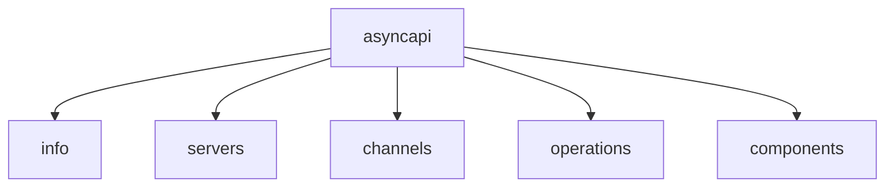
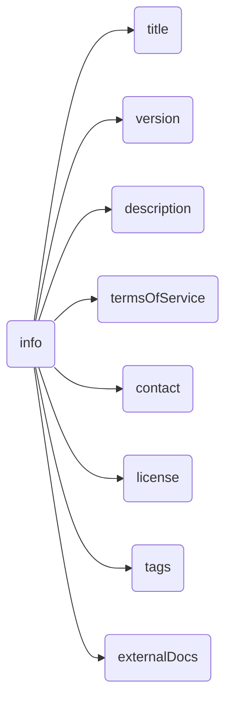
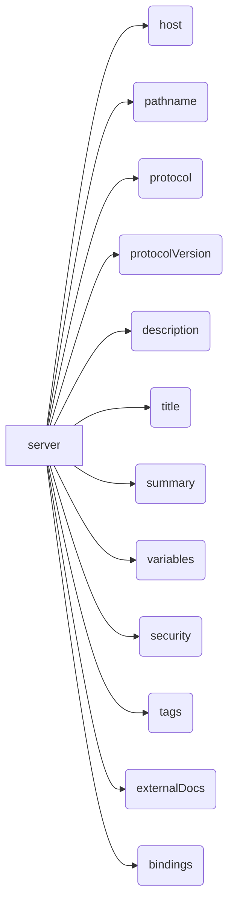
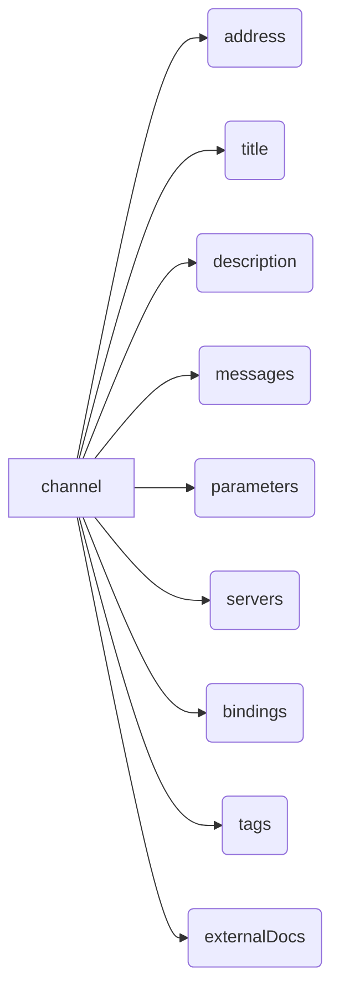
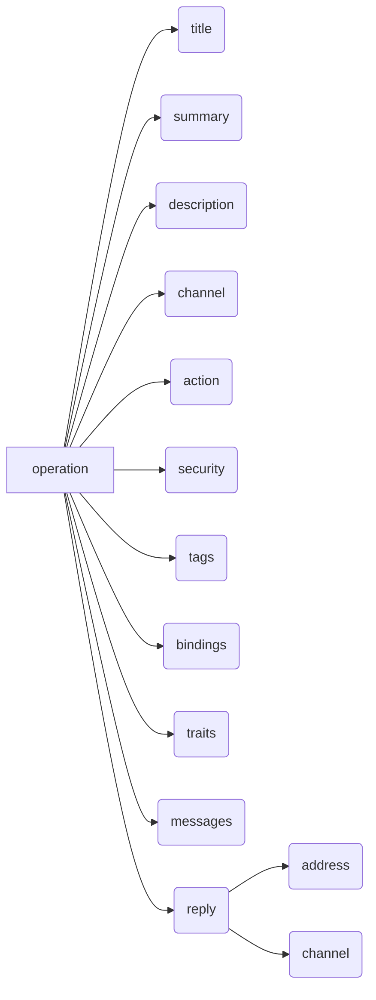
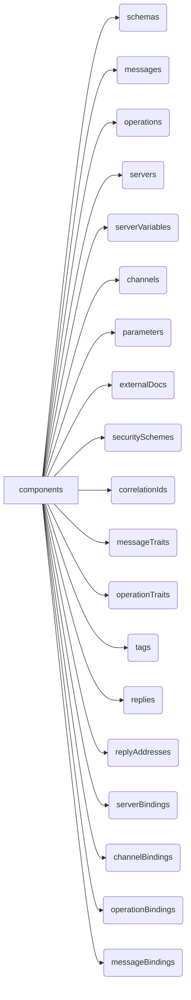

The structure of an AsyncAPI document is defined in a specific format and must follow the [AsyncAPI specification](/docs/reference/specification/latest). The structure of an AsyncAPI document has certain fields that you need to follow, although not all of them are mandatory.

## Root elements

Root elements of an AsyncAPI document provide an overview of the API's characteristics and behavior. These root elements collectively define the metadata, channels, components, and more of an AsyncAPI document. They provide a comprehensive overview of the API's characteristics and behavior.



### `info` field

The `info` field in an API document offers crucial metadata, including the API's title, version, description, contact details, and license. This field provides a comprehensive overview of the API, aiding developers, architects, and other stakeholders in quickly grasping its purpose and capabilities. As a mandatory element of the AsyncAPI specification, the `info` field often serves as the initial reference point for users navigating the API documentation.

The `info` field encompasses various fields such as:

- `title`: API title.
- `version`: API version.
- `description`: Brief description describing the API's purpose and features.
- `termsOfService`: URL or document specifying the API's terms of service.
- `contact`: Contact information of the API's owner or maintainer (name, email, and URL).
- `license`: API's license information, including name and URL.
- `tags`: Tags for categorizing and organizing API documentation. Also used for grouping applications logically.
- `externalDocs`:  Links to additional, external documentation related to the API.

Here's a visual representation of the `info` field and its properties:


Below is an example of the `info` field:
```yaml
info:
  title: My Event-Driven API
  version: 1.0.0
  description: This API provides real-time event streaming capabilities.
  termsOfService: https://example.com/terms-of-service
  contact:
    name: Rohit
    email: rohitwashere@asyncapi.com
  license:
    name: Apache 2.0
    url: https://www.apache.org/licenses/LICENSE-2.0.html
  tags:
    - name: Events
      description: APIs related to event streaming
    - name: Authentication
      description: APIs for authentication and authorization
  externalDocs:
    description: Additional documentation 
    url: https://example.com/docs
```

### `servers` field

The `servers` field allows you to detail a range of servers, outlining the network endpoints or message brokers to which applications can connect. That field includes vital connection information like protocol, host, port, and other options, facilitating connectivity across various environments such as production, staging, or development.

Some of the fields of individual `servers` field are:

- `host`: The server host name. It may include the port. 
- `protocol`: The protocol or messaging protocol used by the server (e.g., AMQP, MQTT, WebSocket).
- `protocolVersion`: The version of the protocol used for the connection.
- `pathname`: The path to a resource in the host.
- `description`: An optional string describing the server.
- `title`: A human-friendly title for the server.
- `summary`: A summary of the server.
- `security`: A declaration of which security schemes can be used with this server. 
- `tags`: A list of tags for logical grouping and categorization of servers.
- `externalDocs`: Additional external documentation for this server.
- `bindings`: A map where the keys describe the name of the protocol and the values describe protocol-specific definitions for the server.

Here's a visual representation of the `server` object and its properties:


Below is an example of the `servers` field with multiple servers:
```yaml
servers:
  production:
    host: rabbitmq.in.mycompany.com:5672
    pathname: /v1
    protocol: amqp
    protocolVersion: "1.0"
    description: Production RabbitMQ broker (uses the `production` vhost).
    title: Production Server
    summary: Production environment server
    security:
      - type: http
        scheme: bearer
    tags:
      - name: production
        description: Production environment
    externalDocs:
      description: Additional documentation for the production server
      url: https://example.com/docs/production
    bindings:
      amqp:
        exchange: my-exchange
        queue: my-queue
  staging:
    host: rabbitmq.in.mycompany.com:5672
    pathname: /v1
    protocol: amqp
    protocolVersion: "1.0"
    description: Staging RabbitMQ broker (uses the `staging` vhost).
    title: Staging Server
    summary: Staging environment server
    security:
      - type: apiKey
        in: user
        description: Provide your API key as the user and leave the password empty.
    tags:
      - name: staging
        description: Staging environment
    externalDocs:
      description: Additional documentation for the staging server
      url: https://example.com/docs/staging
    bindings:
      amqp:
        exchange: my-exchange
        queue: my-queue
```

### `channels` field

With the `channels` field, you can provide a map of different channels the application communicates with during runtime. The `channels` represent the communication pathways through which messages are exchanged. You can specify their purpose, address, and the expected message formats for communication. Consumers of the specific API can understand the supported message-based interactions and the corresponding data models.

Key components within the `channels` field include:

- `address`: A string representation of this channel's address.
- `messages`: A map of the messages that will be sent to this channel by any application at any time.
- `title`: A human-readable title for the channel.
- `summary`: A short yet brief summary of the channel.
- `description`: A description of the channel, providing additional context and details of the message.
- `servers`: An array of `$ref` pointers to the definition of the servers in which this channel is available. If servers are absent or empty, this channel must be available on all the servers defined in the `servers` field. 
- `parameters`: A map of the parameters included in the channel address.
- `tags`: A list of tags for logical grouping of channels.
- `externalDocs`: Additional external documentation for this channel.
- `bindings`: A map where the keys describe the name of the protocol and the values describe protocol-specific definitions for the channel.

Here's a visual representation of the `channels` field and its properties:


Below is an example of of the `channels` field with one channel:
```yaml
channels:
  user:
    address: 'users.{userId}'
    title: Users channel
    description: This channel is used to exchange messages about user events.
    messages:
      userSignedUp:
        $ref: '#/components/messages/userSignedUp'
      userCompletedOrder:
        $ref: '#/components/messages/userCompletedOrder'
    parameters:
      userId:
        $ref: '#/components/parameters/userId'
    servers:
      - $ref: '#/servers/production'
    bindings:
      amqp:
        is: queue
        queue:
          exclusive: true
    tags:
      - name: user
        description: User-related messages
    externalDocs:
      description: 'Find more info here'
      url: 'https://example.com'
```

### `operations` field

The `operations` field is used to comprehensively outline the various operations performed by the application. It offers a clear, structured description, detailing whether the application sends or receives messages and the specific purpose of each operation.

Key components within the `operations` field include:

- `action`: Use `send` type when it's expected that the application will send a message to the given channel, and `receive` type when the application should expect to receive messages from the given channel.
- `channel`: A `$ref` pointer to the definition of the channel in which this operation is performed. 
- `title`:	A human-friendly title for the operation.
- `summary`: A short summary of what the operation is about.
- `description`: A verbose explanation of the operation. 
- `security`:	A declaration of which security schemes are associated with this operation.
- `tags`:	A list of tags for logical grouping and categorization of operations.
- `externalDocs`:	Additional external documentation for this operation.
- `bindings`	A map where the keys describe the name of the protocol and the values describe protocol-specific definitions for the operation.
- `traits`:	A list of traits to apply to the operation object. 
- `messages`:	A list of $ref pointers pointing to the supported Message Objects that can be processed by this operation.
- `reply`:	The definition of the reply in a reply/request operation.

Here's a visual representation of the `operations` field and its properties:


Below is an example of of the `operations` field with one operation:
```yaml
operations:
  sendUserSignUp:
    action: send
    title: User sign up
    summary: Action to sign a user up.
    description: A longer description
    channel:
      $ref: '#/channels/user'
    security:
      - type: oauth2
        description: The oauth security descriptions
        flows:
          clientCredentials:
            tokenUrl: 'https://example.com/api/oauth/dialog'
            availableScopes:
              'subscribe:auth_revocations': Scope required for authorization revocation topic
        scopes:
          - 'subscribe:auth_revocations'
    tags:
      - name: user
      - name: signup
      - name: register
    bindings:
      amqp:
        ack: false
    traits:
      - $ref: "#/components/operationTraits/kafka"
    messages:
      - $ref: '#/components/messages/userSignedUp'
    reply:
      address:
        location: '$message.header#/replyTo'
      channel:
        $ref: '#/channels/userSignupReply'
      messages:
        - $ref: '#/channels/userSignupReply/messages/userSignedUpReply'
```

### `components` field

The `components` field allows for the definition of reusable structures or definitions applicable across various sections of your document. Items detailed within `components` only become part of the API when explicitly referenced by properties external to this field. Utilize it to avoid repetition and enhance the document's maintainability.

Key components of the `components` field include:

- `schemas`: An object to hold the reusable [Schema Object](/docs/reference/specification/latest#schemaObject). 
- `servers`: An object to hold the reusable [Server Objects](/docs/reference/specification/latest#serverObject).
- `channels`: An object to hold the reusable [Channel Objects](/docs/reference/specification/latest#channelObject).
- `operations`: An object to hold the reusable [Operation Item Objects](/docs/reference/specification/latest#operationObject).
- `messages`: An object to hold the reusable [Messages Objects](/docs/reference/specification/latest#messageObject).
- `securitySchemes`: An object to hold the reusable [Security Scheme Objects](/docs/reference/specification/latest#securitySchemeObject).
- `serverVariables`: An object to hold the reusable [Server Variable Objects](/docs/reference/specification/latest#serverVariableObject).
- `parameters`: Contains reusable [Parameter Objects](/docs/reference/specification/latest#parameterObject) that can be used in various parts of the AsyncAPI document.
- `correlationIds`: An object to hold the reusable [Correlation ID Objects](/docs/reference/specification/latest#correlationIdObject).
- `replies`: An object to hold the reusable [Operation Reply Objects](/docs/reference/specification/latest#operationReplyObject).
- `replyAddresses`: An object to hold the reusable [Operation Reply Address Objects](/docs/reference/specification/latest#operationReplyAddressObject).
- `externalDocs`: An object to hold the reusable [External Documentation Objects](docs/reference/specification/latest#externalDocumentationObject).
- `tags`: An object to hold the reusable [Tag Objects](/docs/reference/specification/latest#tagObject).
- `operationTraits`: An object to hold the reusable [Operation Trait Objects](/docs/reference/specification/latest#operationTraitObject).
- `messageTraits`: Represents common traits or characteristics that can be applied to messages or hold reusable [Message Trait Objects](/docs/reference/specification/latest#messageTraitObject).
- `serverBindings`: An object to hold the reusable [Server Bindings Objects](/docs/reference/specification/latest#serverBindingsObject).
- `channelBindings`: An object to hold the reusable [Channel Bindings Objects](/docs/reference/specification/latest#channelBindingsObject).
- `operationBindings`: An object to hold the reusable [Operation Bindings Objects](/docs/reference/specification/latest#operationBindingsObject).
- `messageBindings`: An object to hold the reusable [Message Bindings Objects](/docs/reference/specification/latest#messageBindingsObject).

Here's a visual representation of the `components` field and its properties:


Here's a code example of the components object in an AsyncAPI document:
```yaml
components:

  schemas:
    Category:
      type: object
      properties:
        id:
          type: integer
          format: int64
    AvroExample:
      schemaFormat: application/vnd.apache.avro+json;version=1.9.0
      schema:
        $ref: 'path/to/user-create.avsc/#UserCreate'

  servers:
    development:
      host: '{stage}.in.mycompany.com'
      protocol: amqp
      description: RabbitMQ broker
      bindings:
        $ref: '#/components/serverBindings/devAmqp'
      variables:
        stage:
          $ref: '#/components/serverVariables/stage'
      security:
        - $ref: '#/components/securitySchemes/oauth'

  serverVariables:
    stage:
      default: demo
      description: This value is assigned by the service provider in this example of `mycompany.com`

  channels:
    user:
      address: 'users.{userId}'
      title: Users channel
      description: This channel is used to exchange messages about user events.
      messages:
        userSignedUp:
          $ref: '#/components/messages/userSignUp'
      parameters:
        userId:
          $ref: '#/components/parameters/userId'
      servers:
        - $ref: '#/components/servers/development'
      bindings:
        $ref: '#/components/channelBindings/user'
      tags:
        - $ref: '#/components/tags/user'
      externalDocs:
        $ref: '#/components/externalDocs/infoDocs'

  messages:
    userSignUp:
      summary: Action to sign a user up.
      traits:
        - $ref: '#/components/messageTraits/commonHeaders'
      payload:
        $ref: '#/components/schemas/Category'
      correlationId:
          $ref: '#/components/correlationIds/default'
      bindings:
        $ref: '#/components/messageBindings/user'

  parameters:
    userId:
      description: Id of the user.

  correlationIds:
    default:
      description: Default Correlation ID
      location: $message.header#/correlationId

  operations:
    sendUserSignUp:
      action: send
      title: User sign up
      bindings:
        $ref: '#/components/operationBindings/sendUser'
      traits:
        - $ref: '#/components/operationTraits/binding'
      reply:
        $ref: '#/components/replies/signupReply'

  replies:
    signupReply:
      address:
        $ref: '#/components/replyAddresses/signupReply'
      channel:
        $ref: '#/channels/userSignupReply'

  replyAddresses:
    signupReply:
      location: '$message.header#/replyTo'


  securitySchemes:
    oauth:
      type: oauth2
      description: The oauth security descriptions
      flows:
        clientCredentials:
          tokenUrl: 'https://example.com/api/oauth/dialog'
          availableScopes:
            'subscribe:auth_revocations': Scope required for authorization revocation topic
      scopes:
        - 'subscribe:auth_revocations'

  operationTraits:
    binding:
      bindings:
        amqp:
          ack: false

  messageTraits:
    commonHeaders:
      headers:
        type: object
        properties:
          my-app-header:
            type: integer
            minimum: 0
            maximum: 100

  tags:
    user:
      name: user
      description: User-related messages

  externalDocs:
    infoDocs:
      url: https://example.com/docs
      description: 'Find more info here'

  serverBindings:
    devAmqp:
      amqp:
        exchange: my-exchange
        queue: my-queue

  channelBindings:
    user:
      amqp:
        is: queue
        queue:
          exclusive: true

  operationBindings:
    sendUser:
      amqp:
        ack: false

  messageBindings:
    user:
      amqp:
        contentEncoding: gzip
        messageType: 'user.signup'
        bindingVersion: '0.2.0'
```
