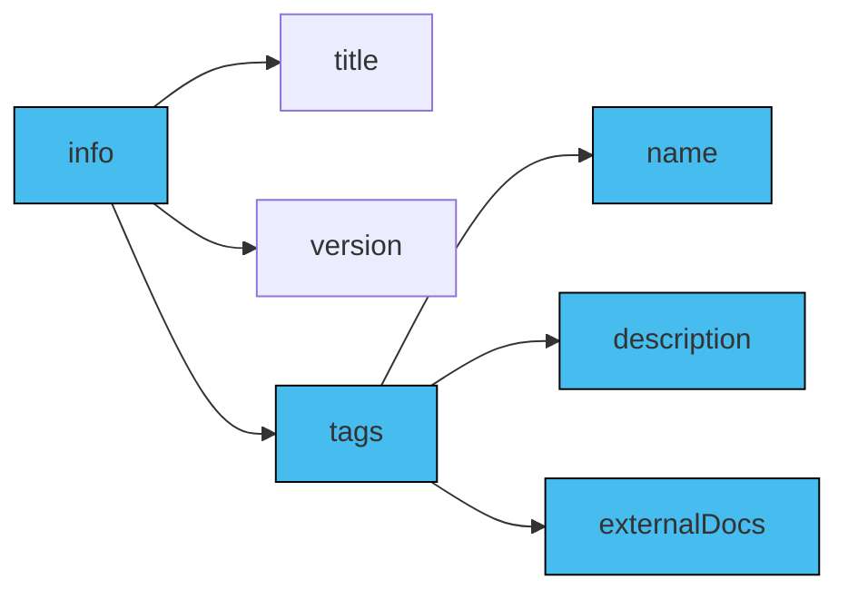
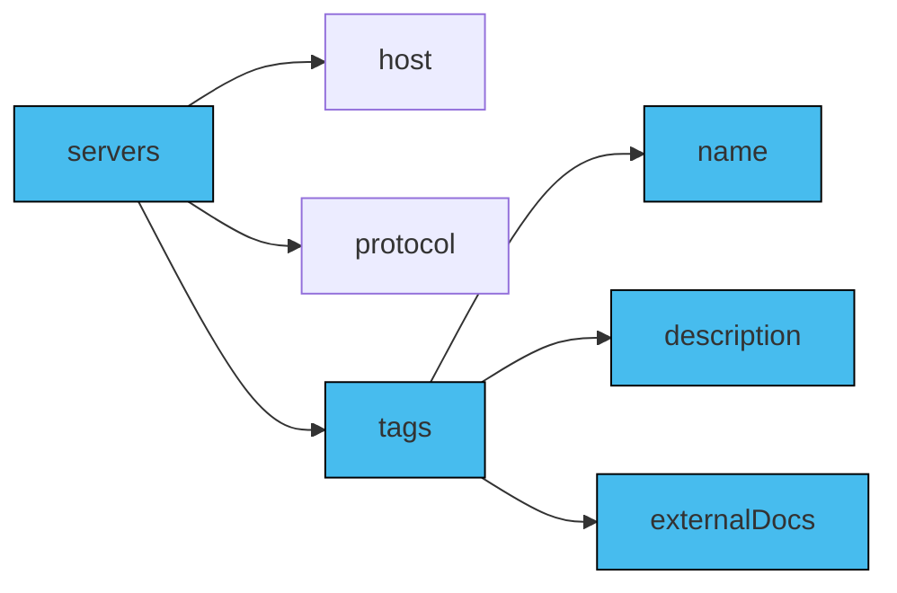
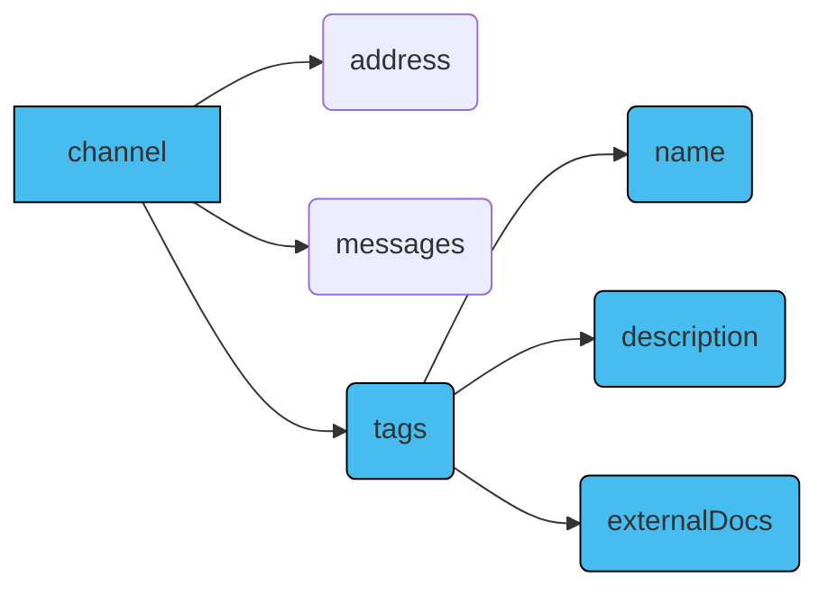
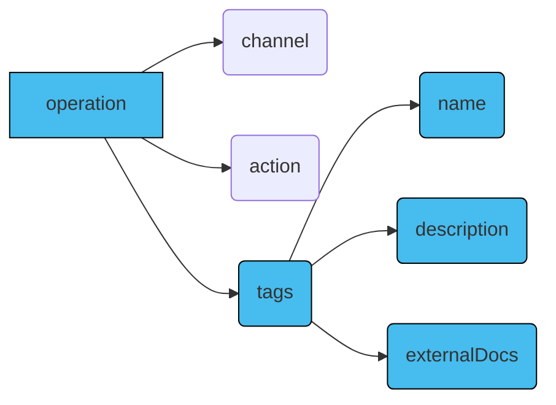
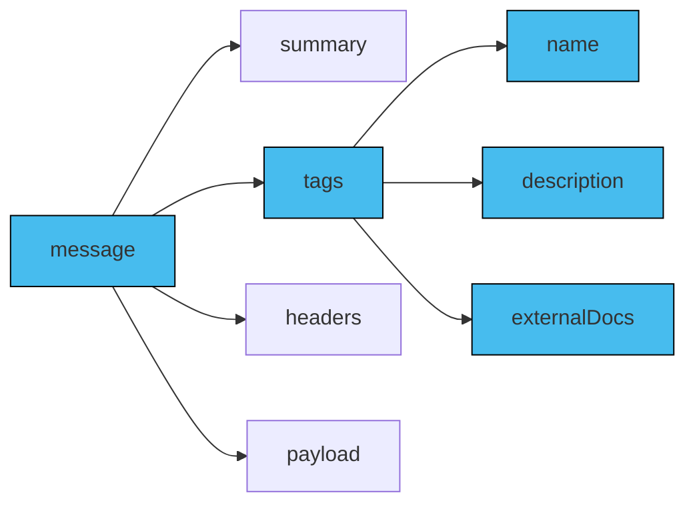

## `tags` in AsyncAPI document
A tag is a label or category that groups related entities in an event-driven system.

In the AsyncAPI document, tags are defined as a list of [`tag` objects](/docs/reference/specification/latest#tagObject) within the [`tags` object](/docs/reference/specification/latest#tagsObject) at the [`info` level](/docs/concepts/asyncapi-document/structure#info-field).

The individual `tags` field contains the following properties:

- `name`: The name of the tag.
- `description`: A short description explaining the tag's purpose or usage.
- `externalDocs`: Additional external documentation for the tag.

Tags have different purposes depending on the context. They can either be used for consistent tag usage across the AsyncAPI document and logical component grouping or be applied to individual components like [`servers`](/docs/concepts/asyncapi-document/structure#servers-field), [`channels`](/docs/concepts/asyncapi-document/structure#channels-field), or [`operations`](/docs/concepts/asyncapi-document/structure#operations-field) for more specific purposes.

To reuse `tags`, you must define them in the [`components` object](/docs/reference/specification/latest#componentsObject) of an AsyncAPI document and then use [reference objects](/docs/reference/specification/latest#referenceObject) to include them.

### `tags` in `info` object
Tags specified in the `tags` property of the `info` object categorize the entire AsyncAPI document. These globally defined tags provide an overarching context, representing key themes or functional areas within the event-driven system. They group elements like channels or servers by relevance, offering a holistic understanding of the application's structure.

Below is a visual representation of the `tags` object inside the `info` object in an AsyncAPI document:



Below is an example of the `tags` object inside the `info` object in an AsyncAPI document:

```yaml
asyncapi: 3.0.0
info:
  title: AsyncAPI Documentation
  version: 1.0.0
  description: |
    This AsyncAPI document provides an overview
    of the event-driven system
  tags:
    - name: Applications
      description: All applications related topics
      externalDocs:
        description: More info about applications
        url: https://applications.example.com/docs
    - name: Time
      description: All time related topics
      externalDocs:
        description: More info about time
        url: https://time.example.com/docs
```

### `tags` in `servers` object
Tags specified in the `tags` property of the `servers` object categorize server configurations and characteristics. They allow for server categorization based on:

- criteria like location, environment type (like production or development), and unique server features.
- specific tags or labels.

Using the `tags` object under `servers` is optional.

Below is a visual representation of the `tags` object inside the `servers` object in an AsyncAPI document:



Below is an example of the `tags` object inside the `servers` object in an AsyncAPI document:

```yaml
asyncapi: 3.0.0

info:
  title: AsyncAPI Documentation
  version: 1.0.0

servers:
  development:
    host: localhost:5672
    description: Development AMQP broker
    protocol: amqp
    protocolVersion: 0-9-1
    tags:
      - name: env:development
        description: This environment is meant for developers to run their tests
  production:
    host: rabbitmq.in.mycompany.com:5672
    description: RabbitMQ broker for the production environment
    protocol: amqp
    protocolVersion: 0-9-1
    tags:
      - name: env:production
        description: This environment is the live environment available for final users
```

### `tags` in `channels` object
Tags specified in the `tags` property of the `channels` object enable logical grouping and categorization based on specific functionalities or business domains.

Using the `tags` object under the `channels` object is optional.

Below is a visual representation of the `tags` object inside the `channels` object in an AsyncAPI document:



Below is an example of the `tags` object inside the `channels` object in an AsyncAPI document:

```yaml
asyncapi: 3.0.0

info:
  title: AsyncAPI Documentation
  version: 1.0.0

channels:
  SignedUp:
    address: 'user.signedup'
    messages:
      userSignedUp:
        payload:
          type: object
    tags:
      - name: user
        description: User-related messages
```

### `tags` in `operations` object
Tags specified in the `tags` property of the `operations` object facilitate logical grouping and categorization of `operation` objects by type, functionality, and more.

Using the `tags` object under the `operations` object is optional.

Below is a visual representation of the `tags` object inside the `operations` object in an AsyncAPI document:



Below is an example of the `tags` object inside the `operations` object in an AsyncAPI document:

```yaml
operations:
  onUserSignUp:
    title: User sign up
    summary: Action to sign a user up
    description: A longer description
    channel:
      $ref: '#/channels/userSignup'
    action: send
    tags:
      - name: user
        description: operation related to user
      - name: signup
        description: operation related to a user's signUp
      - name: register
        description: operation related to a new registration
    bindings:
      amqp:
        ack: false
    traits:
      - $ref: '#/components/operationTraits/kafka'
```

### `tags` in `message` object
Tags specified in the `tags` property of the `message` object group and categorize messages based on criteria, requirements, channels, and operations.

Using the `tags` object under the `message` object is optional.

Below is a visual representation of the `tags` object inside the `message` object in an AsyncAPI document:



Below is an example of the `tags` object inside the `message` object in an AsyncAPI document:

```yaml
 name: SimpleSignup
summary: A simple UserSignup example message
tags: 
    - name: userSignUp
      description: some message related to user signup
headers:
  correlationId: my-correlation-id
  applicationInstanceId: myInstanceId
payload:
  user:
    someUserKey: someUserValue
  signup:
    someSignupKey: someSignupValue
```

Below is an example of all the tags defined in the `components` object and referenced in other components like `servers` and `channels`:

```yml
asyncapi: 3.0.0

components:
  tags:
    speech:
      name: Speech
      description: All speech related topics
    video:
      name: Video
      description: All video related topics
      
info:
  title: AsyncAPI Documentation
  version: 1.0.0
  description: |
    This AsyncAPI document provides an overview
    of the event-driven system
  tags:
    - $ref: '#/components/tags/speech'
    - $ref: '#/components/tags/video'

servers:
  speech:
    host: localhost:5672
    description: RabbitMQ broker for sending speech data
    protocol: amqp
    tags:
      - $ref: '#/components/tags/speech'
  video:
    host: localhost:5673
    description: RabbitMQ broker for video information
    protocol: amqp
    tags:
       - $ref: '#/components/tags/video'

channels:
  getSpeech:
      address: 'application/speech/get'
      servers: 
        - $ref: '#/servers/speech'
      messages:
        voice:
          name: Voice
          summary: Add info about the voice stream data
          tags:
            - $ref: '#/components/tags/speech'
  getVideo:
      address: 'application/video/get'
      servers: 
        - $ref: '#/servers/video'
      messages:
        voice:
          name: Video
          summary: Add info about the video data live bitrate and others
          tags: 
            - $ref: '#/components/tags/video'

operations:
  onVoiceStreamed:
    title: Get speech data
    channel:
      $ref: '#/channels/getSpeech'
    action: receive
    tags:
      - $ref: '#/components/tags/speech'

  onVideoStreamed:
    title: Get video data
    channel:
      $ref: '#/channels/getVideo'
    action: receive
    tags:
      - $ref: '#/components/tags/video'
```
