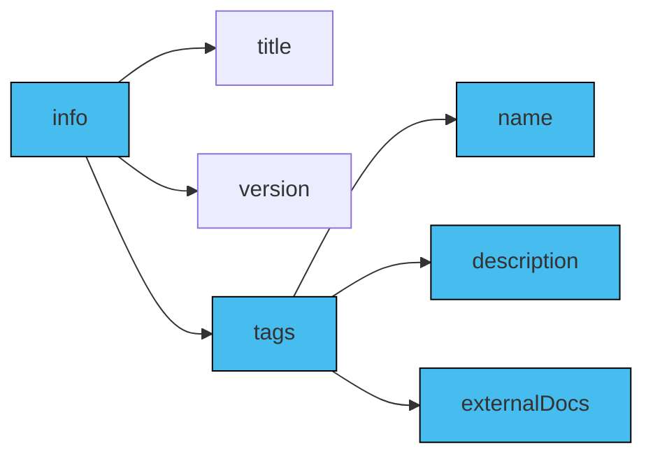
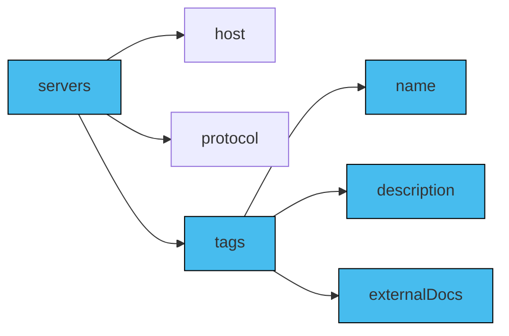
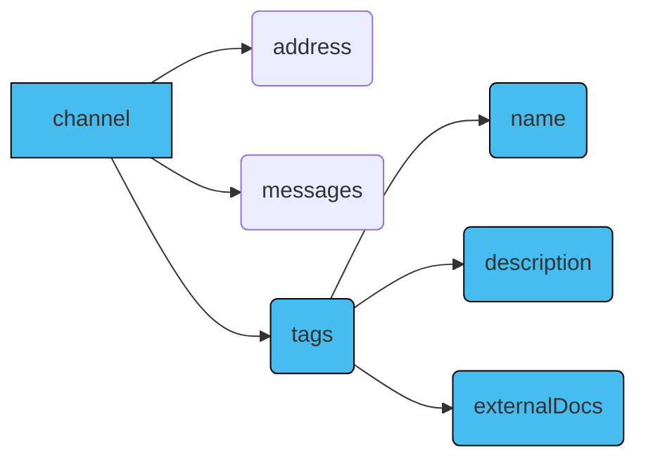
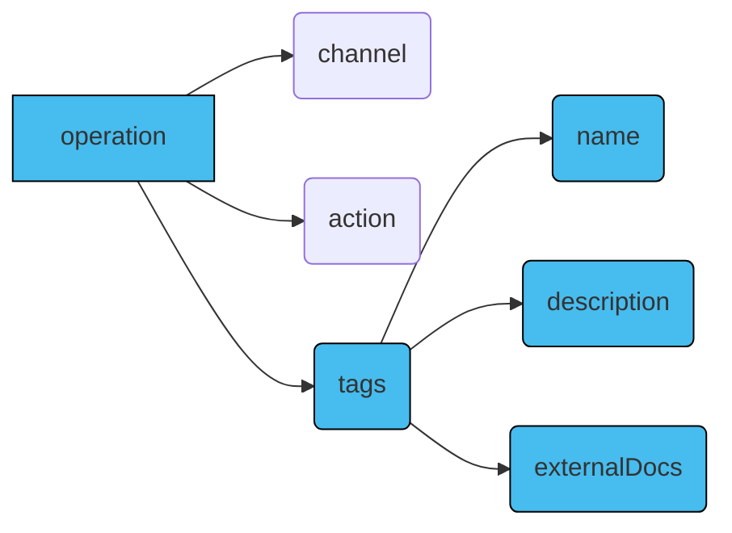
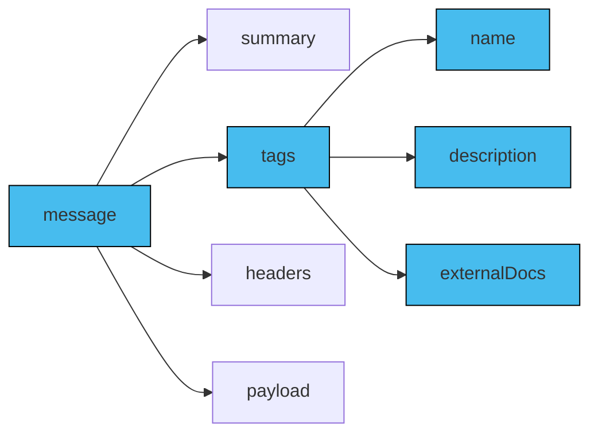

A tag functions as a label or category for logically grouping related entities like channels or servers in an event-driven system. The `tag` object facilitates the organization of channels, operations, or other components, categorizing them based on functionality, purpose, or other relevant criteria.

In AsyncAPI, the `tags` object is a list of individual `tag` objects. Each `tag` within this collection can be defined with a specific name, accompanied by an optional description that offers additional insight into the tag's intended purpose or usage.

You can define `tags` in the [`components` object](/docs/reference/specification/latest#componentsObject) of an AsyncAPI document, which enables the reusability of the tags. If you include `tags` in the `components` object, they can be re-used by using [reference objects](/docs/reference/specification/latest#referenceObject).

Additionally, within AsyncAPI, you can create a list of tags in the `tags` object at the `info` level, specifying the tags you intend to use throughout the document. These predefined tags can then be applied to individual components like `servers` or `channels`, facilitating logical grouping and organization of these components.

## `tags` in AsyncAPI document

The `tags` object consists of a list of `tag` objects, which can be referenced using the [reference object](/docs/reference/specification/latest#referenceObject).

The `tags` object is a list of tags and individual `tag` objects, each containing specific fields.

In an AsyncAPI document, the function of tags within the `tags` object differs depending on context. For example, the `tags` object can be employed for consistent usage of tags across the document and logical grouping of components. Alternatively, tags can be applied to individual components such as `servers` or `channels`, serving more specific purposes within those contexts.

The `tags` object fields include: 
- `name`: The name of the tag.
- `description`: A short description for the tag.
- `externalDocs`: Additional external documentation for the tag.

### `tags` in `info` object

When specified in the `tags` property of the info object, tags offer a comprehensive categorization for the entire AsyncAPI document. These globally defined tags under the `info` object impart an overarching context, representing key themes or functional areas within the event-driven system. They effectively group elements like channels or servers by their broader relevance, providing a holistic understanding of the application's structure.

Here's a visual representation of the `tags` object inside an `info` object in an AsyncAPI document:


Below is an example of the `tags` object inside the `info` object in an AsyncAPI document:
```yaml
asyncapi: 3.0.0
info:
  title: AsyncAPI Documentation
  version: 1.0.0
  description: |
    This AsyncAPI document provides an overview
    of the event-driven system.
  tags:
    - name: Applications
      description: All applications related topics. 
      externalDocs:
        description: More info about applications
        url: https://applications.example.com/docs
    - name: Time
      description: All time related topics.
      externalDocs:
        description: More info about time
        url: https://time.example.com/docs
```

### `tags` in `servers` object
When tags are utilized within the `servers` object's `tags` property, they specifically pertain to server configurations and characteristics. These tags enable server categorization by various criteria, including geographical location, environment type (i.e., production or development), or unique server features. Using `tags` in the `servers` object allows for the categorization and organization of servers based on specific tags or labels. Using the `tags` object under the `servers` object is optional.

Here's a visual representation of the `tags` object inside a `servers` object in an AsyncAPI document:


Below is an example of the `tags` object inside the `servers` object in an AsyncAPI document:
```yaml
asyncapi: 3.0.0

info:
  title: AsyncAPI Documentation
  version: 1.0.0

servers:
  development:
    host: localhost:5672
    description: Development AMQP broker.
    protocol: amqp
    protocolVersion: 0-9-1
    tags:
      - name: "env:development"
        description: "This environment is meant for developers to run their tests."
  production:
    host: rabbitmq.in.mycompany.com:5672
    description: RabbitMQ broker for the production environment.
    protocol: amqp
    protocolVersion: 0-9-1
    tags:
      - name: "env:production"
        description: "This environment is the live environment available for final users."
```

### `tags` in `channels` object

Tags linked with individual channels enable logical grouping and categorization based on specific functionalities or business domains. When the `tags` object is used within a `channels` object in an AsyncAPI document, its context is either confined to the `channels` object, impacting only that section, or it can be employed for consistent tagging across the document for cohesive grouping. Using the `tags` object under the `channels` object is optional.


Here's a visual representation of the `tags` object inside a `channels` object in an AsyncAPI document:


Below is an example of the `tags` object inside the `channels` object in an AsyncAPI document:
```yaml
asyncapi: 3.0.0

info:
  title: AsyncAPI Documentation
  version: 1.0.0

channels:
  SignedUp:
    address: 'user.signedup'
    messages:
      userSignedUp:
        payload:
          type: object
    tags:
      - name: user
        description: User-related messages
```

### `tags` in `operations` object

Within an AsyncAPI document, the `tags` object in the `operations` object facilitates logical grouping and categorization of `operation` objects by operation type, functionality, and more. When used in an `operations` object, the `tags` can either serve a specific purpose within that object or be employed for consistent, logical grouping of components across the document. Using the `tags` object in the `operations` object is optional.

Here's a visual representation of the `tags` object inside a `operations` object in an AsyncAPI document:


Below is an example of the `tags` object inside the `operations` object in an AsyncAPI document:
```yaml
operations:
  onUserSignUp:
    title: User sign up
    summary: Action to sign a user up.
    description: A longer description
    channel:
      $ref: '#/channels/userSignup'
    action: send
    tags:
      - name: user
        description: operation related to user
      - name: signup
        description: operation related to a user's signUp
      - name: register
        description: operation related to a new registration
    bindings:
      amqp:
        ack: false
    traits:
      - $ref: '#/components/operationTraits/kafka'
```

### `tags` in `message` object

Tags linked to individual message objects in an AsyncAPI document enable logical grouping and categorization of messages based on specific criteria, requirements, channels, and operations. When implemented within a `message` object, the context of the `tags` object can be confined to that specific message or integrated as the strategy for consistent tagging and logical organization across the entire document.

Here's a visual representation of a `tags` object inside a `message` object in an AsyncAPI document:


Below is an example of the `tags` object inside the `message` object in an AsyncAPI document:
```yaml
 name: SimpleSignup
summary: A simple UserSignup example message
tags: 
    - name: userSignUp
      description: some message related to user signup
headers:
  correlationId: my-correlation-id
  applicationInstanceId: myInstanceId
payload:
  user:
    someUserKey: someUserValue
  signup:
    someSignupKey: someSignupValue
```


Here's an example illustrating all the tags being defined in the `components` object and then referenced in other components such as `servers`, `channels`, and more:

```yml
asyncapi: 3.0.0

components:
  tags:
    speech:
      name: Speech
      description: All speech related topics.
    video:
      name: Video
      description: All video related topics.
      
info:
  title: AsyncAPI Documentation
  version: 1.0.0
  description: |
    This AsyncAPI document provides an overview
    of the event-driven system.
  tags:
    - $ref: '#/components/tags/speech'
    - $ref: '#/components/tags/video'

servers:
  speech:
    host: localhost:5672
    description: RabbitMQ broker for sending speech data.
    protocol: amqp
    tags:
      - $ref: '#/components/tags/speech'
  video:
    host: localhost:5673
    description: RabbitMQ broker for video information.
    protocol: amqp
    tags:
       - $ref: '#/components/tags/video'

channels:
  getSpeech:
      address: 'application/speech/get'
      servers: 
        - $ref: '#/servers/speech'
      messages:
        voice:
          name: Voice
          summary: Add info about the voice stream data.
          tags:
            - $ref: '#/components/tags/speech'
  getVideo:
      address: 'application/video/get'
      servers: 
        - $ref: '#/servers/video'
      messages:
        voice:
          name: Video
          summary: Add info about the video data live bitrate and others.
          tags: 
            - $ref: '#/components/tags/video'

operations:
  onVoiceStreamed:
    title: Get speech data
    channel:
      $ref: '#/channels/getSpeech'
    action: receive
    tags:
      - $ref: '#/components/tags/speech'

  onVideoStreamed:
    title: Get video data
    channel:
      $ref: '#/channels/getVideo'
    action: receive
    tags:
      - $ref: '#/components/tags/video'
```
