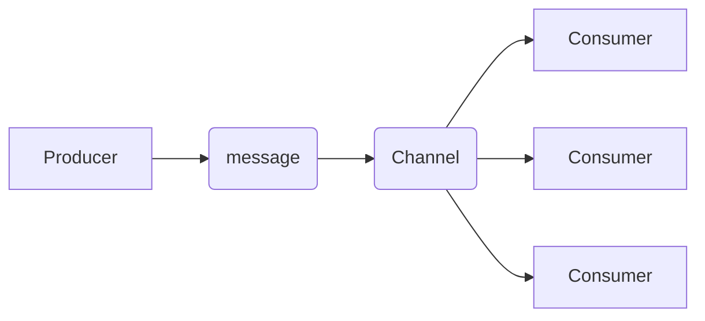

# What is a channel?
A _channel_ is a mechanism created by the server that facilitates the organization and transmission of messages. Depending on the used protocol, users can define channels as a _topic_, _queue_, _routing key_, _path_, or _subject_.

# Why do we need channels?
Channels are pivotal for establishing communication between producers and consumers. They enable producers to send messages, while consumers receive messages from specific channels. The primary function of a channel is to ensure that the intended messages reach the appropriate consumers.

The diagram above illustrates the communication process between a producer and multiple consumers. The producer sends a message through the channel, which then queues the message for delivery to the appropriate consumers.