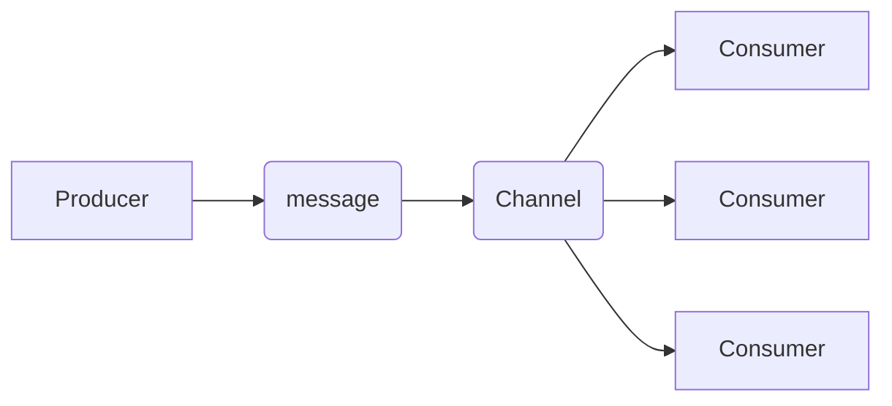

# What is a channel?
A `channel` is a mechanism created by the server for the organization and transmission of messages. Users can define channels as a _topic, queue, routing key, path,_  or _subject_ depending on the protocol used.

# Why do we need channels?
Channels play a crucial role in communication between `producers` and `consumers`. A producer can send a message through the channel, and the consumer receives messages from a particular channel. A channel's sole purpose is to ensure the right messages route to the right consumers.

The diagram above shows the communication between a `producer` and `consumer`, with the producer sending a `message` through the `channel`. The channel then queues the message to the specific consumer.
