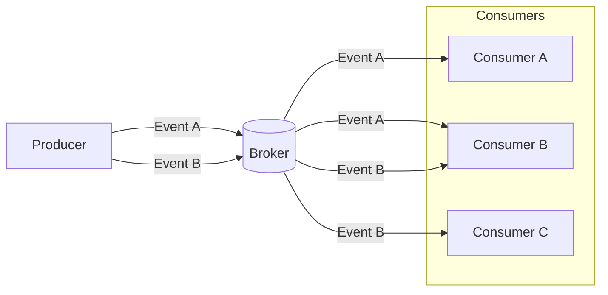

## What is a consumer?
A _consumer_ is an application that subscribes to a specific event from a broker and responds accordingly.

## Why do we need consumers?
Unlike traditional REST APIs, in Event-Driven Architecture (EDA), event consumers are asynchronous, which means they are not required to respond immediately on the same connection. In this architecture, consumers are unaware of the producers or other consumers. All they know is that when a broker sends them an event, it is because they have subscribed to it.

When you want your application to process events asynchronously, the consumer plays a crucial role in completing the event data flow through the event channel.

The diagram above illustrates a sample flow of events from the `producer` to the `broker` to the `consumers`. In this scenario, the `producer` publishes two events _(A and B)_ and sends them to the `broker`. Subsequently, each `consumer` subscribes to receive those events.

<Remember>
<b>Subscribers</b> can also be <a href="https://www.asyncapi.com/docs/concepts/producer">producers</a>.
</Remember>
