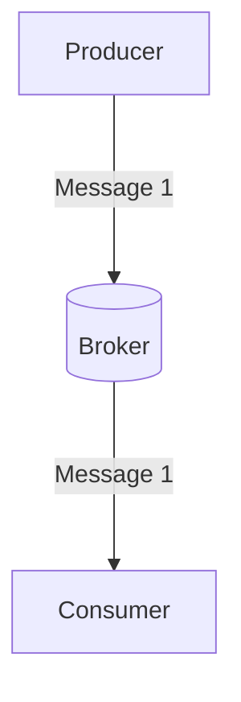
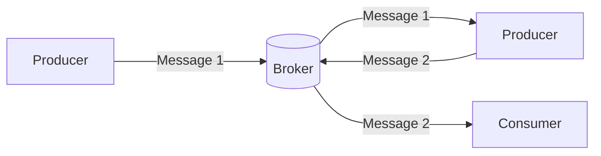

## What is a Producer? 
A _producer_ is an application that detects state changes (_events_) and publishes these events as messages. An event signifies a state change or update triggered by a user’s or device’s action.

The following are sample events:
* Adding an item to a shopping cart on an e-commerce website.
* Clicking the subscribe button on a YouTube channel.
* Detecting a temperature change using a sensor.

## Why do we need Producers? 
The publish/subscribe communication model is one of the core concepts of event-driven architecture. In this model, producers are publishers, acting as the first logical layer responsible for distributing messages to the broker, enabling others to subscribe and receive these messages.

The diagram above illustrates the communication flow between a producer who publishes events to a specific channel in a broker and a consumer who subscribes to the same channel.

In some cases, an entity can simultaneously function as both a producer, publishing messages to a specific channel in the broker, and a consumer, subscribing to messages from a different channel in the broker.

In the diagram above, there is a producer publishing messages to a specific channel and a consumer subscribing to messages from that channel. Also, there is a second producer publishing to one channel and subscribing to messages from another channel.
