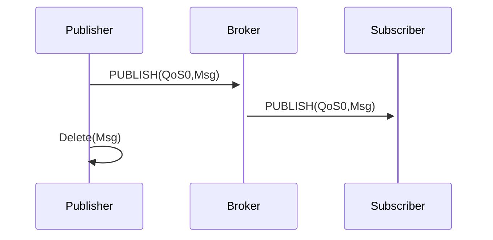

## What is a protocol?
A _protocol_ is a set of rules that governs the exchange of information between applications and/or servers.

Protocol examples:
* [WebSockets](https://developer.mozilla.org/en-US/docs/Web/API/WebSocket)
* [HTTP](https://developer.mozilla.org/en-US/docs/Web/HTTP)
* [Kafka](https://kafka.apache.org/)
* [MQTT](https://mqtt.org/)

## Why do we need protocols?
Protocols play a crucial role in message transmission. Whenever a producer detects a state change (events) and publishes those events as messages, a protocol carries those messages to the channel and then to the consumer.

The diagram above illustrates the message exchange flow from `producer` to `broker` to `consumer` using the MQTT protocol with QoS0 (quality of service 0). In other words, the information transferred from the producer to broker to consumer is delivered at most once.

The quality of service information rule is defined at the protocol level. Broker implementations and other involved parties must adhere to this rule.

In AsyncAPI documents, all protocol-specific details that the application follows can be described using [bindings](https://www.asyncapi.com/docs/reference/specification/latest#definitionsBindings).
