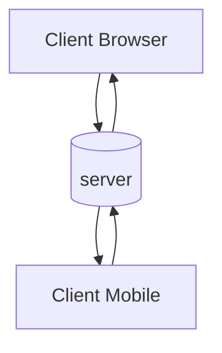
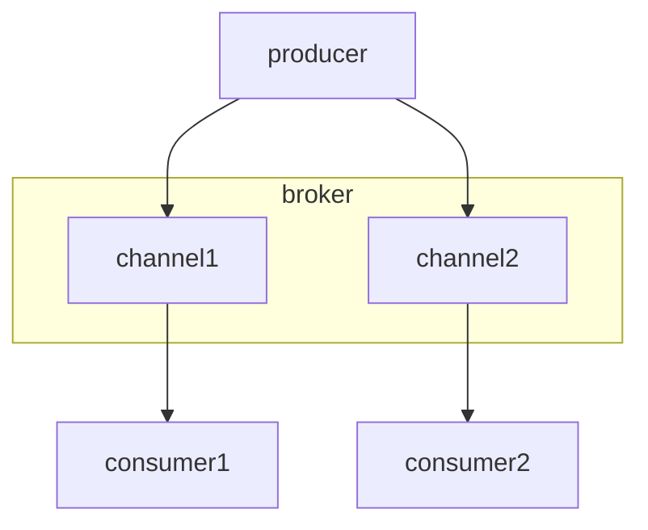

## What is a server?
A _server_ acts as a _messaging broker_ system, establishing connections and facilitating communication between [_producers_](producer) and [_consumers_](consumer). Unlike traditional API servers that rely on request-response interactions, message broker interactions occur bidirectionally across various channels.

## What is the purpose of servers?
Servers play a crucial role in establishing a connection between producers and consumers. In the context of designing and setting up an event-driven application, servers are responsible for delivering asynchronous messages from the producer to the consumers through the use of [_channels_](channel). Additionally, servers can integrate various messaging [_protocols_](protocol) to facilitate the transmission and exchange of messages between _clients_.

### Clients and Server

The diagram above illustrates a bidirectional communication between one server and several clients. In this case, in your AsyncAPI file, you describe the `server`, so the [`Server Object`](https://www.asyncapi.com/docs/reference/specification/latest#serverObject) holds information about the actual server, including its physical location.

### Broker Centric

The diagram above illustrates the Broker-centric Architecture. In this case, there are three AsyncAPI files for the `producer`, `consumer1`, and `consumer2`. In these AsyncAPI files, the [`Server Object`](https://www.asyncapi.com/docs/reference/specification/latest#serverObject) provides information about the `broker`, so that API users know where to connect to start receiving or sending messages.
