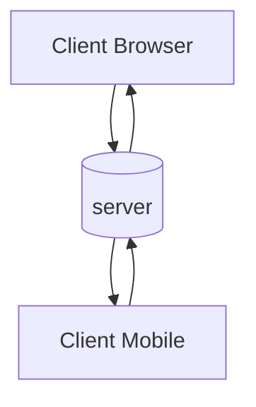
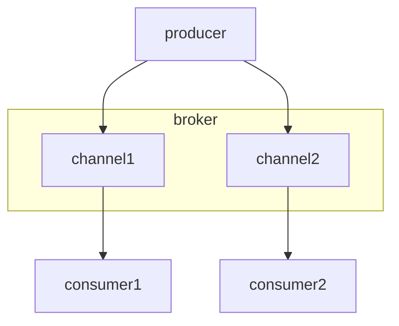

## What is a _server_?
A _server_ acts as a _messaging broker_ system, establishing connections and facilitating communication between [_producers_](producer) and [_consumers_](consumer). Unlike traditional API servers that rely on request-response interactions, message broker interactions occur bidirectionally across various _channels_.

## What is the purpose of _servers_?
_Servers_ play a crucial role in establishing a connection between _producers_ and _consumers_. In the context of designing and setting up an event-driven application, _servers_ are responsible for delivering asynchronous messages from the _producer_ to the _consumers_ through the use of [_channels_](channel). Additionally, _servers_ can integrate various messaging [_protocols_](protocol) to facilitate the transmission and exchange of messages between _clients_.

### _Clients_ and _Server_

The diagram above illustrates a bidirectional communication between one _server_ and several _clients_. In this case, in your AsyncAPI file, you describe the `server`, so the [`Server Object`](https://www.asyncapi.com/docs/reference/specification/latest#serverObject) holds information about the actual _server_, including its physical location.

### _Broker Centric_

The diagram above illustrates the _Broker-centric_ Architecture. In this case, there are three AsyncAPI files for the _producer_, _consumer1_, and _consumer2_. In these AsyncAPI files, the [`Server Object`](https://www.asyncapi.com/docs/reference/specification/latest#serverObject) provides information about the _broker_, so that API users know where to connect to start receiving or sending messages.
