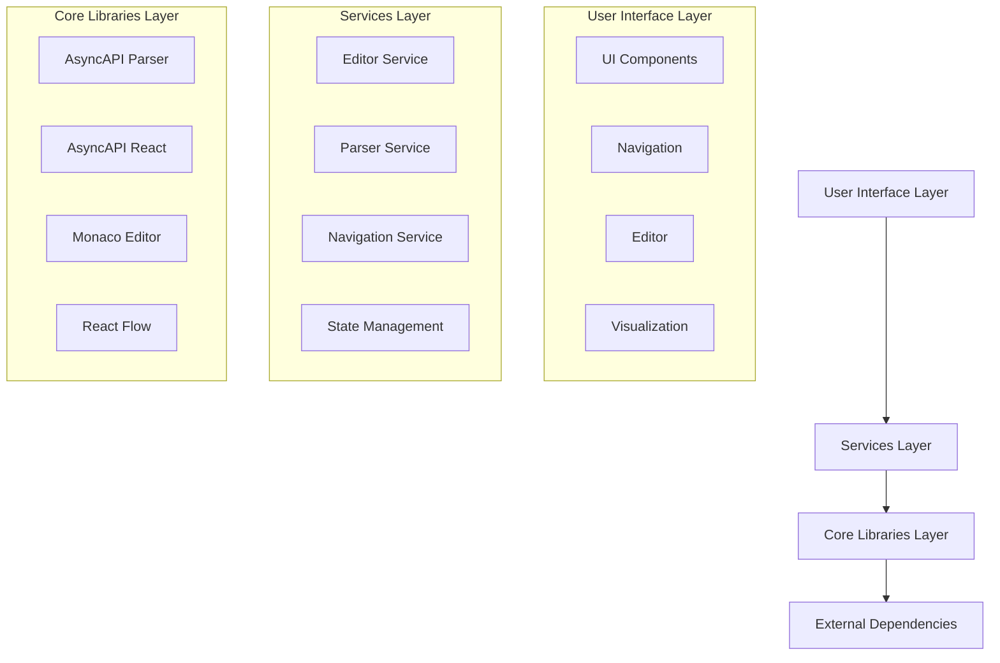
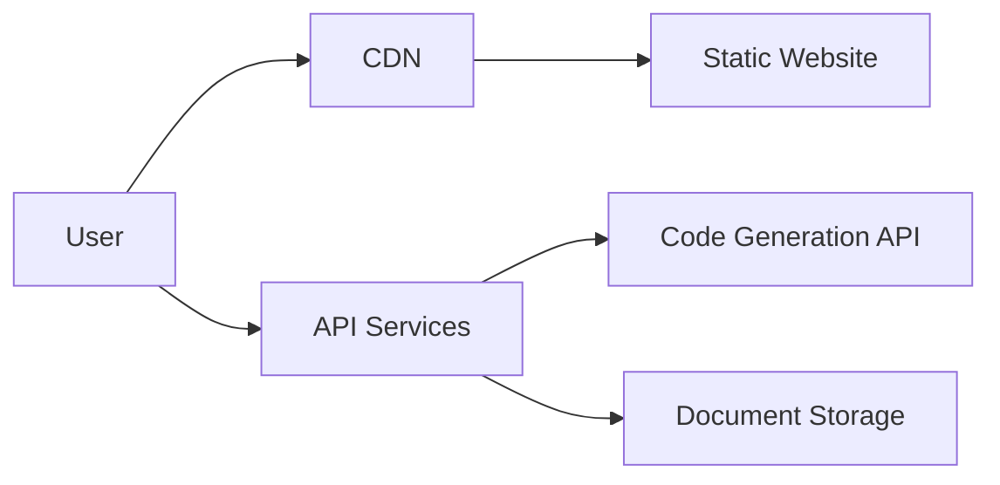
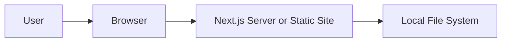
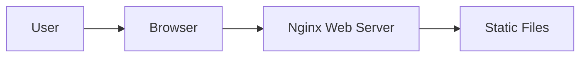

AsyncAPI Studio is built as a monorepo using Turbo, with a modular architecture that separates concerns into distinct services and components. The application follows a layered architecture pattern:

## Key Components

AsyncAPI Studio consists of several key components that work together to provide a seamless experience:

### User Interface Components

The UI layer consists of React components organized into logical groups:

1. **Core Components**: Base UI components like buttons, inputs, panels, and modals
2. **Navigation Components**: Sidebar, tabs, and navigation controls
3. **Editor Components**: Monaco editor integration and editor-related UI
4. **Visualization Components**: React Flow integration for API visualization
5. **Preview Components**: Documentation preview using AsyncAPI React component

### Services Layer

The services layer provides the core functionality of the application:

#### Editor Service

The Editor Service handles all aspects of editing AsyncAPI documents:

- Manages Monaco Editor configuration and integration
- Provides syntax highlighting and code completion
- Handles file loading and saving
- Manages document format conversion (YAML/JSON)

#### Parser Service

The Parser Service is responsible for processing and validating AsyncAPI documents:

- Integrates with the AsyncAPI Parser library
- Validates documents against the AsyncAPI schema
- Processes validation results and error reporting
- Handles schema resolution and references

#### Navigation Service

The Navigation Service manages navigation within the application:

- Controls switching between different views (Editor, Preview, Visualize)
- Manages the sidebar navigation
- Handles URL routing and state persistence
- Coordinates interactions between different views

### State Management

AsyncAPI Studio uses Zustand for state management, with several stores:

1. **Editor Store**: Manages the editor state, content, and configuration
2. **Parser Store**: Stores validation results and parsed document information
3. **UI Store**: Manages UI state like sidebar visibility and active panels
4. **Settings Store**: Handles user preferences and application settings

## Technology Stack

AsyncAPI Studio is built using modern web technologies:

### Frontend Technologies

- **React**: For building the user interface
- **Next.js**: For server-side rendering and routing
- **TailwindCSS**: For styling and design system
- **Monaco Editor**: For the code editing experience
- **React Flow**: For interactive API visualizations
- **Zustand**: For state management

### AsyncAPI Technologies

- **AsyncAPI Parser**: For validating and processing AsyncAPI documents
- **AsyncAPI Converter**: For converting between different AsyncAPI versions
- **AsyncAPI React**: For rendering documentation previews
- **AsyncAPI Generator**: For code generation from specifications

### Build and Development Tools

- **Turbo**: For monorepo management and efficient builds
- **pnpm**: For package management
- **TypeScript**: For type-safe code
- **ESLint/Prettier**: For code quality and formatting
- **Jest/React Testing Library**: For testing

## Data Flow

The following diagram illustrates how data flows through the application:

## Deployment

AsyncAPI Studio supports multiple deployment models:

### Hosted Version

The hosted version at [studio.asyncapi.com](https://studio.asyncapi.com) is deployed as a static site on cloud infrastructure:

### Local Deployment

When deployed locally, AsyncAPI Studio runs as a standalone application:

### Docker Deployment

The Docker deployment packages the application in a lightweight container:

## Design Decisions

Several key design decisions that shape AsyncAPI Studio's architecture:

1. **Monorepo Structure**: Allows sharing code between applications while maintaining separation
2. **Service-Based Architecture**: Separates concerns into distinct services
3. **Local-First Processing**: Performs validation and parsing client-side for better performance
4. **Extensible Plugin System**: Enables future extensions through plugins
5. **Responsive Design**: Works on various devices and screen sizes