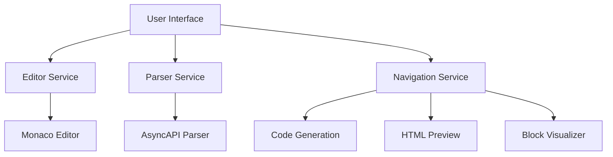

AsyncAPI Studio is a web-based tool designed specifically for working with AsyncAPI specifications. It provides an integrated environment for developing, validating, converting, and visualizing AsyncAPI documents, making it easier to create and manage your asynchronous API definitions.

## Key Features

AsyncAPI Studio offers a rich set of features to streamline your AsyncAPI development workflow:

* **Advanced Editor**: Build and edit AsyncAPI documents with syntax highlighting, code completion, and error detection
* **Validation**: Instantly validate your AsyncAPI documents against schema rules
* **Version Conversion**: Convert specifications between different AsyncAPI versions
* **Documentation Preview**: Render beautiful documentation using the AsyncAPI React component
* **Visual Flow Diagrams**: Visualize message flows between systems for better understanding
* **Code Generation**: Generate code from your AsyncAPI specifications using various templates
* **Collaboration**: Share your AsyncAPI documents with others through URLs or file exports

## Why Use AsyncAPI Studio?

AsyncAPI Studio simplifies the process of working with AsyncAPI specifications by providing all the tools you need in one place:

* **User-Friendly Interface**: Designed for both beginners and experienced AsyncAPI users
* **Immediate Feedback**: Get instant validation as you type to catch errors early
* **Visualization**: See your API structure visually to better understand message flows
* **No Installation Required**: Use the online version at [studio.asyncapi.com](https://studio.asyncapi.com) or deploy locally

## Studio Architecture

AsyncAPI Studio is built with modern web technologies:

The application integrates several key components:
* **Monaco Editor**: Powers the advanced code editing capabilities
* **AsyncAPI Parser**: Validates and processes specifications
* **React Flow**: Creates interactive visualizations of your API components
* **AsyncAPI React**: Renders beautiful documentation previews

Whether you're just getting started with AsyncAPI or you're an experienced user, AsyncAPI Studio provides the tools you need to create high-quality AsyncAPI specifications efficiently. 