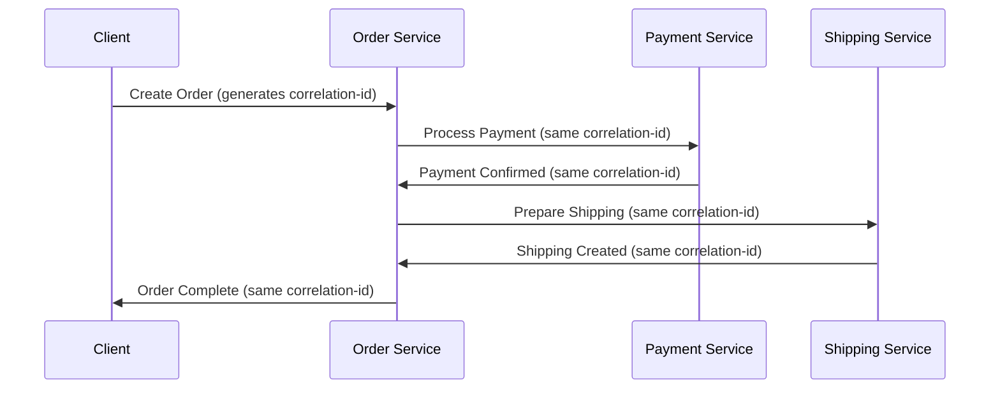

## Introduction
This guide explains the concept of correlation IDs in event-driven architectures and how to define them using AsyncAPI. You'll learn why correlation IDs are crucial for distributed tracing and how to implement them in your applications.

## Correlation IDs
In distributed systems, especially with event-driven architectures, a single business transaction might span multiple services. Correlation IDs help track these transactions across different services and message flows.

Let's understand the basic components involved:
- Original Request: The initial trigger that starts a business transaction
- Message Chain: Series of messages exchanged between different services
- Correlation ID: A unique identifier that links all related messages together

### Why Use Correlation IDs?
Correlation IDs serve several important purposes:
- Tracing requests across distributed systems
- Debugging and troubleshooting issues
- Monitoring end-to-end transaction flow
- Analyzing system performance
- Maintaining data consistency

### Implementing Correlation IDs
There are several ways to implement correlation IDs in your event-driven system:

1. Message Headers: Including correlation IDs in message headers
2. Payload Fields: Embedding correlation IDs within message payloads
3. Middleware: Automatically adding correlation IDs through middleware

Let's see how to define correlation IDs in AsyncAPI:

```yaml
asyncapi: 3.0.0
info:
  title: Order Processing Service
  version: 1.0.0
  description: Handles order processing with correlation IDs

channels:
  order/created:
    address: order.created
    messages:
      orderCreated:
        name: OrderCreated
        headers:
          type: object
          properties:
            correlation-id:
              type: string
              description: Unique identifier to track the order process
              example: "ord_123_456_789"
        payload:
          type: object
          properties:
            orderId:
              type: string
            timestamp:
              type: string
              format: date-time
            items:
              type: array
              items:
                type: object
                properties:
                  productId:
                    type: string
                  quantity:
                    type: integer

operations:
  publishOrder:
    action: publish
    channel:
      $ref: '#/channels/order/created'
```
### Practical Implementation
Here's a practical example using Node.js with AMQP:
```javascript
const amqp = require('amqplib');
const { v4: uuidv4 } = require('uuid');

class OrderService {
  async connect() {
    this.connection = await amqp.connect('amqp://localhost');
    this.channel = await this.connection.createChannel();
  }

  async publishOrder(orderData) {
    // Generate correlation ID
    const correlationId = uuidv4();

    // Prepare message with correlation ID in headers
    const message = {
      orderId: orderData.orderId,
      timestamp: new Date().toISOString(),
      items: orderData.items
    };

    // Publish message with correlation ID in headers
    await this.channel.publish(
      'orders',
      'order.created',
      Buffer.from(JSON.stringify(message)),
      {
        correlationId,
        headers: {
          'correlation-id': correlationId
        }
      }
    );

    return correlationId;
  }

  async consumeOrder() {
    await this.channel.consume('orders', async (msg) => {
      const correlationId = msg.properties.correlationId;
      console.log(`Processing order with correlation ID: ${correlationId}`);

      // Process the order
      const order = JSON.parse(msg.content.toString());

      // Log with correlation ID for tracing
      console.log(`[${correlationId}] Processing order ${order.orderId}`);

      // Acknowledge the message
      this.channel.ack(msg);
    });
  }
}

// Usage example
async function main() {
  const orderService = new OrderService();
  await orderService.connect();

  // Start consuming orders
  await orderService.consumeOrder();

  // Publish a new order
  const correlationId = await orderService.publishOrder({
    orderId: "12345",
    items: [
      { productId: "P1", quantity: 2 },
      { productId: "P2", quantity: 1 }
    ]
  });

  console.log(`Order published with correlation ID: ${correlationId}`);
}

main().catch(console.error);
```

### Best Practices
When implementing correlation IDs:

1. Generate unique IDs: Use UUID v4 or similar algorithms
2. Propagate consistently: Pass the same ID through all related messages
3. Include in logs: Add correlation IDs to log entries
4. Document in AsyncAPI: Define correlation ID fields in your AsyncAPI specification
5. Make IDs accessible: Store IDs where they can be easily retrieved



### Monitoring and Debugging
With correlation IDs properly implemented:
- Track transactions across multiple services
- Search logs efficiently using correlation IDs
- Analyze transaction flow and performance
- Debug issues by following the correlation ID trail

## Conclusion
Correlation IDs are essential for maintaining observability in distributed systems. By properly defining them in your AsyncAPI documents and implementing them in your services, you can achieve better tracing, debugging, and monitoring capabilities.

<Remember>
Always generate correlation IDs as early as possible in the transaction flow and ensure they are propagated throughout the entire chain of services.
</Remember>