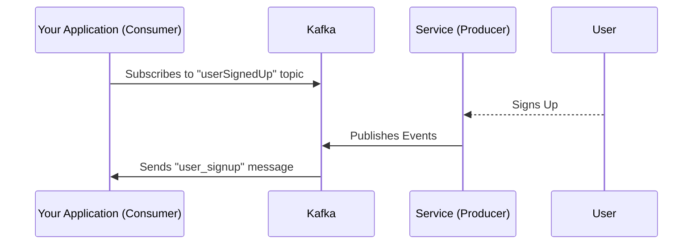

## Introduction

In this tutorial, you will create a schema document for Kafka Messages using AsyncAPI. You will also learn about Event-Driven Architecture, the pub/sub model, and brokers concerning Kafka. 
  
Suppose you have a service publishing data to a Kafka topic whenever a new user signs up on your application.

You want to build a system that tracks users who have signed up for your application. As such, your application will have the following flow:




## Background context

[Event-Driven Architecture (EDA)](/docs/tutorials/getting-started/event-driven-architectures) is a design pattern that revolves around the production, detection, and reaction to events over time. It consists of three main components: a message broker, event publishers, and subscribers, which together serve as the backbone for event exchange within different services. 

[Message brokers](/docs/tutorials/getting-started/event-driven-architectures#message-broker) facilitate asynchronous communications between services, meaning the sending service doesn't have to wait for the receiving service's response. Multiple services can talk to each other directly, even if they are written in different languages. 

A great example of such a message broker is Apache Kafka. [Apache Kafka](https://kafka.apache.org/) is a distributed event streaming platform thousands of companies use for their event-driven system. Here, a distributed event streaming platform is a system that operates on multiple nodes, providing high availability and fault tolerance.

[Publisher/Subscriber (Pub/Sub)](/docs/tutorials/getting-started/event-driven-architectures#publishersubscriber) is a typical model in EDAs, providing flexible coupling between publishers and subscribers. In this model, those who `send` event notifications act as publishers, while those who `receive` the notifications act as the corresponding subscribers.

## Create AsyncAPI document for Kafka messages  

In this section, you’ll create an AsyncAPI document to describe the `UserSignUp` API. The same document can be later used to generate code and documentation as per requirement.

Let's begin by analyzing the document. As you progress in the tutorial, we'll break down each segment, uncovering its purpose and functionality.

```
asyncapi: 3.0.0
info:
  title: User Signup API
  version: 1.0.0
  description: The API notifies you whenever a new user signs up in the application.

servers:
  centralKafkaServer:
    host: central.mykafkacluster.org:8092
    description: Kafka broker running in a central warehouse
    protocol: kafka
  westKafkaServer:
    host: west.mykafkacluster.org:8092
    description: Kafka broker running in the west warehouse
    protocol: kafka
  eastKafkaServer:
    host: east.mykafkacluster.org:8092
    description: Kafka broker running in the east warehouse
    protocol: kafka

operations:
  onUserSignedUp:
    action: receive
    channel:
      $ref: '#/channels/userSignedUp'

channels:
  userSignedUp:
    description: This channel contains a message per each user who signs up in our application.
    address: user_signedup
    messages:
      userSignedUp:
        $ref: '#/components/messages/userSignedUp'

components:
  messages:
    userSignedUp:
      payload:
        type: object
        properties:
          userId:
            type: integer
            description: This property describes the id of the user
          userEmail:
            type: string
            description: This property describes the email of the user
```

Let's now break it down into pieces.

### Define AsyncAPI version, API information, and server

First, you must describe your application, including the AsyncAPI version, the info about the document, and the server your application is based on.

```
asyncapi: 3.0.0
info:
  title: User Signup API
  version: 1.0.0
  description: The API notifies you whenever a new user signs up in the application.
servers:
  centralKafkaServer:
    host: central.mykafkacluster.org:8092
    description: Kafka broker running in a central warehouse
    protocol: kafka
  westKafkaServer:
    host: west.mykafkacluster.org:8092
    description: Kafka broker running in the west warehouse
    protocol: kafka
  eastKafkaServer:
    host: east.mykafkacluster.org:8092
    description: Kafka broker running in the east warehouse
    protocol: kafka
```

In the above snippet:

- The `asyncapi` field indicates that you use AsyncAPI version 3.0.0.
  
- The `info` field provides information about the API. Here the the APIs `title`, `version`, and `description` are being defined.
  
- The `server` field specifies the details of the server, including the `host`, `description`, and the `protocol` that is being used (i.e., Kafka). This section allows you to define multiple clusters or servers, as shown in the provided code block.

<Remember>
If an application has multiple servers hidden from the user behind a load balancer, then only the address of the load balancer must be included in the AsyncAPI document. 
</Remember>

### Define channels

Next, let's move on to the `channels` section. The channel addresses are the topics in Kafka; they are the routes to which your API will send/receive messages. 

```
channels:
  userSignedUp:
    description: This channel contains a message per each user who signs up in our application.
    address: user_signedup
    messages:
      userSignedUp:
        $ref: '#/components/messages/userSignedUp'
```

In the above code snippet:
  
- The `userSignedUp` object inside `channels` describes the Kafka topic where the application will receive the information and the associated message definition. 
- The `address` field represents the actual name of the Kafka topic and the `messages` field describes the expected messages in that topic.

### Define operations

Now, let's move on to the `operations` section. The `operations` property is used to describe how your application interacts with the defined channels.

```
operations:
  onUserSignedUp:
    action: receive
    channel:
      $ref: '#/channels/userSignedUp'
```

In the above code snippet:

- The `onUserSignedUp` object specifies the operation's nature, which occurs when the user signs up. 
- The `action` property indicates that the application will receive the information.
- The `channel` property points to the channel where the operation occurs.

### Define messages and schemas

Finally, you'll define the messages and their payload. The payload defines how the event would look like when it's sent from the channel.

```
components:
  messages:
    userSignedUp:
      payload:
        type: object
        properties:
          userId:
            type: integer
            description: This property describes the ID of the user
          userEmail:
            type: string
            description: This property describes the Email of the user
```

In the above code snippet:

- The `userSignedUp` message is defined which describes the payload (content) of the message.
  
- The `payload` property defines the message content. Your message payload should contain a `userId`, an integer, a `userEmail` property, and a string property.

## Summary

The ability to generate an AsyncAPI document for Kafka is now in your toolkit. You generated an AsyncAPI document that defines the structure of the Kafka messages in a machine-readable format, which makes it easier to maintain event-driven architecture. Try adding your business logic and playing around with it.

## Next steps

Now that you know how to write an AsyncAPI document for Kafka messages using the default schema, let's learn how to create an [AsyncAPI document using Avro Schema instead](/docs/tutorials/kafka/configure-kafka-avro). 
