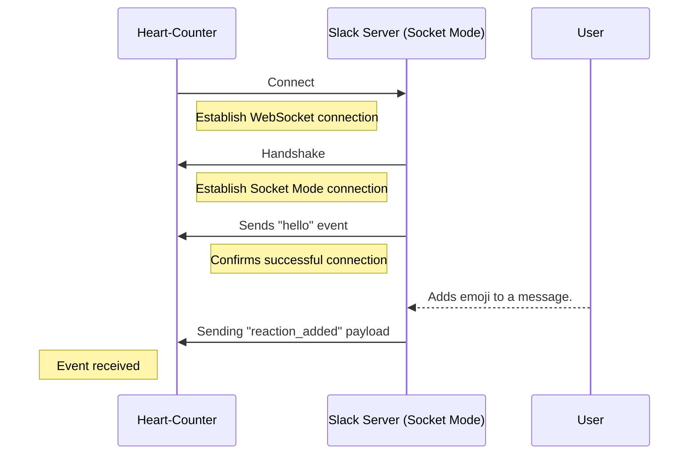
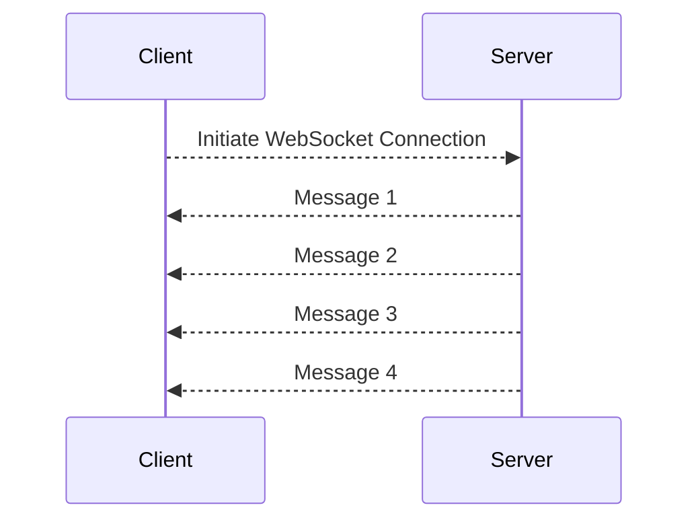

## Introduction
In this tutorial, you will learn how to write an AsyncAPI document designed for a Slack application that operates in Socket Mode. The aim is to help you grasp a real-world application of AsyncAPI with the WebSocket protocol. You will learn how to write an AsyncAPI document for a consumer-only application receiving a stream of messages from a WebSocket server. You will also learn why the AsyncAPI bindings feature exists and how to use it.

Consider a scenario where you are in charge of maintaining a highly active Slack workspace. You want an easy way to keep track of the popular messages across all channels, but doing this manually would be difficult. To simplify this process, you will build a Slackbot called `Heart-Counter` that actively monitors reactions added to a message and determines its popularity by counting the reactions of the “heart” emoji.

Here’s a visual representation of how the `Heart-Counter` should work: 

## Background context
[WebSocket](https://en.wikipedia.org/wiki/WebSocket) is a communication protocol that enables simultaneous bidirectional data exchange between a client and a server over a single, long-lived connection. Unlike HTTP, which relies on the request-response model, WebSocket is ideal for scenarios where real-time, interactive, and low-latency communication is necessary.

In Slack, WebSocket is employed as part of its [Socket Mode](https://api.slack.com/apis/connections/socket) feature to facilitate real-time notifications between Slack's servers and third-party applications or bots. The [Slack Event API](https://api.slack.com/apis/connections/events-api) is a tool that lets you receive real-time notifications of specific events in a Slack workspace such as messages, reactions, and user presence changes.

## Define AsyncAPI version, API information, and server

You start your AsyncAPI document by specifying the AsyncAPI version and essential information about your Slack application's API, which includes details such as the `title,` `version,` and `description.`

The `servers` section allows you to define the protocol and specify information about the URLs your application will use, such as  `host`, `pathname`, `protocol`, and `description`.

<Remember>
The WebSocket URL is generated  by invoking the <a href="https://api.slack.com/methods/apps.connections.open">apps.connections.open</a> method from Slack’s API. You use the authentication tokens obtained during the configuration of your Slackbot to generate this URL.
</Remember>

<CodeBlock language="yaml">
{`asyncapi: '3.0.0'
info:
  title: Create an AsyncAPI document for a Slackbot with WebSocket
  version: '1.0.0'
  description:  |
    The Heart-Counter manages popular messages in a Slack workspace by monitoring message reaction data
servers:
  production:
    host: wss-primary.slack.com
    pathname: /link
    protocol: wss
    description: Slack's server in Socket Mode for real-time communication `}
</CodeBlock>

## Define messages and schemas

Your AsyncAPI document needs to be very clear on the type of event it is expected to receive. Here's where the `messages` component steps in. Using the `payload` property, you can specify what these events should look like, their structure, and what content they carry.

The `payload` attribute specifies the name, format, and description of all the expected properties. `Heart-Counter` starts the popularity count of a message by validating if the `reaction` property set in the `reaction` schema definition corresponds to "heart".

<CodeBlock language="yaml" highlightedLines={[5,6,9,10,42,43,44]}>
{`components:
  messages:
    reaction:
      summary: Action triggered when the channel receives a new reaction-added event
      payload:
        $ref: '#/components/schemas/reaction'
    hello:
      summary: Action triggered when a successful WebSocket connection is established
      payload:
        $ref: '#/components/schemas/hello'
  schemas:
    hello:
      type: object
      properties:
        type:
          type: string
          description: A hello string confirming WebSocket connection
        connection_info:
          type: object
          properties:
            app_id:
              type: string
        num_connections:
          type: integer
        debug_info:
          type: object
          properties:
            host:
              type: string
            started:
              type: string
            build_number:
              type: integer
            approximate_connection_time:
              type: integer
    reaction:
      type: object
      properties:
        user:
          type: string
          description: User ID who performed this event
        reaction:
          type: string
          description: The only reaction that we need is a heart emoji
        item_user:
          type: string
          description: User ID that created the original item that has been reacted to
        item:
          type: object
          properties:
            channel:
              type: string
              description: Channel information of original message
            ts:
              type: string
              description: Timestamp information of original message
        event_ts:
          type: string
          description: Reaction timestamp
`}
</CodeBlock>

## Define channels and  bindings

The `channels` attribute defines a communication channel for the event. The `address` specifies where the channel is tuned in to receive messages while the `messages` property defines a key-value pair where each key corresponds to the event it's set up to handle.

The WebSocket URL generated for `Heart-Counter` includes authentication tokens. This information is represented using `query` parameters. Query parameters are specific to HTTP protocol and partially to WebSocket, which uses HTTP to connect client and server. Since this is protocol-specific information, you must use an AsyncAPI feature called `bindings` that enables you to provide protocol-specific information inside the AsyncAPI document using the `bindings` attribute. By utilizing the `query` object from the WebSocket binding, you can outline the parameters needed for the connection and the conditions they must meet. 

<CodeBlock language="yaml" highlightedLines={[9]}>
{`channels:
  root:
    address: /
    messages:
      hello:
        $ref: '#/components/messages/hello'
      reaction:
        $ref: '#/components/messages/reaction'
    bindings:
      ws:
        query:
          type: object
          description: Tokens are produced in the WebSocket URL generated from the [apps.connections.open](https://api.slack.com/methods/apps.connections.open) method from Slack’s API
          properties:
            ticket:
              type: string
              description: Temporary token generated when connection is initiated
              const: '13748dac-b866-4ea7-b98e-4fb7895c0a7f'
            app_id:
              type: string
              description: Unique identifier assigned to the Slack app
              const: 'fe684dfa62159c6ac646beeac31c8f4ef415e4f39c626c2dbd1530e3a690892f' `}
</CodeBlock>

## Define operations 
The `operation` property is all about defining specific tasks your application can perform. Essentially, it's how the `Heart-Counter` interacts with Slack.

In this example, the `helloListener` operation keeps an eye out for the message sent by the Slack server when a WebSocket connection is successfully established. On the other hand, the `reactionListener` is focused on the `reaction_added` event type.

Your Slack application is designed to be notified of events within your workspace. It subscribes to a specific event type and uses Slack's Event API. In this case, both operations' `action` property is set to `receive` events.

<CodeBlock language="yaml" highlightedLines={[3,9]}>
{`operations:
  helloListener:
    action: receive
    channel:
      $ref: '#/channels/root'
    messages:
      - $ref: '#/channels/root/messages/hello'
  reactionListener:
    action: receive
    channel:
      $ref: '#/channels/root'
    messages:
      - $ref: '#/channels/root/messages/reaction' `}
</CodeBlock>

Congratulations, you've completed the tutorial! Putting these blocks together gives you an AsyncAPI document all ready to go.

<CodeBlock language="yaml">
{`asyncapi: '3.0.0'
info:
  title: Create an AsyncAPI document for a Slackbot with WebSocket
  version: '1.0.0'
  description:  |
    The Heart-Counter manages popular messages in a Slack workspace by monitoring message reaction data.
servers:
  production:
    host: wss-primary.slack.com
    pathname: /link
    protocol: wss
    description: Slack's server in Socket Mode for real-time communication
channels:
  root:
    address: /
    messages:
      hello:
        $ref: '#/components/messages/hello'
      reaction:
        $ref: '#/components/messages/reaction'
    bindings:
      ws:
        query:
          type: object
          description: Tokens are produced in the WebSocket URL generated from the [apps.connections.open](https://api.slack.com/methods/apps.connections.open) method from Slack’s API
          properties:
            ticket:
              type: string
              description: Temporary token generated when connection is initiated
              const: '13748dac-b866-4ea7-b98e-4fb7895c0a7f'
            app_id:
              type: string
              description: Unique identifier assigned to the Slack app
              const: 'fe684dfa62159c6ac646beeac31c8f4ef415e4f39c626c2dbd1530e3a690892f'
operations:
  helloListener:
    action: receive
    channel:
      $ref: '#/channels/root'
    messages:
      - $ref: '#/channels/root/messages/hello'
  reactionListener:
    action: receive
    channel:
      $ref: '#/channels/root'
    messages:
      - $ref: '#/channels/root/messages/reaction'
components:
  messages:
    reaction:
      summary: Action triggered when the channel receives a new reaction-added event
      payload:
        $ref: '#/components/schemas/reaction'
    hello:
      summary: Action triggered when a successful WebSocket connection is established
      payload:
        $ref: '#/components/schemas/hello'
  schemas:
    hello:
      type: object
      properties:
        type:
          type: string
          description: A hello string confirming WebSocket connection
        connection_info:
          type: object
          properties:
            app_id:
              type: string
            num_connections:
              type: integer
            debug_info:
              type: object
              properties:
                host:
                  type: string
                started:
                  type: string
                build_number:
                  type: integer
                approximate_connection_time:
                  type: integer
    reaction:
      type: object
      properties:
        user:
          type: string
          description: User ID who performed this event
        reaction:
          type: string
          description: The only reaction that we need is a heart emoji
        item_user:
          type: string
          description: User ID that created the original item that has been reacted to
        item:
          type: object
          properties:
            channel:
              type: string
              description: Channel information of original message
            ts:
              type: string
              description: Timestamp information of original message
        event_ts:
          type: string
          description: Reaction timestamp `}
</CodeBlock>

## Summary
In this tutorial, you learned to create an AsyncAPI document for a Slackbot using WebSocket in Socket Mode. You gained practical insights into the functionality of operations, channels, messages, and schemas. Now you're equipped to handle real-world applications that facilitate bidirectional real-time data exchange, such as chatbots and live-streaming platforms.
