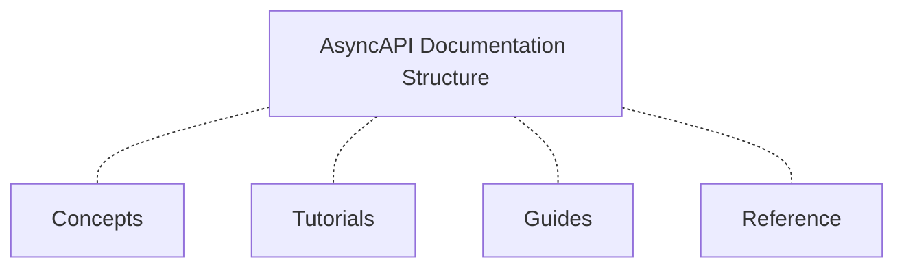

# Content Buckets
We adopt a systematic approach from the Diátaxis framework to structure our documentation. We ensure our docs are presented in a manner that is easy to understand by organizing and classifying them into content buckets.

At AsyncAPI, our docs are classified into the following content buckets:

- **Concepts** - Defines various features and capabilities AsyncAPI offers, helping readers understand the core concepts underlying the AsyncAPI framework.

- **Tutorials** - Our tutorial section offers practical guidance to individuals who are beginners or new to AsyncAPI. It provides step-by-step guidance and offers hands-on experience using real-world examples.

- **Guides** - In the guides section, individuals can learn how to troubleshoot AsyncAPI issues at a more advanced level. It provides various problem-solving techniques and knowledge enhancement.  

- **Reference** - Here, you can find detailed technical information about the specification. It includes release notes, APIs, and internal documents that provide function definitions and parameter descriptions.
