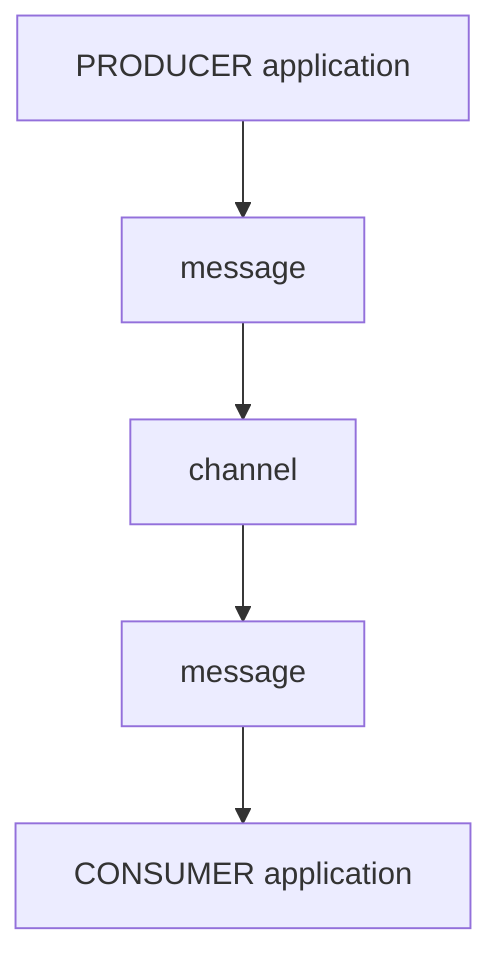

## What is an application?
An application is any computer program or a group of them. 

An application could also be a micro-service, IoT device (sensor), mainframe process, etc. Users may even write applications in different programming languages if they support one of the selected protocols. 

## Why do we need applications?
In Event-Driven Architecture (EDA), an application must be a `producer`, a `consumer`, or both. Applications must also use the protocols the server supports if they wish to connect and exchange messages.

### Applications: producers and consumers

The above diagram describes a message communication traveling through a channel between a **PRODUCER application** and a **CONSUMER application**. 

<Remember>
When writing your AsyncAPI document, make sure to describe what a user can do with your application; not what the application does. In other words, if your <em>application</em> is a <b>producer</b>, your AsyncAPI document should describe where users can subscribe to, to receive messages produced by your <b>producer</b> application. 
</Remember>
