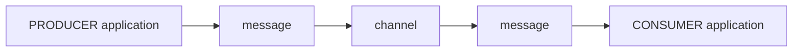

## What is an application?
An application is any computer program or a group of them. 

An application could also be a micro-service, IoT device (sensor), mainframe process, etc. Users may even write applications in different programming languages if they support one of the selected protocols. 

## What is the purpose of an application?
In Event-Driven Architecture (EDA), an application must be a producer, a consumer, or both. Applications must also use the protocols the server supports if they wish to connect and exchange messages.

### Applications: producers and consumers

The diagram above describes a bi-directional communication between a **producer application** and a **consumer application**. In this case, in your AsyncAPI file, you describe the `channel` via the [`Channel Bindings Object`](https://www.asyncapi.com/docs/reference/specification/v2.4.0#channelBindingsObject), which describes the protocol-specific definitions for `channel`s.