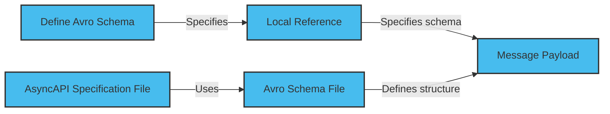

The payload schema defines a message's format, data types, and properties to ensure that the payload follows a specific structure and data format.

You should use AsyncAPI Schema to handle complex messages and structured data models. Enabling consumers to gain insights into the structure and data types of the payload.

Use npm or yarn to install the `@asyncapi/avro-schema-parser` package to enable Avro schema parsing in AsyncAPI.

## Define Avro schema

Define the Avro schema for the message payload. You can choose one of the following methods:

- Embedded notation: Define the Avro schema within the message payload property.
- Remote reference: Specify the schema using an absolute remote endpoint, such as `$ref: 'https://schemas.example.com/user'`.
- Local file reference: Specify the schema using a relative reference, such as `$ref: './user-signedup.avsc'`.

The diagram below defines the AsyncAPI specification file using the local reference method.



Here is an example of an AsyncAPI specification file that uses the local reference method:

```yaml
messageId: userSignup
name: UserSignup
title: User signup
summary: Action to sign a user up.
description: A longer description
tags:
  - name: user
  - name: signup
payload:
  schemaFormat: application/vnd.apache.avro+json;version=1.9.0
  schema:
    $ref: path/to/user-create.avsc
```

Create a separate Avro schema file with a `.avsc` extension. The file should define the structure of the message payload. Here is an example of an Avro schema file for the user record type:

```json
{
  "namespace": "UserCreate.avro",
  "type": "record",
  "name": "user",
  "fields": [
    {
      "name": "fullName",
      "type": "string"
    },
    {
      "name": "email",
      "type": "string"
    }
  ]
}
```

## Attach examples

Although optional, it is highly recommended to attach examples to the AsyncAPI specification. You can use JSON or YAML format for binary encodings, like Avro. Attach the examples to the examples property within the message payload definition. Here is an example,

```yaml
examples:
  - name: SimpleSignup
    summary: A simple UserSignup example message
  - payload:
      user:
        fullName: Demo
        email: demo@demo.io
```

You can use a Schema Registry to separate the Avro schema from the message payload, making it easier to manage schema compatibility.

## Reuse schema

To reuse a schema in your AsyncAPI specification, define it in the `components/schemas` section and reference it using the `$ref` keyword. Using `$ref` helps to avoid duplication and ensures consistency. Here's an example of reusing a schema from components in AsyncAPI.

```yaml
channels:
  user/signedup:
    subscribe:
      message:
        payload:
          $ref: '#/components/schemas/User'
components:
  schemas:
    User:
      type: object
      properties:
        fullName:
          type: string
        email:
          type: string
```
