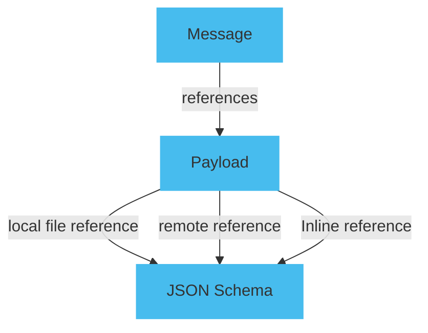

The payload schema defines a message's format, data types, and properties to ensure that the payload follows a specific structure and data format.

You should use AsyncAPI Schema to handle complex messages and structured data models. Enabling consumers to gain insights into the structure and data types of the payload.

## Define JSON schema

Define the JSON schema for the message payload. You can choose one of the following methods:

- Inline reference: Define the JSON schema within the message payload property.
- Remote reference: Specify the schema using an absolute remote endpoint, such as `$ref: 'https://schemas.example.com/user'`.
- Local file reference: Specify the schema using a relative reference, such as `$ref: './user-signedup.json'`.

The diagram below describes how to use complex payloads.



Here is an example of an AsyncAPI specification file that uses the local reference method:

```yaml
channels:
  exampleChannel:
    address: exampleChannel
    messages:
      publish.message:
        payload:
          $ref: path/to/user-create.json
operations:
  exampleChannel.publish:
    action: receive
    channel:
      $ref: '#/channels/exampleChannel'
    messages:
      - $ref: '#/channels/exampleChannel/messages/publish.message'
```

Create a separate JSON schema file with a `.json` extension. The file should define the structure of the message payload. Here is an example of a JSON schema file for the user record type:

```json
{
  "type": "object",
  "properties": {
    "username": {
      "type": "string",
      "description": "The username of the sender"
    },
    "email": {
      "type": "string",
      "format": "email",
      "description": "The email of the sender"
    },
    "message": {
      "type": "string",
      "description": "The content of the message"
    }
  }
}
```

## Attach examples

Although optional, it is highly recommended to attach examples to the AsyncAPI specification. You can use JSON or YAML format for binary encodings. Attach the examples to the examples property within the message payload definition. Here is an example,

```yaml
examples:
  - name: SimpleSignup
    summary: A simple UserSignup example message
  - payload:
      user:
        name: Demo
        email: demo@demo.io
```

## Reuse schema

To reuse a schema in your AsyncAPI specification, define it in the `components/schemas` section and reference it using the `$ref` keyword. Using `$ref` helps to avoid duplication and ensures consistency. Here's an example of reusing a schema from components in AsyncAPI.

```yaml
components:
  messages:
    SimpleSignup:
      name: SimpleSignup
      contentType: application/json
      payload:
        $ref: '#/components/schemas/SimpleSignup'
    examples:
      name: example
      payload: 
        SimpleSignup:
          name: Demo
          email: demo@demo.io
schemas:
    SimpleSignup:
      type: object
      properties:
        name:
          type: string
        email:
          type: string
```
