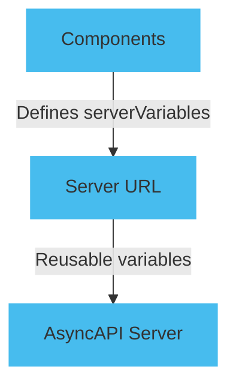

Servers benefit from a defined base URL and rules for URL variables. You can easily manage multiple endpoints, handling various server configurations and environments.

URL variables are placeholders for values you can replace during runtime. AsyncAPI enables you to construct dynamic URLs while enhancing the flexibility and maintainability of your AsyncAPI documents.

## Add dynamic variables

Use the `server.url` and `server.variables` to add variables to a server URL. Leverage `components.serverVariables` to enable reusable variable definitions across multiple servers.

The diagram below describes how to use variable urls in AsyncAPI.



### Servers section

Define the servers section in your AsyncAPI document, and include the base URLs for your API servers. Use placeholders enclosed in curly braces {} to represent the variables in the server URL. For example:

```yaml
servers:
  production:
    url: 'https://{subdomain}.example.com:{port}/v1'
    variables:
      subdomain:
        enum:
          - development
          - staging
          - production
      port:
        default: '8080'
```

### `serverVariables` section

Define the components.serverVariables section in your AsyncAPI document. For each variable used in the server URLs, provide a default value and an optional description. This helps you avoid repeating variable defination. For example,

```yaml
components:
  serverVariables:
    subdomain:
      enum:
        - development
        - staging
        - production
      default: development
    port:
      default: '8080'
```

### Define domain and port variables

You can use components.serverVariables to avoid repeating variable definations such as domains and ports. To change the values of these variables, update their default values in the components.serverVariables section. Both servers' URLs will reflect the changes.

Here's the complete AsyncAPI document with the server URL variables:

```yaml
info:
  title: Example API
  version: '1.0.0'
servers:
  production:
    host: '{subdomain}.example.com:{port}'
    pathname: /v1
    protocol: amqp
    variables:
      subdomain:
        $ref: '#/components/serverVariables/subdomain'
      port:
        $ref: '#/components/serverVariables/port'
  development:
    host: '{subdomain}.example.com:{port}'
    pathname: /v1
    protocol: amqp
    variables:
      subdomain:
        $ref: '#/components/serverVariables/subdomain'
      port:
        $ref: '#/components/serverVariables/port'
components:
  serverVariables:
    subdomain:
      enum:
        - development
        - staging
        - production
      default: development
    port:
      default: '8080'
```
