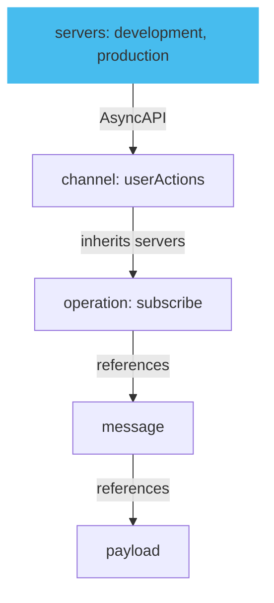

A server represents a message broker handling communication between producers and consumers. Adding and defining servers is useful because it specifies where and how to connect. The connection facilitates where to send and receive messages.

A unique key identifies the server and contains information about the server's connection details, such as the URL, protocol, and authentication. The diagram below describes how to define and add servers in AsyncAPI.



For more information, refer to the [introduction to servers](/docs/server.md) document.

## Define servers

Define the servers in your AsyncAPI specification file. Server definitions specify the server to which a channel or operation is connected. Here's an example of how to define a server in AsyncAPI:

```yaml
servers:
  url: mqtt://test.mosquitto.org
  protocol: mqtt
  description: Test MQTT server
```

In this example, you define a server with the URL using the MQTT protocol and describe the server.

### Define Server reference

Add the server reference to your channels or components in the AsyncAPI specification. You can specify the server for each channel or component. Here's an example of how to add a server reference to a channel:

```yaml
channels:
  myChannel:
    publish:
      server: mqttServer
      message:
        $ref: '#/components/messages/myMessage'
```

In this example, specify the server reference `mqttServer` for the `myChannel` channel.

## AsyncAPI apps

Servers interact with AsyncAPI apps by following configurations defined in the AsyncAPI document. They establish connections, subscribe to channels, publish and consume messages, handle errors, and enforce security measures based on the defined server configurations.

Here's an example of a server to publish messages to a channel.

1. The server establishes connections based on the server configurations in the AsyncAPI document.
1. The server uses the publishMessage operation ID to publish messages to the channel. The message payload follows the defined schema in the ChatMessage message component.
1. When an app subscribes to the chat.message channel, it receives the published messages.

```yaml
channels:
  chat.message:
    publish:
      operationId: publishMessage
      message:
        $ref: '#/components/messages/ChatMessage'
components:
  messages:
    ChatMessage:
      payload:
        type: object
        properties:
          sender:
            type: string
          content:
            type: string
```

The server can also validate the incoming requests from the app.
