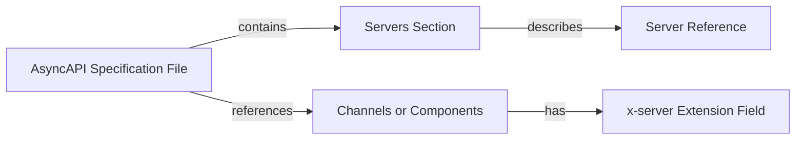

Defining and connecting to servers in AsyncAPI allows you to describe the communication infrastructure of your event-driven system enabling smooth message exchange among various components.



## Define Servers

Define the servers in your AsyncAPI specification file. The servers section is used to describe the servers that your API connects to. Here's an example of how to define a server in AsyncAPI:

```yaml
servers:
  url: mqtt://test.mosquitto.org
  protocol: mqtt
  description: Test MQTT server
```

In this example, you define a server with the URL, using the MQTT protocol, and provide a description for the server.

## Define Server reference

Add the server reference to your channels or components in the AsyncAPI specification. You can specify the server for each channel or component by using the x-server extension field.

Here's an example of how to add a server reference to a channel:

```yaml
channels:
  myChannel:
    publish:
      x-server: mqttServer
      message:
        $ref: '#/components/messages/myMessage'
```

In this example, you specify the server reference mqttServer for the myChannel channel.
