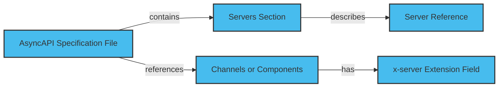

A server represents a message broker handling communication between producers and consumers. Adding and defining servers is useful because it specifies where and how to connect. The connection facilitates where to send and receive messages.

A unique key identifies the server and contains information about the server's connection details, such as the URL, protocol, and authentication.

The diagram below depicts how to define and add servers.



For more information, refer [introduction to servers](../server.md)

## Define Servers

Define the servers in your AsyncAPI specification file. Server definitions specify the server to which a channel or operation is connected. Here's an example of how to define a server in AsyncAPI:

```yaml
servers:
  url: mqtt://test.mosquitto.org
  protocol: mqtt
  description: Test MQTT server
```

In this example, you define a server with the URL using the MQTT protocol and describe the server.

## Define Server reference

Add the server reference to your channels or components in the AsyncAPI specification. You can specify the server for each channel or component using the x-server extension field.

Here's an example of how to add a server reference to a channel:

```yaml
channels:
  myChannel:
    publish:
      x-server: mqttServer
      message:
        $ref: '#/components/messages/myMessage'
```

In this example, specify the server reference mqttServer for the myChannel channel.
